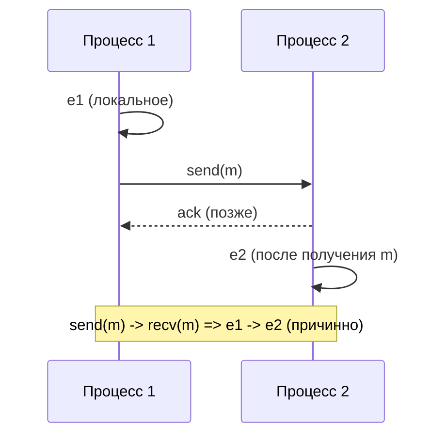
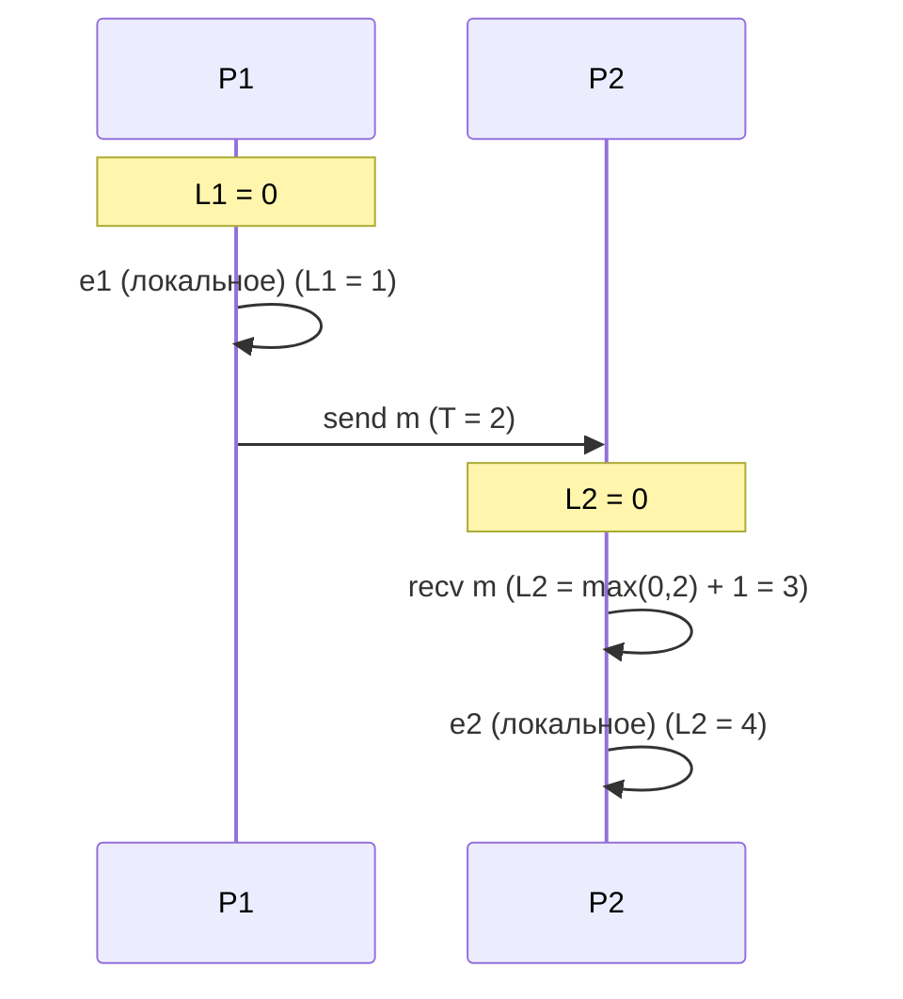
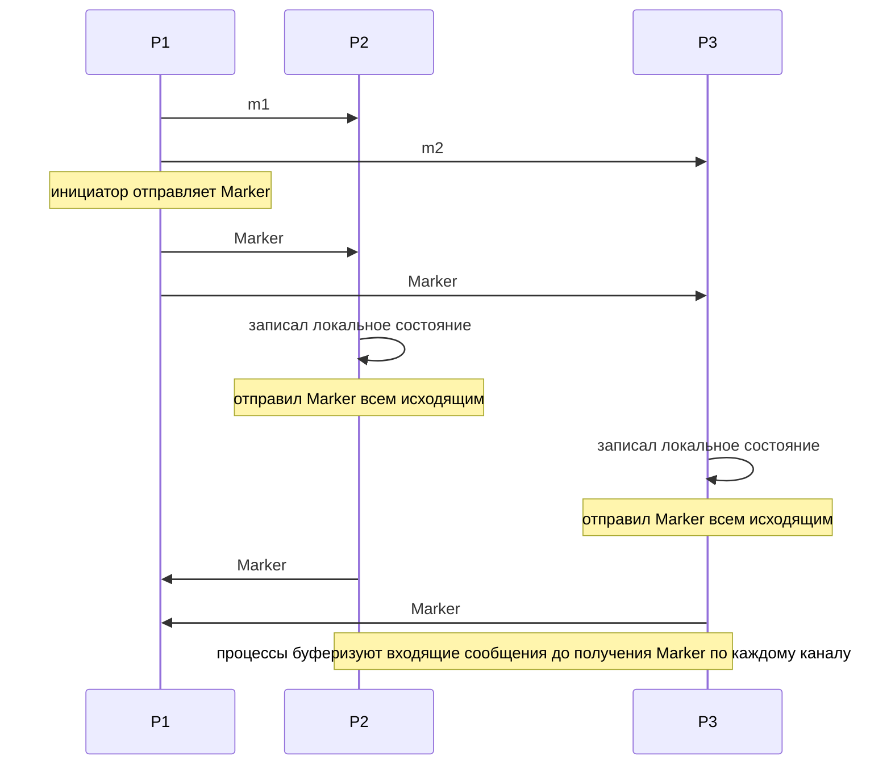

# Лекция 03. Время и порядок событий: причинность, часы и согласованные срезы

Как только у нас появляется больше одного узла, «время» перестаёт быть очевидным. Разбираем причинность и частичный порядок, логические и векторные часы, как жить с реальным временем (NTP/PTP) и зачем иногда платить за глобальный порядок. Завершаем практикой моделирования часов и поиска гонок.

---

## 1) Причинность и отношение happens-before

В распределённой системе каждое действительное «событие» похоже на точку в локальном времени процесса: отправка или приём сообщения, изменение переменной, лог‑запись. Понятие причинности помогает установить, какие события могли влиять друг на друга, а какие — независимы. Это важно потому, что у нас нет единого физического часов, который бы однозначно упорядочивал события на всех узлах.

Отношение happens-before (обозначаемое →) формализует эту интуицию. Простыми словами: A → B означает, что событие A могло повлиять на B — например, потому что A произошло в том же процессе прежде, чем B, или потому что A — отправка сообщения, а B — соответствующее получение. Кроме прямых связей есть правило транзитивности: если A → B и B → C, то A → C. Именно эта транзитивность позволяет строить частичный порядок причинно связанных событий по всей системе.

Формальные правила определения happens-before:
- Если A и B — события в одном процессе и A происходит перед B, то A → B.
- Если A — отправка сообщения m, а B — приём этого же сообщения m, то A → B.
- Если A → B и B → C, то A → C (транзитивность).

Если ни A → B, ни B → A не выполняется, события называют конкурентными (concurrent). Конкурентность означает отсутствие причинной связи: ни одно событие не могло повлиять на другое через обмены сообщений или последовательность в одном процессе. Конкурентные события нельзя однозначно упорядочить по причинности — любое такое упорядочение было бы искусственным.

Почему это важно на практике:
- Для отладки и трассировки: знание happens-before помогает понять, какие сообщения и действия могли породить наблюдаемое состояние.
- Для согласованных срезов и снапшотов: необходимо включать в снимок все отправки, предшествующие включённым приёмам, иначе снимок будет неконсистентен.
- Для детекции гонок: два конкурентных доступа к ресурсу — потенциальная гонка, потому что ни одно из событий не гарантированно «до» другого.
- Для проектирования протоколов: многие алгоритмы согласования состояния опираются на частичный порядок причинности, а при необходимости вводят отдельный механизм для получения тотального порядка.

Ограничения: happens-before отражает только потенциальную причинную связь, а не реальное физическое время. Два события могут выглядеть «одновременными» по happens-before, хотя их физические часы различаются; наоборот, разница физических часов не делает события причинно связанными. Для практических задач часто комбинируют причинность (логические или векторные часы) и информацию о физических часах, чтобы управлять неопределённостью и обеспечивать нужные свойства согласованности.

- Событие A → B, если B может наблюдать эффект A; иначе события могут быть конкурентны (concurrent).
- Отношение happens-before задаёт частичный порядок; глобального «единого» порядка часто нет.

Иллюстрация причинности:



---

## 2) Логические часы Лэмпорта: просто и полезно

Логические часы Лэмпорта — это простая и в то же время эффективная техника, которая отвечает на элементарный вопрос: «что произошло раньше, а что позже, если мы не можем доверять физическим часам?» Представьте систему из нескольких процессов, каждый из которых ведёт свой журнал событий. Нам нужно иметь способ упорядочить эти события так, чтобы порядок был совместим с причинностью (happens‑before), даже если часы на узлах рассинхронизированы.

Идея Лэмпорта очень интуитивна: вместо физических времён каждый процесс хранит маленький целочисленный счётчик. Когда происходит событие в процессе — счётчик увеличивается; когда процесс отправляет сообщение, он помечает его текущим счётчиком; при получении сообщения приёмник обновляет свой счётчик с учётом метки отправителя. Таким образом метки «перетекают» вместе с сообщениями и несут информацию о порядке между событиями.

Правила обновления счётчика кратко выглядят так:

1) Каждый процесс i хранит локальный счётчик L_i, инициализированный нулём.
2) Локальное (внутреннее) событие: L_i := L_i + 1.
3) При отправке сообщения m: L_i := L_i + 1; в сообщение включается метка T := L_i.
4) При получении сообщения с меткой T от процесса j: L_i := max(L_i, T) + 1.

Почему это хорошо работает? Потому что если событие A произошло до события B в смысле happens‑before (A → B), то метка Лэмпорта для A будет меньше метки для B. Обратная сторона: если метки показывают L(A) < L(B), это не обязательно означает причинную связь — метки дают совместимый тотальный порядок, но не точное различение конкурирующих (concurrent) событий. Чтобы разрешать конкуренцию требуется более богатая метрика (например, векторные часы), о которых мы поговорим далее.

Для практики полезно представить, как это выглядит на примере. Ниже — простой сценарий с двумя процессами: P1 создаёт событие, отправляет сообщение, P2 получает сообщение и затем выполняет своё событие. Последовательность обновлений будет именно такой, как предсказывают правила Лэмпорта.



Практическое применение Лэмпорта простое и повсеместное: метки используются для упорядочивания логов в распределённых системах, для дедупликации сообщений, для упрощённой детекции «что шло раньше», и как недорогая альтернатива физическим часам, когда нужен лишь совместимый порядок. В логах часто сохраняют кортеж (L, pid) и сортируют по лексикографическому порядку — это даёт детерминированный тотальный порядок, совместимый с причинностью.

Ограничения метода тоже важны: Лэмпорт не различает конкурирующие события (если A и B concurrent, их метки могут быть любыми относительными), и метки не дают информации о «насколько позже» произошло событие в физическом времени. Для тех случаев, когда необходимо различать конкуренцию, применяют векторные часы; когда нужна информация о реальном времени — совместно используют логические метки и физические часы с учётом погрешностей.

В следующем разделе разберём векторные часы — как они расширяют идею Лэмпорта и позволяют точно определять, какие события конкурентны.

---

## 3) Векторные часы: различаем конкуренцию

Векторные часы (vector clocks) расширяют идею Лэмпорта так, чтобы не только давать совместимый порядок, но и точно определять, какие события конкурентны. Напомню: простые логические метки Лэмпорта позволяют сказать «A произошло до B» в случае A → B, но не дают способа надёжно различать два события, которые не связаны причинностью. Векторные часы исправляют это, сохраняя по одному счётчику на каждый процесс.

Структура и правила

- Каждый процесс i хранит вектор V длины N (число процессов). Изначально V = (0,0,...,0).
- Локальное событие в процессе i: V[i] := V[i] + 1.
- При отправке сообщения процесс i отправляет вместе с ним копию своего вектора V.
- При получении сообщения с вектором W от процесса j: для всех k выполняем V[k] := max(V[k], W[k]); затем увеличиваем свою компоненту V[i] := V[i] + 1 (отражая обработку события приёма).

Сравнение векторов

Сравнение выполняется покомпонентно: говорим, что V ≤ W, если для всех k выполнено V[k] ≤ W[k]. Если V ≤ W и V != W, то событие, помеченное V, произошло до события, помеченного W (V happened‑before W). Если же ни V ≤ W, ни W ≤ V — вектора несравнимы, и соответствующие события считаются конкурентными. Это даёт точный способ обнаружения concurrency, в отличие от числовых меток Лэмпорта.

Простой пример

Представим два процесса P1 и P2, векторы имеют длину 2.

- Изначально: V1 = (0,0), V2 = (0,0).
- P1 выполняет локальное событие: V1 := (1,0).
- P1 отправляет сообщение m с меткой (1,0).
- P2 получает m: сначала возьмёт поэлементный максимум V2 := max((0,0),(1,0)) = (1,0), затем увеличит свою компоненту: V2 := (1,1).

Теперь у нас есть метки (1,0) для события отправки и (1,1) для события приёма/следующего внутреннего события — легко проверить, что (1,0) ≤ (1,1), то есть send → recv.

Демонстрация конкурентных событий

Если P1 сделает ещё одно локальное событие, получив V1 = (2,0), а P2 до получения этого сообщения совершит своё локальное событие и получит V2 = (1,2) (в результате других обменов), то сравнение (2,0) и (1,2) покажет несравнимость — ни один вектор не покомпонентно меньше другого, значит события конкурентны.

Слияние векторов

Когда нужно объединить знания двух процессов (например, при приёме сообщения), применяется поэлементный максимум. Это даёт новый «объединённый» вектор, который отражает всю известную причинную предысторию.

Преимущества и недостатки

Преимущество векторных часов — точное различение конкуренции: они позволяют однозначно определять, произошла ли причинная связь между двумя событиями или они независимы. Это незаменимо для детекции гонок, causal multicast, согласованных снапшотов, оптимистичных репликаций и др.

Недостатки — главным образом стоимость: вектор имеет размер O(N), и пересылка/обновление векторов требует O(N) работы и передачи данных. В больших динамических кластерах это может стать узким местом. Для практики существуют оптимизации — разрежённые представления, компрессия, dotted version vectors, hybrid logical clocks — которые уменьшают накладные расходы, но усложняют реализацию.

Практические советы

- Используйте векторные часы в небольших кластерах или там, где точное обнаружение concurrency критично.
- Для больших систем применяйте оптимизации: храните только ненулевые компоненты, используйте суммарные структуры или гибридные схемы (HLC) для сокращения размеров меток.
- Помните о стоимости в процентах: в системах с высокой частотой сообщений накладные расходы на передачу векторов могут превысить выигрыш от точной детекции конкуренции.

В следующем разделе обсудим реальные часы и способы учёта дрейфа и неопределённости времени.


---

## 4) Реальное время: NTP/PTP, дрейф и TrueTime‑подобные интервалы

Когда мы говорим о «реальном времени» в распределённых системах, важно понимать две вещи сразу: во‑первых, физические часы на разных машинах не идеальны и постоянно дрейфуют; во‑вторых, доступные нам протоколы синхронизации дают приближение к «истинному» времени, но всегда с погрешностью. Эта секция объясняет, почему так происходит, как работают основные протоколы и зачем концепция интервала неопределённости (как в TrueTime) полезна при проектировании согласованных алгоритмов.

Дрейф часов и неизбежность погрешности

Часы в аппаратуре — это кварцевые генераторы, у каждого свой темп, зависящий от температурных условий, возраста и качества кристаллов. Поэтому даже если вы синхронизировали две машины на старте, их локальные счётчики будут постепенно расходиться — это и называется drift (дрейф). Кроме дрейфа есть джиттер (изменчивость измерений) и систематические смещения (offset) между машинами.

Чтобы компенсировать дрейф, системы периодически синхронизируют время с опорными серверами, но синхронизация никогда не даёт мгновенно точного ответа: сеть вносит задержки (RTT), аппаратная латентность и очереди добавляют неопределённость. В сумме это даёт только оценку истинного времени с некоторым интервалом ошибки.

NTP (Network Time Protocol)

NTP — самый распространённый протокол для синхронизации времени в открытой сети. Он опирается на измерение round‑trip‑time и оценки смещения между локальным и серверным временем, применяя фильтрацию и алгоритмы сглаживания. NTP хорошо работает для интернета: обычно даёт точность в миллисекундах (зависит от качества сети и выбранного stratum). Но NTP бывает подвержен скачкам (если сервер внезапно даёт другой offset), и его поведение зависит от реализации (ntpd, chrony и т.д.).

PTP (Precision Time Protocol)

PTP — протокол для локальных сетей со специализированной поддержкой аппаратной временной метки (IEEE 1588). В условиях правильной сетевой инфраструктуры и аппаратной поддержки PTP позволяет синхронизировать часы с точностью до субмикросекунд. PTP предпочтителен в дата‑центрах и телекоме, где нужна высокая точность и доступен аппаратный таймстампинг.

TrueTime‑подобные интервалы (концепция из Google Spanner)

Идея TrueTime (используемая в Spanner) — не обещать точного моментального времени, а возвращать интервал [earliest, latest], в котором с заданной вероятностью лежит «истинное» время. Этот интервал отражает неопределённость синхронизации: earliest = now_estimate - epsilon, latest = now_estimate + epsilon. При использовании таких интервалов можно строить алгоритмы, дающие строгие свойства согласованности: например, Spanner использует задержку commit'а до тех пор, пока latest не превысит некоторую отметку, что гарантирует внешнюю согласованность (external consistency) без гонок.

Практическое влияние на проектирование распределённых алгоритмов

- Нельзя полагаться на локальное время для тотального порядка: если ваша система назначает порядковые номера на основе немонотонного локального времени, она уязвима к рассогласованию и сдвигам часов.
- Для многих задач физическое время полезно: TTL, кэш‑время, репликация «по возрасту» — но для сильной согласованности лучше сочетать логические часы и интервалы неопределённости.
- При проектировании commit/transaction протоколов учтите, что использование интервалов TrueTime позволяет избежать распределённого соглашения для получения единого времени, но требует, чтобы epsilon (погрешность) был контролируемым и известным.

Практические рекомендации

- Для обычных приложений используйте NTP (chrony предпочтительнее для виртуализированных сред) и следите за статусом синхронизации (ntpstat, chronyc tracking). Не забывайте о мониторинге offset и jitter.
- Для дата‑центров и latency‑sensitive систем применяйте PTP с аппаратной поддержкой, если нужна субмиллисекундная точность.
- Для критичных распределённых сервисов, где важен внешний порядок (такие как глобальные транзакции), рассматривайте архитектуру, основанную на интервалах неопределённости (TrueTime) или гибридных решениях (HLC, Spanner‑style). Оцените стоимость ожидания commit'а (commit wait) против сложности согласования.
- Используйте монотонные (monotonic) часы для измерения интервалов и таймаутов — системные вызовы типа clock_gettime(CLOCK_MONOTONIC) защищают вас от скачков системного времени (например, при NTP correction или ручной правке часов).
- Никогда не инлайновайте секреты или приватные данные в статически подписанные временные метки. Время служит метаданным, а не средством аутентификации.

Эксперименты для практики

- Запустите два контейнера/VM без синхронизации, измерьте drift за 24 часа и посмотрите, как часто нужно вызывать синхронизацию.
- Настройте chrony в гостевой ОС и сравните offset до и после включения chrony; измерьте влияние нагрузки на сетевые метрики синхронизации.
- Если есть доступ к оборудованию с PTP, сравните измерения задержек и стабильности между NTP и PTP.

Короткое резюме

Физические часы дают полезную информацию, но всегда с погрешностью. NTP — хорош для интернета, PTP — для высокоточных локальных сред, а концепция интервала неопределённости (TrueTime) даёт удобный и формализованный способ учёта ошибки и построения корректных протоколов. Там, где требуется строгий глобальный порядок, выбирайте подход, учитывающий неопределённость времени, либо вовсе опирайтесь на логические/гибридные часы.


---

## 5) Глобальный порядок: когда он нужен и чем за него платим

Иногда в системе нужен не просто частичный порядок событий, а строгий, один‑единственный порядок, который все участники согласуют и которому можно доверять как «истинной» последовательности операций. Такой глобальный (тотальный) порядок упрощает мышление о корректности: он позволяет говорить о линейной истории операций, реализовывать линерализуемые объекты, упрощает аудит и отладку. Но получение и поддержание глобального порядка — это сознательная архитектурная цена, и важно понимать, за что вы платите.

Что даёт глобальный порядок

- Простую семантику: операции видимо происходят в некоем последовательном журнале; это облегчает реализацию транзакций, очередей с единственным порядком и систем, где важен детерминированный результат (банковские операции, биллинг, распределённые лог‑сервисы).
- Гарантии внешней согласованности: если система предоставляет внешнюю согласованность (external consistency), клиенты видят одинаковый порядок завершённых операций независимо от узла.

За что придётся заплатить

- Централизация и узкие места. Если вы ставите единого секвенсора/арбитра (leader), он становится точкой нагрузки: вся серия операций проходит через него, что ограничивает максимальную пропускную способность и увеличивает задержку. Кроме того, он — потенциальная точка отказа, требующая репликации и быстрой замены при падении.
- Координация и задержки. Достижение тотального порядка обычно требует распределённого согласования (Paxos/Raft) или ожидания подтверждений, что добавляет RTT в критический путь и делает глобальные операции медленнее — особенно при кросс‑датацентровых сценариях.
- Сложность эксплуатации. Протоколы, гарантирующие тонкие свойства порядка (линерализуемость, external consistency), требуют аккуратной настройки, мониторинга и инструментов для восстановления и инвалидации.

Альтернативы и гибриды

Полностью централизованный секвенсор — не единственный путь. Есть несколько подходов, которые снижают цену за порядок:

- Разбиение (sharding): даём строгий порядок только внутри партиции (partitioned logs), что масштабирует систему горизонтально, а между партициями допускаем лишь частичный порядок или согласование на более высоком уровне.
- Распределённый секвенсор на основе консенсуса (Raft/Paxos): лидер реплицирует журнал и обеспечивает тотальный порядок без единой «точки» одиночного отказа; цена — лидерство и репликация, но это стандартный путь для линейной истории (например, Kafka с контроллером, replicated state machines).
- Гибриды: комбинируют логические/временные метки с локальной сериализацией и глобальной проверкой (например, Spanner использует TrueTime + commit wait; другие системы применяют HLC или физические часы с коррекцией).
- Аппроксимации и компромиссы: для многих задач подходят CRDT и commutative операции, которые позволяют достигать согласованности без глобального порядка, либо использовать идемпотентные операции и компенсационные механизмы.

Когда стоит выбирать глобальный порядок

- Финансовые приложения и биллинг, где порядок операций критичен для корректного состояния.
- Системы с требованием строгого аудита и репродуцируемости (журналы транзакций, event sourcing для критичных доменов).
- Сценарии, где пользовательский опыт требует одного последовательного поведения (например, очередь задач с гарантией строгой очередности выполнения).

Практические советы

- Не вводите глобальный порядок по привычке: сначала проверьте, нельзя ли решить задачу локально (партиции) или с помощью CRDT/идемпотентности.
- Если нужен тотальный порядок, проектируйте масштабирование через партиции и минимизируйте операции, требующие глобального согласования.
- Используйте батчи и асинхронную репликацию, чтобы уменьшить overhead на каждой операции.
- Мониторьте латентность лидера/секвенсора, размер очередей и время переключения лидера — именно эти метрики будут первыми, которые покажут проблемы.
- Планируйте стратегию отказоустойчивости: горячее реплицирование лидера, быстрый failover и проверенные процедуры recovery.

Короткое резюме

Глобальный порядок даёт простую и мощную модель, но стоит дорого: узкие места, задержки и операционная сложность. В большинстве приложений разумный компромисс — локальный порядок + согласование там, где действительно критично, или переход на алгебры (CRDT), которые избавляют от необходимости в общем секвенсоре.


---


## 6) Согласованные срезы (consistent cuts) и снапшоты

Когда вы хотите получить снимок состояния распределённой системы — например, сделать checkpoint, собрать глобальную телеметрию или проанализировать причину сбоя — важно, чтобы этот снимок был согласованным: он не должен отражать «полу‑мир», в котором видно получение сообщения, но не видно его отправки. Согласованный срез (consistent cut) — это набор локальных состояний каждого процесса и наборов сообщений «в каналах», который не нарушает причинных зависимостей: если срез содержит приём сообщения, то он также содержит соответствующую отправку.

Почему это важно

Если вы сохраните несогласованное состояние, восстановление по нему может привести к невозможности воспроизвести поведение системы или к неконсистентным данным (например, транзакции, которые зависели от сообщений, которых «не было» в восстановленном логе). Для отладки и корректного восстановления требуется состояние, которое могло реально наступить при некоторой последовательности событий — именно это и гарантирует согласованный срез.

Как получить согласованный срез, не останавливая систему

Один из классических алгоритмов — Chandy‑Lamport snapshot (1985). Его сила в том, что процессы не останавливаются: алгоритм использует специальные маркеры, которые распространяются по каналам и помогают отделить уже зафиксированные сообщения от тех, что находятся «в пути».

Алгоритм в нескольких шагах (описательно):

1. Некто (инициатор) решает сделать снимок и отправляет маркер по всем своим исходящим каналам.
2. При получении маркера процесс, который ещё не снимал своё состояние, сначала сохраняет текущее локальное состояние, затем отправляет маркеры по всем своим исходящим каналам и начинает записывать в буфер все входящие сообщения по каждому каналу до тех пор, пока не получит маркер по этому каналу. Эти записанные сообщения — и есть состояние канала (in‑flight messages) на момент снимка.
3. Если процесс получает маркер по каналу, для которого он уже зафиксировал локальное состояние, он перестаёт буферизовать сообщения на этом канале и считает, что состояние канала записано (все сообщения до маркера входят в состояние, последующие — нет).
4. Когда все процессы зафиксировали своё локальное состояние и состояние всех входящих каналов, сборщик может объединить эти куски в один согласованный снимок.

Важно: алгоритм корректен при условии FIFO‑каналов; для ненадёжных/не FIFO каналов существуют расширения и другие техники фиксации.

Иллюстрация (схема маркеров):



Практические применения

- Checkpointing для восстановления после сбоев: согласованный снимок гарантирует корректное восстановление без «потерянных» зависимостей.
- Сбор распределённой телеметрии и snapshot‑анализ: глобальные инварианты и детекция состояний (например, наличие гонки, deadlock‑детектор) требуют согласованных данных.
- Снимки состояния в системах транзакций и репликации: для создания консистентных бэкапов реплик или логов.

Подводные камни и практические замечания

- FIFO‑каналы: базовый Chandy‑Lamport опирается на FIFO; если сеть не гарантирует порядок, алгоритм нужно адаптировать (например, маркировать сообщения или использовать дополнительные согласования).
- Размеры и частота снимков: частые глобальные снимки обходятся дорого — хранение, передача и объединение состояний требуют ресурсов. На практике используют инкрементальные снимки, дельты, или делают снимки только для нужных партиций.
- Нагрузка на сеть: маркеры и передача снимков добавляют трафик; планируйте окно снимка в периоды умеренной нагрузки.
- Согласованность в динамике: при добавлении/удалении процессов и каналов алгоритм требует расширений (несколько вариантов существуют для динамических топологий).

Как потренироваться (мини‑задания)

1. Смоделируйте 3‑узловую систему с FIFO‑каналами и реализуйте Chandy‑Lamport: запустите симуляцию, инициируйте snapshot и проверьте, что полученный глобальный состояние согласовано (нет recv без send).
2. Измерьте overhead: сколько сообщений маркеров отправляется, сколько данных буферизуется, и как растёт объём снапшота с увеличением частоты снимков.
3. Попробуйте адаптацию для ненадёжных каналов: что нужно изменить в протоколе, чтобы корректно записать состояние?

Короткое резюме

Согласованные срезы — базовый инструмент для безопасного сохранения и анализа состояния распределённых систем. Chandy‑Lamport даёт простой и практичный рецепт: записать локальное состояние, распространить маркеры и буферизовать in‑flight сообщения. На практике выбирайте стратегию снимков, учитывая стоимость, гарантии каналов и динамику системы.

---

## Практика

1. Реализуйте логические часы Лэмпорта в симуляции процессов и сообщений; логируйте (L,pid) у каждого события.
1. Добавьте векторные часы и покажите детекцию конкурентных событий.
1. Смоделируйте снапшот с согласованным срезом (останавливать процессы нельзя — только маркеры/границы).

Подсказка (псевдокод):

```text
init L=0; on local(): L++
on send(): L++; send(msg,L)
on recv(T): L=max(L,T)+1
```

---
