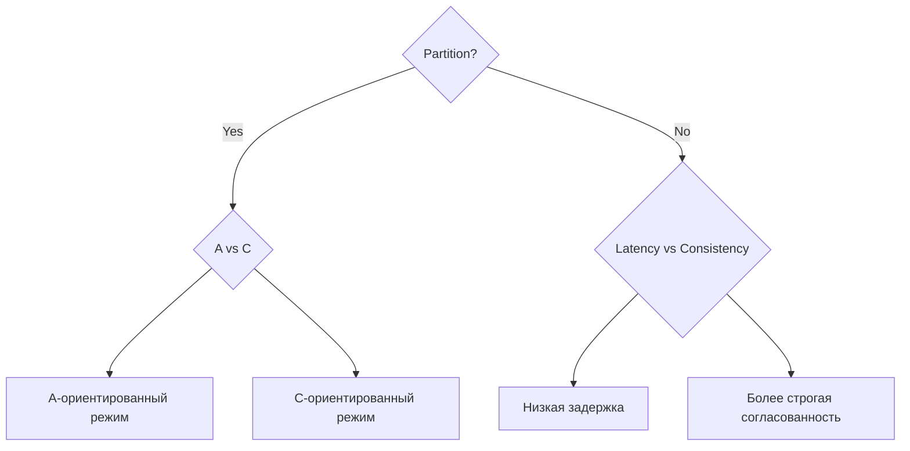
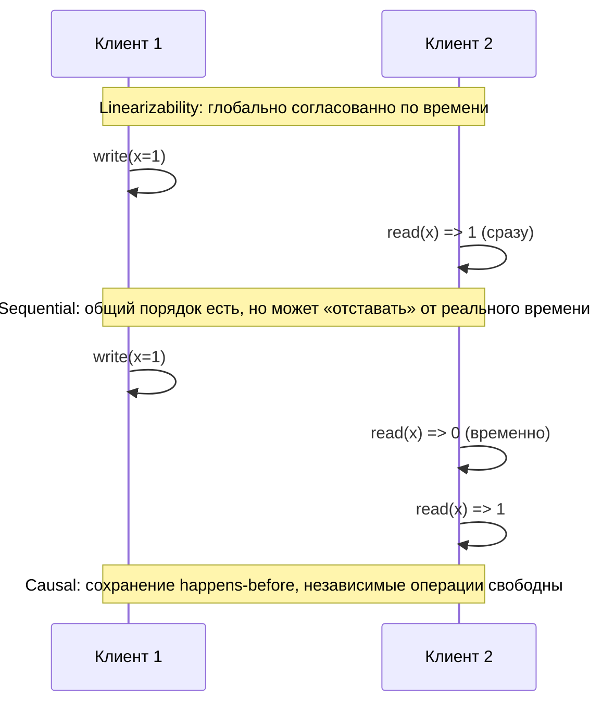
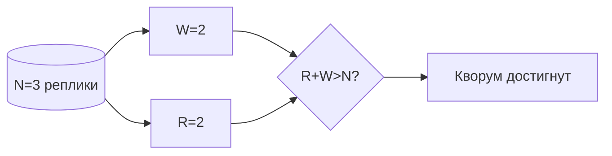

# Лекция 04. CAP, PACELC и модели консистентности: как выбирать осознанно

В этой лекции мы разберём, почему распределённая система не может одновременно давать «всё и сразу», какие реальные компромиссы скрываются за короткими формулами типа CAP и PACELC, и как на практике подбирать модель консистентности и параметры репликации под требования приложения. В конце — несколько практических задач и подсказок для реализации симуляций и экспериментов.

---

## 1) CAP без мифов

CAP — это полезная интуиция, но её часто неправильно интерпретируют. Формула звучит просто: при сетевом разделении (Partition, P) система обязана выбирать между доступностью (Availability, A) и строгой согласованностью (Consistency, C). Важно подчёркнуть несколько моментов:

- CAP применим только в контексте реальных сетевых сбоев и разделений. Если сеть исправна, то одновременно обеспечить и A, и C можно — но за счёт увеличения задержек или централизованных архитектур (лидеры, синхронные реплики).
- Выбор между A и C обычно делается на уровне операции: одна операция (например, чтение с быстрым локальным кэшем) может быть A‑ориентированной, другая (финансовый перевод) — C‑ориентированной.
- Под «Consistency» в CAP часто понимают линерализуемость/строгую согласованность — то есть поведение как будто существует единый узел. Под «Availability» — способность отвечать на запросы у большинства/всех реплик даже при разрыве части сети.

Практический пример: представьте базу данных, разбросанную по два региона. При потере связи между регионами система может либо продолжить обслуживать локальные запросы (A), рискуя получить расхождение данных, либо блокировать некоторые операции, пока связь не восстановится (C).

Скетч интуиции CAP:

```mermaid
flowchart LR
P[Сетевое разделение (P)] -->|есть| Choice{Выбор}
Choice --> C[Consistency]
Choice --> A[Availability]
P -->|нет| Both[C и A возможны]
```

Короткие правила практического применения CAP:

- Не думайте о CAP как о «запрете» — думайте о нём как о наборе проектных опций при сбоях.
- Проектируя систему, явно перечисляйте операции и требуемые SLAs: какие операции допускают задержку, какие — нет.
- Часто комбинируют подходы: для критичных операций используют CP‑режим (ждут кворума), для наблюдений и аналитики — AP‑режим (быстрые ответы, eventual convergence).

---

## 2) PACELC: если P Else Latency vs Consistency

PACELC расширяет CAP реальным наблюдением: даже при отсутствии разделения (Else) система делает компромисс между задержкой (Latency, L) и консистентностью (C). То есть не только «при разделе», но и «в норме» разработчик выбирает, чем ценить — скорость или строгую согласованность.

Почему это важно: многие распределённые БД и репликаторы дают параметры управления поведением — например, сколько реплик ждёт запись, с каким уровнем подтверждений читать и т. п. Эти параметры прямо влияют на L vs C.

Примеры практических выборов:

- Системы вроде Dynamo/Cassandra изначально оптимизировались под низкую задержку и высокую доступность (Eдут в сторону P→A и Else→L). Они поддерживают настраиваемые R/W, eventual convergence, и часто используют hinted handoff, read repair.
- HBase/Spanner (в своей архитектуре) стремятся к сильной согласованности для критичных операций (P→C и Else→C), иногда платя за задержку и сложную синхронизацию.

Диаграмма PACELC:



Практический совет: при проектировании распределённой системы выпишите требования по latency и консистентности для каждой операции и используйте PACELC как чеклист — это помогает выбрать хранилище и настройки (R/W, кворумы, leader/follower, гео‑репликацию).

---

## 3) Модели консистентности: от строгой к мягкой

Здесь мы проговорим наиболее используемые модели, приведём интуиции, примеры и оценим цену реализации.

### Linearizability (Strong consistency)

Описание: все операции кажутся атомически происходящими в некоторый момент «сейчас» и порядок операций согласован для всех клиентов. Это наиболее сильная модель — эквивалент поведения единого узла.

Интуиция: если вы пишете `x=1` и затем сразу читаете `x`, вы увидите `1` у всех клиентов (после завершения записи).

Стоимость: требует синхронизации (синхронная репликация, лидеры, глобальные кворумы), что увеличивает задержки и снижает доступность при сети с высокой латентностью.

Пример: распределённые транзакционные системы, банковские реестры — там чаще нужна линерализуемость.

### Sequential consistency

Описание: существует некоторый общий порядок операций, который видят все процессы, но этот порядок не обязан соответствовать реальному времени. Гарантируется, что относительный порядок операций от одного процесса сохраняется.

Интуиция: все видят одну последовательность действий, но наблюдение может «запаздывать» относительно локального времени.

Стоимость: проще реализовать, чем линерализуемость в распределённой среде, но всё ещё требует согласования порядка.

### Causal consistency

Описание: система гарантирует, что если событие A повлияло на событие B (A → B по happens‑before), то все процессы увидят A перед B. Независимые операции могут быть видны в разном порядке.

Интуиция: поддерживает «причинную» связность без глобальной сериализации. Позволяет более низкую задержку, чем линерализуемость, при сохранении полезных гарантий.

Реализация: векторные часы или контексты зависимостей; стоимость увеличивается с числом реплик/клиентов при простых реализациях.

### Eventual consistency

Описание: если прекратить обновления, все реплики в итоге сойдутся к одному значению. Слабая гарантия, но экономичная.

Интуиция: система быстро отвечает, расхождения допускаются, фоновые процессы (anti‑entropy, read‑repair) приводят к сходимости.

Пример: кэширование, системы аналитики, некоторые NoSQL‑хранилища.

### Session guarantees (Read‑Your‑Writes, Monotonic Reads/Writes и Writes‑Follow‑Reads)

Описание: гарантии в рамках сессии клиента. Они обеспечивают удобство для пользователя (например, вы видите собственные изменения), не требуя строгой глобальной согласованности.

Примеры и практики:

- Read‑Your‑Writes (RYW): после того как клиент записал значение, последующие чтения от этого же клиента будут видеть эту запись.
- Monotonic Reads: если клиент видел значение X в прошлом, он никогда не увидит «старую» версию Y<X позже.
- Monotonic Writes: записи одного клиента применяются в том порядке, в котором он их выполнил.

Таймлайны и сравнение (интуитивный пример):



Практический выбор модели зависит от требований: если ваша бизнес‑логика допускает «временные рассинхронизации» и важна пропускная способность — eventual/causal могут быть хорошим выбором; если требуется сильная семантика (финансовые операции) — линерализуемость или транзакционная модель.

---

## 4) Кворумы и настраиваемая консистентность

Кворумная репликация даёт удобный механизм для балансировки задержки/доступности/согласованности с помощью трёх параметров: N (число реплик), W (сколько реплик подтверждает запись), R (сколько реплик читается для ответа). Правило R + W > N обеспечивает, что при отсутствии сбоев чтение пересекается с хотя бы одной репликой, которая приняла последнюю запись.

Почему это работает: когда запись подтверждается W реплик, последующее чтение с R репликами гарантированно допросит хотя бы одну реплику из множества W (при R+W>N), а значит увидит последнюю запись.

Торговля показателями:

- Увеличивая W, вы повышаете гарантию согласованности, но платите задержкой записи.
- Уменьшая R, вы ускоряете чтения, но уменьшаете вероятность попадания на свежую запись.
- Выбор (R,W,N) часто зависит от профиля нагрузки: чтение‑ориентированное приложение может взять маленькое R и большее W; запись‑ориентированное — наоборот.

Дополнительные техники, делающие систему более надёжной и согласованной в фоне:

- Read repair: при чтении обнаруживать несогласованные реплики и чинить их.
- Anti‑entropy (gossip): фоновые обмены для сходимости.
- Hinted handoff: временно сохранять запись на соседней ноде, если целевая реплика недоступна.

Иллюстрация кворума (пример для N=3):



Пример числовой настройки:

- N=3, W=2, R=2 ⇒ R+W=4>3, запись подтверждена двумя репликами, чтение опрашивает две — пересечение гарантирует свежесть.
- N=5, можно поставить W=3, R=1 для быстрых чтений, но более дорогих записей.

---

## 5) Сессионные гарантии на практике

Сессионные гарантии дают хорошее соотношение удобства пользователя и простой реализации. Они полезны для приложений, где пользователю важно видеть свои собственные изменения, но строгая глобальная согласованность не требуется.

Как реализовать:

- Sticky sessions / affinity: направлять запросы клиента на один и тот же лидер/шарду, чтобы он видел свои изменения.
- Клиентские токены/версии: сервер возвращает версию (например, логический номер, timestamp или контекст зависимостей), и клиент добавляет её в последующие запросы, чтобы обеспечить read‑your‑writes.
- Causal metadata: хранить зависимости (векторные метки или causal context) в операциях, чтобы сервера могли реконструировать причинный порядок при применении обновлений.

Торговля и ограничения:

- Sticky sessions повышают нагрузку на отдельные ноды и уменьшают балансировку.
- Клиентские механизмы усложняют интерфейс клиента, но позволяют избежать глобальной синхронизации.

Примеры использования: социальные сети (показать собственные публикации сразу), редактирование документов (удерживать последовательность действий одного клиента), e‑commerce (показывать клиенту собственные корзинные изменения).

---

## Практика

1. Для N=3 подберите пары (R,W) для разных SLO:

- Задача A (низкая задержка чтения): цель — отвечать на чтение <50ms, терпимо небольшое окно устаревших значений. Подсказка: попробуйте R=1, W=2.
- Задача B (строгая согласованность записи): требуется, чтобы последующее чтение от любого клиента видел последнюю запись. Подсказка: R=2, W=2 или R=1, W=3 при N=3.

2. Смоделируйте eventual → causal:

- Реализуйте лёгкую симуляцию с N репликами, которая отправляет обновления и использует anti‑entropy (gossip). Затем добавьте механизмы для хранения зависимостей (векторные часы) и покажите, как некоторые наблюдения становятся причинно‑упорядоченными.

3. Обеспечьте RYW/Monotonic для одного клиента при репликации с лагом:

- Вариант: реализуйте клиентские версии — клиент хранит последнюю прочитанную/записанную версию и при чтении подаёт её серверу; сервер перенаправляет чтение на ноду с версии >= указанной, либо ждёт фоновую синхронизацию.
- Другой вариант: sticky session на лидере шардa — самый простой в реализации, но с накладными расходами на балансировку.

---
