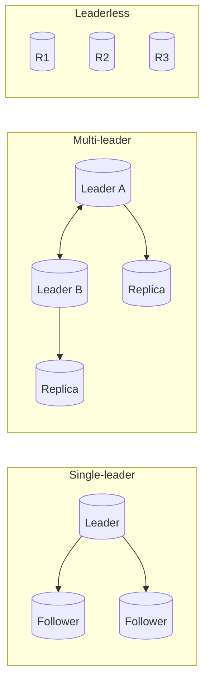
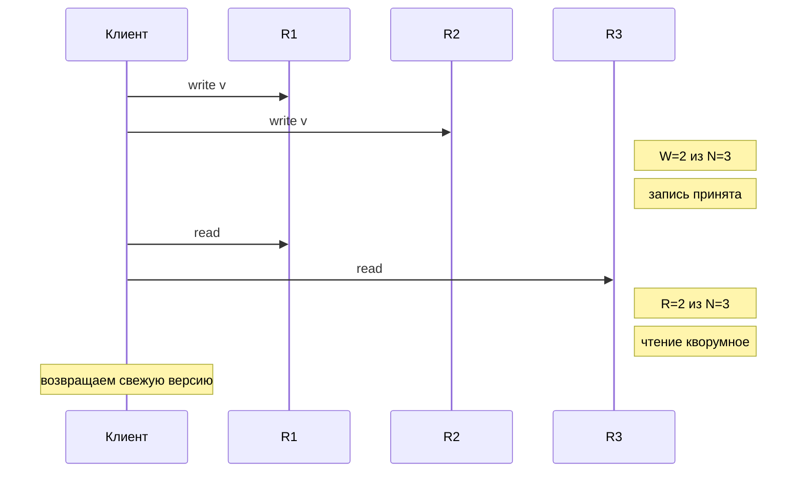

# Лекция 05. Репликация и консенсус: от топологий до кворумо

Цель лекции — объединить знания о способах репликации данных (single‑leader, multi‑leader, leaderless) с концепцией консенсуса, понять компромиссы между задержками, конфликтами и устойчивостью к сбоям, а также получить интуицию о том, как логи, кворумы и протоколы консенсуса (Paxos, Raft) обеспечивают надёжность и согласованность в распределённых системах.

Короткая карта тем:

1. Топологии репликации: single‑leader, multi‑leader, leaderless — архитектура и применимость.
2. Задержки, конфликты и сходимость — как обрабатывать конкурирующие записи.
3. Кворумы — правила R+W>N и их влияние на доступность и консистентность.
4. Логи, коммиты и durability — почему Write‑Ahead Log и fsync критичны.
5. Отказоустойчивость и защита от split‑brain: fencing, majority, аренды.
6. Интуиция Paxos и Raft — как консенсус-протоколы строят надёжную репликацию.
7. Практические задания и эксперименты.

---

## 1) Топологии репликации — выбор архитектуры

Репликация решает несколько задач одновременно: повышает доступность данных, обеспечивает disaster recovery и позволяет географически распределить нагрузку чтения. Однако выбор топологии репликации определяет, как система будет себя вести в нормальных условиях, при сбоях и при конфликтах.

### Single‑leader (primary/replica)

В этой топологии одна нода — лидер (primary) — принимает все записи, а остальные ноды (followers, replicas) асинхронно (или синхронно для критичных реплик) получают изменения и обслуживают чтения.

**Преимущества:**

- Простота: все записи проходят через одну точку → естественный порядок (линеаризация).
- Нет конфликтов записи: лидер единолично решает порядок операций.
- Легко обеспечить строгую консистентность для чтений с лидера.

**Недостатки:**

- Лидер — единая точка отказа (single point of failure) для записи: если он упал, нужна процедура failover.
- Чтения с реплик могут быть «старыми» (replication lag), если репликация асинхронна.
- Не подходит для multi‑datacenter записи с низкими задержками (все записи идут через одну географическую точку).

**Типичные применения:** PostgreSQL/MySQL с репликацией, MongoDB replica set (с первичным узлом).

### Multi‑leader (multi‑master)

Несколько нод могут принимать записи независимо (обычно в разных дата‑центрах). Изменения реплицируются друг другу асинхронно.

**Преимущества:**

- Низкая задержка записи из любого ДЦ: клиенты пишут в ближайший лидер.
- Устойчивость: отказ одного лидера не блокирует записи в других ДЦ.

**Недостатки:**

- Конфликты: два лидера могут одновременно изменить одну запись (write‑write conflict).
- Нужны стратегии разрешения конфликтов: last‑write‑wins (LWW), версионирование, CRDT, или ручная обработка.
- Сложность эксплуатации и отладки.

**Типичные применения:** CouchDB, системы коллаборации (Google Docs используют CRDT), геораспределённые установки PostgreSQL с BDR.

### Leaderless (Dynamo‑style)

Нет выделенного лидера: клиент пишет и читает напрямую на несколько реплик (кворумы W и R). Сходимость обеспечивается через read repair, hinted handoff и anti‑entropy (фоновые процессы сравнения и синхронизации).

**Преимущества:**

- Высокая доступность: система работает, даже если несколько нод недоступны (если W+R>N, сохраняется консистентность).
- Отсутствие единой точки отказа.
- Гибкая настройка: можно выбирать W и R в зависимости от требований (low latency vs consistency).

**Недостатки:**

- Консистентность «слабее»: eventual consistency, возможны конфликты версий.
- Усложнённая логика клиента: нужно обрабатывать несколько ответов, версии, конфликты (vector clocks, version vectors).
- Read repair и anti‑entropy требуют дополнительных накладных расходов.

**Типичные применения:** Amazon DynamoDB, Apache Cassandra, Riak.

**Визуализация топологий:**

**Практический вывод:** Выбор топологии зависит от ваших приоритетов. Single‑leader — для простоты и строгой консистентности; multi‑leader — для геораспределённой записи с риском конфликтов; leaderless — для высокой доступности с eventual consistency.

---

## 2) Задержки, конфликты и сходимость — как системы справляются с конкурирующими изменениями

Репликация всегда сталкивается с фундаментальным вопросом: что происходит, если несколько клиентов (или нод) пытаются изменить одни и те же данные одновременно?

### Single‑leader: сериализация и replication lag

В single‑leader топологии лидер выстраивает все записи в строгий линейный порядок (через лог WAL). Реплики воспроизводят этот лог, но с некоторой задержкой (replication lag). Это приводит к нескольким эффектам:

- **Read‑your‑writes inconsistency:** Клиент записал данные на лидера, но сразу прочитал их с реплики — и не увидел свои изменения (ещё не дошли).
- **Monotonic reads:** Клиент прочитал свежие данные с одной реплики, а потом переключился на более «старую» реплику и видит устаревшую версию.
- **Consistent prefix reads:** События происходят в определённом порядке на лидере, но реплика может применить их в нарушенном порядке, если репликация асинхронная.

Решения: sticky sessions (читать с одной реплики), read‑from‑leader для критичных операций, или использовать метки времени/логические часы для проверки свежести.

### Multi‑leader: конфликты и стратегии их разрешения

Когда несколько лидеров принимают записи независимо, неизбежны write‑write конфликты. Пример: два пользователя одновременно редактируют одно поле документа в разных ДЦ.

**Стратегии разрешения:**

1. **Last‑Write‑Wins (LWW):** Используем timestamp или логические часы; побеждает «самая поздняя» запись. Проблема: можно потерять данные; часы могут быть несинхронизированы.
2. **Версионирование (version vectors):** Каждая нода хранит версию записи; при конфликте клиент получает обе версии и решает, как объединить.
3. **CRDT (Conflict‑free Replicated Data Types):** Специальные структуры данных (G‑Counter, PN‑Counter, LWW‑Element‑Set), которые математически гарантируют сходимость без конфликтов.
4. **Application‑level merge:** Приложение само определяет логику слияния (например, объединение множеств тегов, merge логики в Google Docs).

**Практический совет:** Если возможно, избегайте multi‑leader для данных, требующих строгой консистентности. Используйте single‑leader или консенсус-протоколы.

### Leaderless: кворумная согласованность и eventual consistency

В leaderless системах клиент пишет на W реплик из N и читает с R реплик. Если R+W>N, то множества чтения и записи пересекаются — значит, при чтении клиент получит как минимум одну свежую реплику.

**Механизмы сходимости:**

- **Read repair:** При чтении клиент видит разные версии с реплик; система автоматически обновляет устаревшие реплики.
- **Anti‑entropy:** Фоновый процесс сравнивает реплики (например, через Merkle trees) и синхронизирует различия.
- **Hinted handoff:** Если реплика недоступна, данные временно записываются на другую ноду, а потом передаются нужной реплике, когда она вернётся.

**Проблемы:**

- При W+R≤N возможны «грязные чтения» (stale reads).
- При сетевых разделах (network partition) система может принимать записи, но не обеспечивать линейную консистентность.

---

## 3) Кворумы: R/W против N — математика доступности и консистентности

Кворумная репликация — это способ балансировки между доступностью и консистентностью через параметры W (write quorum), R (read quorum) и N (replication factor).

### Основное правило

Если **R + W > N**, то множества чтения и записи гарантированно пересекаются — хотя бы одна реплика будет содержать самую свежую версию данных. Это даёт **кворумную консистентность**: при чтении вы всегда увидите самую последнюю успешную запись (при условии, что система выбирает версию с наибольшим timestamp/version).

### Настройка компромиссов

- **W=1, R=N:** Быстрая запись (пишем на одну ноду), но медленное чтение (читаем со всех) — редко используется.
- **W=N, R=1:** Медленная запись (все ноды должны подтвердить), но быстрое чтение — подходит для read‑heavy workload.
- **W=N/2+1, R=N/2+1 (majority quorum):** Классический выбор: баланс между задержками и устойчивостью. Используется в Cassandra, Riak, и служит основой для протоколов консенсуса.

### Визуализация кворумного чтения/записи

### Ограничения кворумов

- **Sloppy quorum:** Если некоторые реплики недоступны, запись может пойти на «временные» ноды (hinted handoff) — это ослабляет гарантии.
- **Network partitions:** При разделе сети кворумы могут разделиться, и возникает риск split‑brain или потери данных.
- **Не гарантирует линеаризацию:** Кворумы дают eventual consistency, но не строгую линеаризуемость (linearizability) — для этого нужны консенсус-протоколы.

**Практический пример:** В Cassandra можно задать `QUORUM` (W=R=N/2+1), чтобы балансировать доступность и консистентность, или использовать `ONE` для низких задержек с риском stale reads.

---

## 4) Логи, коммиты и durability — как обеспечить надёжность записи

Надёжность (durability) в распределённых системах достигается через комбинацию write‑ahead logging (WAL), синхронизацию данных на диск (fsync) и подтверждения от реплик.

### Write‑Ahead Log (WAL) — журналирование до изменения состояния

WAL — это техника, при которой изменения сначала записываются в последовательный журнал (log), а только потом применяются к основным структурам данных (B‑tree, LSM‑tree и т.д.).

**Зачем это нужно:**

- **Crash recovery:** Если процесс упал до применения изменений, при перезапуске можно воспроизвести (replay) лог и восстановить состояние.
- **Репликация:** Реплики получают лог и воспроизводят его у себя, обеспечивая идентичное состояние.
- **Производительность:** Последовательная запись в лог (append‑only) быстрее, чем случайные обновления в дереве.

**Примеры:** PostgreSQL (WAL), MySQL (binlog, redo log), MongoDB (oplog), Kafka (commit log).

### fsync и компромисс задержка/надёжность

После записи в WAL возникает вопрос: когда данные действительно попадают на диск? Операционная система кеширует данные в памяти (page cache), и без явного вызова `fsync()` они могут остаться в памяти и потеряться при сбое питания.

**Стратегии:**

- **fsync=always:** Каждая запись дожидается fsync — максимальная надёжность, но высокая задержка (единицы миллисекунд на SSD, десятки на HDD).
- **fsync=periodic (каждые N секунд):** Компромисс: запись считается подтверждённой сразу, но реально гарантируется только после fsync — риск потери данных за окно N секунд.
- **Батчирование:** Группировать несколько записей и делать fsync один раз — снижает накладные расходы, но усложняет логику подтверждений.

**Практика:** Многие БД позволяют настроить уровень durability: `synchronous_commit` в PostgreSQL, `innodb_flush_log_at_trx_commit` в MySQL.

### Коммит как консенсус

В распределённой системе запись считается **committed** (принятой), когда она:

1. Записана в WAL и fsync‑нута на диск на достаточном числе реплик (majority quorum).
2. Лидер получил подтверждения (acknowledgements) от реплик.
3. Запись добавлена в commit index (в терминах Raft) или эквивалент в Paxos.

Это обеспечивает, что даже если лидер упадёт, новый лидер сможет восстановить все committed записи из лога реплик и продолжить с согласованного состояния.

**Важный момент:** Клиент должен дождаться подтверждения коммита, иначе возможна потеря данных при сбое лидера.

---

## 5) Отказоустойчивость: split‑brain, fencing, majority — как избежать катастроф

Отказоустойчивость — это способность системы продолжать работу при сбоях части узлов. Однако неправильно спроектированная репликация может привести к катастрофическим сценариям, таким как split‑brain (два лидера одновременно) и потеря данных.

### Split‑brain — когда два лидера думают, что они главные

Split‑brain возникает в single‑leader системах при сетевом разделе (network partition): старый лидер изолирован от большинства нод, но продолжает обрабатывать запросы, а оставшиеся ноды выбирают нового лидера.

**Проблема:** Оба лидера принимают записи → конфликты, потеря данных, нарушение инвариантов (например, дублирование уникальных ключей).

**Решения:**

1. **Fencing tokens (заграждающие токены):** Каждый лидер получает монотонно возрастающий номер (epoch/term). Реплики и внешние системы (например, хранилище) принимают запросы только от лидера с наибольшим номером. Старый лидер с меньшим номером автоматически отвергается.
2. **Lease (аренда):** Лидер получает временную «аренду» на право быть лидером (например, на 10 секунд). Если он не может продлить аренду (нет связи с majority), он автоматически отказывается от роли лидера. Новый лидер может быть выбран только после истечения старой аренды.
3. **Majority quorum:** Для выборов и коммита записи требуется подтверждение от большинства нод. Если старый лидер изолирован от majority, он не может коммитить записи → клиенты получают ошибки и переключаются на нового лидера.

**Практический пример:** Raft и Paxos используют terms/epochs и majority voting для предотвращения split‑brain.

### Majority (большинство) как базовая гарантия безопасности

В системах с N нодами **majority = N/2 + 1**. Почему это важно?

- **Пересечение:** Любые два majority quorum'а пересекаются как минимум в одной ноде — это гарантирует, что новый лидер обязательно увидит последние committed записи.
- **Единственность:** В каждый момент времени может быть только один лидер с поддержкой majority (невозможно, чтобы два непересекающихся majority одновременно выбрали разных лидеров).
- **Живучесть (liveness):** Система остаётся работоспособной при падении меньшинства нод (например, в кластере из 5 нод система выдерживает 2 сбоя).

**Компромисс:** Для работы нужно N/2+1 нод → при сетевом разделе меньшая часть становится недоступной для записи (но это безопасно — лучше отказ, чем потеря данных).

### Gossip и anti‑entropy — выравнивание состояния в leaderless системах

В leaderless системах нет централизованного контроля над репликацией. Для обеспечения eventual consistency используются:

- **Gossip protocol:** Ноды периодически обмениваются информацией о своём состоянии с случайными соседями — изменения распространяются по сети «сплетнями».
- **Anti‑entropy (фоновая синхронизация):** Ноды периодически сравнивают свои данные (часто с помощью Merkle trees — хеш‑деревья для быстрого поиска различий) и синхронизируют расхождения.

**Примеры:** Cassandra использует gossip для распространения метаданных о кластере и anti‑entropy для синхронизации данных.

---

## 6) Где живут Paxos и Raft — интуиция консенсуса

Консенсус‑протоколы (Paxos, Raft, Zab, Viewstamped Replication) решают задачу **согласованной репликации лога** в условиях сбоев: как обеспечить, чтобы все ноды применяли команды в одинаковом порядке и не потеряли данные при сбоях.

### Общая модель: реплицируемый лог и state machine replication

Консенсус‑протоколы строятся вокруг идеи **replicated state machine**:

1. Все ноды начинают с одинакового начального состояния.
2. Команды (записи) добавляются в реплицируемый лог.
3. Каждая нода применяет команды из лога в том же порядке → все ноды приходят к одинаковому состоянию.

**Ключевой вопрос:** Как гарантировать, что все ноды согласятся с порядком команд, даже если лидер упал, сеть разделилась, или некоторые ноды работают медленно?

### Paxos — теоретически элегантный, практически сложный

Paxos (Lamport, 1998) — первый широко известный алгоритм консенсуса, математически минималистичный, но трудный для понимания и реализации.

**Основные идеи:**

- Процесс согласования одного значения (single‑decree Paxos) состоит из двух фаз: **Prepare** (получение обещаний от majority) и **Accept** (запись значения на majority).
- Multi‑Paxos расширяет это на последовательность команд (лог), вводя понятие лидера (coordinator) для оптимизации.
- Безопасность гарантируется через majority quorum и номера предложений (proposal numbers).

**Проблемы:**

- Lamport‑овская бумага сложна для понимания; практические реализации (Google Chubby, Spanner) требуют множества деталей (reconfiguration, snapshots, liveness heuristics).
- Нет чёткого описания «полной» системы — много вариантов интерпретации.

### Raft — консенсус для людей

Raft (Ongaro & Ousterhout, 2014) был разработан с явной целью: сделать консенсус **понятным** (understandable).

**Ключевые отличия от Paxos:**

- **Чёткие роли:** Leader, Follower, Candidate — состояния понятны и визуализируемы.
- **Term (термы):** Логическое время, разделяющее периоды работы разных лидеров — проще, чем proposal numbers в Paxos.
- **Простая процедура выборов:** Кандидат запрашивает голоса у majority; побеждает тот, у кого лог не «старее».
- **Log matching property:** Если две записи имеют одинаковый индекс и терм, все предыдущие записи идентичны — упрощает reasoning о корректности.

**Применение:** etcd (Kubernetes), Consul, CockroachDB используют Raft для репликации метаданных и данных.

### Зачем консенсус, если есть кворумы?

Кворумы (R+W>N) дают eventual consistency, но не **линеаризуемость** (linearizability) — строгое свойство, при котором операции выглядят так, будто выполняются атомарно и в реальном времени.

Консенсус‑протоколы (Paxos/Raft) обеспечивают линеаризуемость и строгие гарантии безопасности при любых сбоях (кроме byzantine failures — злонамеренных нод, для этого нужны BFT‑алгоритмы).

**Практический вывод:** Если вам нужна строгая консистентность (как в традиционных БД) и отказоустойчивость — выбирайте Raft/Paxos. Если достаточно eventual consistency и важны низкие задержки — leaderless кворумы могут быть лучше.

---

## 7) Практические задания и эксперименты

Эти задания помогут закрепить интуицию о репликации, кворумах и консенсусе через моделирование и анализ.

### Задание 1: Моделирование кворумного кластера

**Условия:** N=3 реплики (R1, R2, R3), W=2 (write quorum), R=2 (read quorum).

**Сценарий:**

1. Клиент записывает значение `v=42` на кворум (W=2). Запись успешна на R1 и R2, но R3 недоступна.
2. Клиент читает с кворумом (R=2), обращаясь к R1 и R3.
3. R3 вернулась в работу, но ещё не получила запись `v=42`.

**Вопросы:**

- Увидит ли клиент значение `v=42` при чтении? (Ответ: да, если R1 участвует в кворуме чтения; если читаем с R2 и R3 — может быть конфликт версий.)
- Как система разрешит конфликт версий, если R3 возвращает старую версию, а R1 — новую? (Read repair, version vector, timestamp.)
- Что произойдёт, если сеть разделится и клиент попадёт в меньшинство (только R3)? (Запись не пройдёт, если W=2 недостижим.)

**Практика:** Нарисуйте sequence diagram с таймлайнами записи/чтения, отметьте моменты отказов и восстановления.

### Задание 2: Стратегия разрешения конфликтов для multi‑leader

**Условия:** Два дата‑центра (DC1, DC2), в каждом лидер. Оба принимают запись на один документ (например, поле `status`).

**Сценарий:**

- В DC1 пользователь A обновляет `status = "approved"` в момент времени T1.
- В DC2 пользователь B обновляет `status = "rejected"` в момент времени T2 (почти одновременно).
- Репликация доходит, и оба ДЦ видят конфликт.

**Задача:** Выберите стратегию разрешения и обоснуйте выбор:

1. **Last‑Write‑Wins (LWW):** Используем timestamp (T2 > T1 → "rejected"). Проблема: часы могут быть несинхронизированы; может потерять важное изменение.
2. **Version vectors:** Сохраняем обе версии, клиент видит конфликт и вручную разрешает (merge UI).
3. **Application logic:** Задаём правило (например, "rejected" имеет приоритет над "approved" из бизнес‑логики).
4. **CRDT (например, LWW‑Register):** Автоматическое слияние по правилам типа данных.

**Практика:** Реализуйте псевдокод функции `mergeConflict(v1, v2, metadata)` для одной из стратегий.

### Задание 3: Влияние WAL и fsync на задержку/надёжность

**Условия:** PostgreSQL с настройками `synchronous_commit`.

**Эксперимент:**

1. Настройте `synchronous_commit = on` (fsync после каждой транзакции) и измерьте задержку записи (latency).
2. Переключите на `synchronous_commit = off` (запись в память, fsync периодически) и снова измерьте.
3. Искусственно сымитируйте сбой (kill -9 процесса postgres) между записью и fsync.

**Вопросы:**

- Насколько увеличилась задержка при `on` vs `off`? (Ожидается: 1-10 ms на SSD для `on`, <1 ms для `off`.)
- Какие транзакции потерялись при сбое в режиме `off`? (Все uncommitted в окне до последнего fsync.)
- Как это соотносится с RPO (recovery point objective) и бизнес‑требованиями?

**Практика:** Напишите отчёт с измерениями и рекомендациями по выбору настроек для сценариев: финтех (высокая durability) vs соцсети (допустима потеря нескольких секунд данных).

### Задание 4: Симуляция split‑brain и fencing

**Условия:** Кластер из 3 нод с single‑leader топологией (Leader L, Followers F1, F2).

**Сценарий:**

1. Лидер L изолирован от F1 и F2 (network partition), но продолжает получать запросы от клиентов.
2. F1 и F2 запускают выборы и выбирают F1 новым лидером.
3. Оба лидера (старый L и новый F1) пытаются коммитить записи.

**Задача:**

- Объясните, как fencing tokens (terms в Raft) предотвратят коммит от старого лидера L.
- Нарисуйте sequence diagram с использованием terms: L имеет term=1, F1 после выборов получает term=2; реплики отвергают записи с term=1.
- Покажите, как lease (аренда лидерства) могла бы предотвратить split‑brain без явных токенов.

**Практика:** Реализуйте псевдокод функции `validateLeader(term, lease)` для реплики, которая решает, принимать ли запись от лидера.

---

## Дополнительное чтение и ресурсы

- **"Designing Data‑Intensive Applications" (Martin Kleppmann), главы 5-9:** исчерпывающий обзор репликации, транзакций и консенсуса.
- **Raft paper (Diego Ongaro):** <https://raft.github.io/raft.pdf> — очень доступное описание.
- **Paxos Made Simple (Leslie Lamport):** <https://lamport.azurewebsites.net/pubs/paxos-simple.pdf> — попытка упростить Paxos (но всё равно сложно).
- **Jepsen.io:** Анализ корректности реальных распределённых систем (Kafka, Cassandra, MongoDB и др.) — показывает, где теория расходится с практикой.

---

## Вопросы для самопроверки

1. В чём ключевое отличие single‑leader и multi‑leader топологий с точки зрения конфликтов?
2. Почему для кворумной консистентности важно условие R+W>N, а не R+W≥N?
3. Как Write‑Ahead Log помогает в crash recovery и репликации?
4. Что такое split‑brain, и как fencing tokens / terms предотвращают его?
5. Чем Raft проще Paxos, и какие проблемы решает каждый протокол?
6. В каких сценариях eventual consistency (leaderless) предпочтительнее строгой консистентности (Raft/Paxos)?

---
