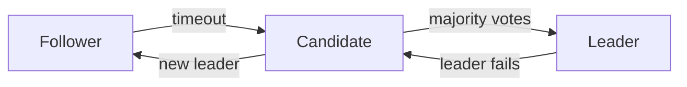
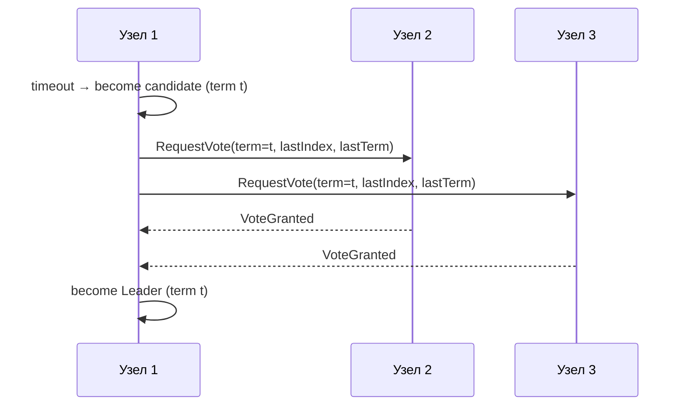
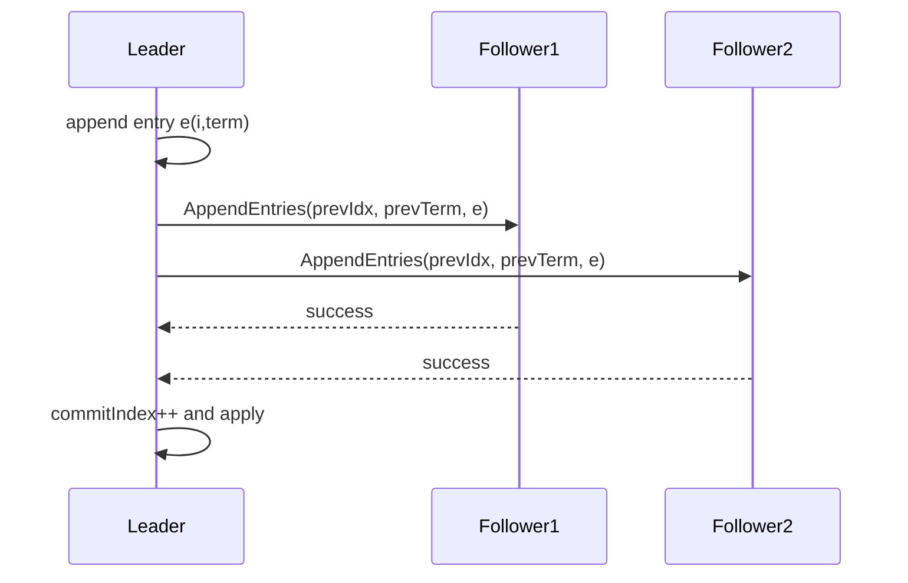

# Лекция 06. Raft подробно: как работает понятный консенсус

Raft — алгоритм консенсуса, который специально был спроектирован для простоты понимания и практической надёжности. В этой лекции мы пройдёмся по основным слоям протокола: роли и термы, механика выборов лидера, как лидер реплицирует лог и обеспечивает коммит, почему обеспечивается безопасность, а также как Raft решает проблему роста лога (снапшоты) и изменение состава кластера (joint consensus). В конце — практические задания для проверки понимания.

---

## 1) Роли и термы

Raft делит поведение узла на три понятные роли: follower, candidate и leader. Узлы проводят большую часть времени в состоянии follower — они пассивно ждут сообщений. Когда follower долго не получает от лидера heartbeat, он становится candidate и инициирует выборы. Лидер отвечает за обработку клиентских запросов и репликацию лога.

Ключевая идея — термы (terms). Терм — это логическая эпоха; каждый раз, когда начинается новый раунд выборов, увеличивается номер терма. Важное свойство: в одном терме не может быть более одного лидера — это обеспечивает простоту аргументов безопасности.

Чтобы уменьшить вероятность одновременных кандидатов и сплит‑вот (split vote), тайм‑ауты ожидания лидера рандомизируются в диапазоне. Это значит, что вероятность того, что два узла одновременно станут кандидатами, невысока; если же это случается, следующая волна тайм‑аутов/голосований обычно разрешит конфликт.

Диаграмма ролей (упрощённо):



Практический совет: при настройке Raft кластера выбирайте тайм‑ауты так, чтобы они были заметно длиннее средней сетевой задержки в кластере, но не слишком большие, чтобы выборы не задерживали реакцию на падение лидера.

---

## 2) Выбор лидера (RequestVote)

Когда follower не получает heartbeat от лидера в течение своего тайм‑аута, он переходит в состояние candidate и начинает выборы: увеличивает текущий term и посылает всем узлам RPC RequestVote с информацией о своём последнем логе (lastIndex, lastTerm). Узел отдаёт голос кандидату, если он ещё не голосовал в этом терме и лог кандидата не «устарел» по сравнению с его собственным (либо равен, либо новее).

Это условие «лог кандидата не старее» защищает от ситуаций, когда кандидат с неполным логом становится лидером и тем самым может «переписать» более новые записи. Только кандидат с актуальным логом может получить голоса большинства.

Если кандидат собирает голоса от большинства, он становится лидером в этом терме и начинает рассылать AppendEntries (heartbeat) для подтверждения лидерства.

Скетч таймлайна выборов:



Замечание про split vote: если несколько кандидатов одновременно стартуют и ни один не получает большинство, у всех истекает тайм‑аут и начинается новый раунд с увеличенным term; рандомизация тайм‑аутов обычно даёт преимущество одному из кандидатов.

---

## 3) Репликация лога (AppendEntries)

Когда узел стал лидером, он отвечает за приём клиентских команд: лидер добавляет команду в свой локальный лог и рассылает RPC AppendEntries каждому фолловеру, указывая prevLogIndex и prevLogTerm — ссылки на предыдущую запись, чтобы фолловер мог проверить соответствие.

Фолловер сравнивает prevLogIndex/prevLogTerm с собственным логом. Если они не совпадают, фолловер отвергает AppendEntries; лидер затем пробует «сдвинуть» индекс назад (decrement nextIndex для этой реплики) и повторяет попытку, пока не найдёт синхронизированный префикс. Этот механизм называется log matching и обеспечивает, что фолловер и лидер рано или поздно согласуют общий префикс лога.

Запись считается закоммиченной (и применённой к state machine) только после того, как она подтверждена большинством реплик (majority ack). Лидер поддерживает commitIndex и, когда видит, что для некоторого индекса получено подтверждение большинства и индекс в его логе принадлежит текущему терму, он повышает commitIndex и применяет записи к машине состояний, возвращая результат клиенту.

Иллюстрация согласования лога:



Практический нюанс: оптимизации часто хранят nextIndex/ matchIndex для каждой реплики, чтобы быстро находить нужную позицию при повторной отправке; также возможны пакетные AppendEntries для повышения пропускной способности.

---

## 4) Безопасность (safety)

Raft формально доказывает несколько ключевых свойств, которые дают уверенность в корректности системы:

- Log matching property: если два лог‑записи имеют одинаковый индекс и терм, то все записи до этого индекса одинаковы. Это обеспечивает согласованность префиксов логов.
- Leader completeness: если запись закоммичена в некотором терме t, то эта запись присутствует в логах всех будущих лидеров. Это свойство даёт гарантию, что коммит не будет «потерян» при смене лидеров.
- Election safety: в одном терме не может быть два лидера.

Комбинация этих свойств обеспечивает, что применённые команды в state machine сохраняют согласованное поведение, как если бы был один последовательный исполнитель команд.

---

## 5) Снимки и компакция

Логи со временем разрастаются — для кластера с долгим временем работы хранение всего лога становится непрактичным. Raft решает это с помощью снапшотов: лидер сохраняет снимок состояния машины состояний (state machine snapshot) и отбрасывает старый префикс лога до некоторого lastIncludedIndex/term.

Когда фолловер сильно отстаёт и его лог слишком короткий, лидер может передать ему снапшот вместо ряда AppendEntries; фолловер применит снапшот и установит свой lastIncludedIndex соответственно. Это значительно ускоряет восстановление и экономит диск.

Практические советы:

- Частота снапшотов зависит от скорости роста лога и доступного диска; слишком частые снапшоты увеличивают нагрузку на CPU/IO, слишком редкие — размер состояния и время восстановления.
- Реализации (etcd/consul) часто делают асинхронную компакцию и позволяют конфигурировать порог создания снапшота.

---

## 6) Смена состава кластера (joint consensus)

Изменение состава кластера (добавление/удаление узлов) опасно: если просто переключиться с конфигурации Old на New, может возникнуть состояние, когда разные подмножества узлов считают себя кворумом и безопасность нарушится. Raft использует стратегию joint consensus: переход проходит через промежуточную конфигурацию, в которой действуют оба набора реплик и кворум определяется как пересечение (majority) удовлетворяющее обоим наборам.

Идея: сначала применяют конфигурацию joint (Old+New), ждут, пока она стабилизируется и записи закоммитятся в joint, а затем переключаются на New. Такое двухэтапное переключение гарантирует, что не возникнет ситуации с двумя конкурентными кворумами.

Скетч совместного большинства:

```mermaid
flowchart LR
Old[Old config] --- Joint[Joint (Old+New)] --- New[New config]
```

Практический момент: изменение размера кластера увеличивает требования к кворуму и влияет на задержки; планируйте операции изменения состава вне пиковых нагрузок.

---

## Практика

1. Постройте симуляцию трёхузлового кластера и визуализируйте тайминги выборов при разных тайм‑аутах; покажите split vote и как рандомизация решает проблему.
2. Смоделируйте конфликт логов: создайте ситуацию, где два лидера (после разделения сети) имеют разные записи, и покажите, как при восстановлении связи происходит разрешение конфликтов через AppendEntries.
3. Реализуйте простую стратегию снапшотов: измерьте размер лога и выберите порог для создания снапшота; сравните время восстановления узла при наличии/отсутствии снапшотов.

---
