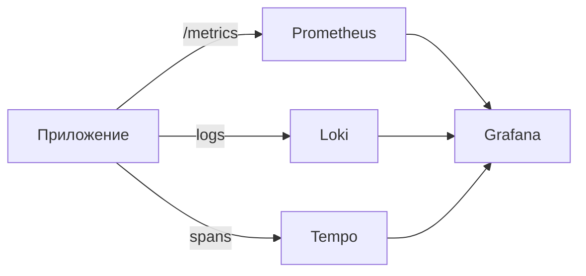

# Лекция 13. Наблюдаемость распределённых систем

Коротко: зачем и где применяется. Наблюдаемость помогает понять, что происходит внутри системы без остановки её работы: измерять, видеть и объяснять состояние и поведение сервисов. Это ключ к надёжности, производительности и быстрому поиску проблем в веб‑и микросервисных архитектурах.

## Результаты обучения

После лекции вы:

- объясните различие мониторинга и наблюдаемости; знаете 3 столпа: метрики, логи, трассировки;
- спроектируете базовую схему сбора телеметрии с Prometheus + Grafana + Loki + Tempo/OpenTelemetry;
- добавите метрики и логирование в приложение (Node.js/Express) и проверите дашборды;
- настроите алерт на SLO с «error budget» и поймёте, как выбирать пороги;
- разберётесь с частыми ошибками: «шумные алерты», «метрики без кардинальности», «нечитабельные логи».

## Пререквизиты

- Базовые знания HTTP, REST, контейнеров Docker.
- Умение запускать команды в Linux bash.
- Понимание, что такое сервис/микросервис и его зависимости.

## Введение: картина мира

Представьте автомобиль с приборной панелью. Без датчиков вы не знаете скорость, температуру, давление масла. В системах та же идея: наблюдаемость — «приборная панель» для сервисов. Она складывается из трёх потоков данных: метрики (числа), логи (события/тексты), трассировки (цепочки вызовов между сервисами). В реальных проектах именно эти данные позволяют:

- находить регрессии производительности до жалоб пользователей;
- подтверждать гипотезы «почему упал throughput»;
- безопасно выпускать релизы с включённым мониторингом и алертами.

## Основные понятия и терминология

- Наблюдаемость (Observability): способность системы «показывать» своё внутреннее состояние через внешнюю телеметрию.
- Метрики: агрегированные числовые ряды (счётчики, гистограммы, gauge). Пример: HTTP запросы/сек.
- Логи: структурированные записи событий. Пример: {ts, level, service, msg}.
- Трассировки (traces): цепочки вызовов и их длительность; показывают, где «узкое место».
- SLI/SLO/SLAs: индикатор качества/цель качества/договор. Пример SLO: 99.9% успешных запросов за 30 дней.
- Error budget: допустимый «запас ошибок» при заданном SLO. Если $SLO=99.9\%$, бюджет на ошибки: $0.1\%$ от времени/запросов.

## Пошаговое освоение темы

### Подтема 1. Архитектура наблюдаемости: компоненты и потоки

Определения:

- Pull‑мониторинг (Prometheus): система опрашивает экспортеры и таргеты; удобно для метрик.
- Push‑логирование (Loki/ELK): приложение отправляет логи; их индексируют и ищут.
- OpenTelemetry (OTel): стандарт SDK/протоколов для метрик, логов и трассировок.
- Визуализация: Grafana — дашборды, алерты; Tempo — хранилище трассировок.



Пояснение к примеру: диаграмма показывает три канала телеметрии из приложения в специализированные хранилища и общую визуализацию.

Проверка: при запуске стека вы должны видеть источники данных в Grafana (Prometheus/Loki/Tempo) и подключённые дашборды.

Типичные ошибки: смешивание разных временных рядов в одну метрику; отсутствие ярлыков (labels) для фильтрации; логирование «как попало» без JSON.

### Подтема 2. Метрики: типы, кардинальность, схемы

Определения:

- Counter: только растёт; для подсчёта событий.
- Gauge: может расти и падать; для текущих значений (температура, активные сессии).
- Histogram/Summary: распределение длительностей/размеров; p50/p90/p99.

Короткий вывод: выбирайте counter для событий, gauge для состояний, histogram для латентности. Следите за кардинальностью labels (должна быть ограничена).

Типичные ошибки: label с userId → «взрыв» кардинальности; смешивание статусов 2xx/4xx/5xx в одном ряду без метки status.

### Подтема 3. Логи: уровни, структура, контекст

Определения:

- Уровни: debug, info, warn, error.
- Структурированное логирование: JSON с полями ts, level, service, traceId.
- Корреляция: связывание логов с трассировками через traceId/spanId.

Короткий вывод: логируйте JSON, добавляйте минимум service, env, requestId/traceId, и не храните PII без маскировки.

Типичные ошибки: «шум» debug в проде, логирование секретов, отсутствие ротации.

### Подтема 4. Трассировки: путь запроса и узкие места

Определения:

- Span: отрезок работы (функция/вызов) с началом/концом.
- Trace: связка span’ов для одного запроса.
- Sampling: доля запросов, для которых включаем трассировку.

Короткий вывод: включите базовую трассировку входящих HTTP и внешних вызовов (DB, API), используйте sampling 1–10% на старте.

Типичные ошибки: слишком подробные spans → перегрузка; несогласованные имена операций.

### Подтема 5. Мини‑практика: приложение и метрики (Node.js/Express)

Определения:

- Express: минималистичный веб‑фреймворк для Node.js.
- prom-client: библиотека экспорта метрик в формате Prometheus.
- Endpoint /metrics: HTTP точка для чтения метрик Prometheus.

```js
// file: app.js
import express from 'express'
import client from 'prom-client'

const app = express()
const register = new client.Registry()
client.collectDefaultMetrics({ register })

const httpRequests = new client.Counter({
	name: 'http_requests_total',
	help: 'Total HTTP requests',
	labelNames: ['method', 'route', 'status']
})
register.registerMetric(httpRequests)

app.get('/health', (req, res) => {
	res.status(200).json({ ok: true })
})

app.get('/api', (req, res) => {
	// business logic ...
	res.status(200).json({ data: 'hello' })
})

app.use((req, res, next) => {
	const end = res.end
	res.end = function (...args) {
		httpRequests.inc({ method: req.method, route: req.path, status: res.statusCode })
		end.apply(this, args)
	}
	next()
})

app.get('/metrics', async (req, res) => {
	res.set('Content-Type', register.contentType)
	res.end(await register.metrics())
})

app.listen(3000, () => console.log('App on http://localhost:3000'))
```

Пояснение к примеру: добавлены счётчики HTTP запросов по методам/роутам/статусам и экспорт /metrics.

Проверка:

- запустите приложение, откройте http://localhost:3000/metrics и убедитесь, что есть ряды http_requests_total;
- сделайте 5 запросов к /api и проверьте рост counter с нужными labels.

Типичные ошибки: забыли проставить route → «/unknown»; рост кардинальности из‑за динамических маршрутов (нормализуйте пути).

### Подтема 6. Стек наблюдаемости: Docker Compose

Определения:

- Prometheus: сбор метрик по pull.
- Grafana: дашборды/алерты.
- Loki: сбор/поиск логов.
- Tempo: хранилище трассировок (опционально).

```yaml
# file: docker-compose.yml
version: '3.8'
services:
	prometheus:
		image: prom/prometheus:latest
		volumes:
			- ./prometheus.yml:/etc/prometheus/prometheus.yml:ro
		ports:
			- "9090:9090"

	grafana:
		image: grafana/grafana:latest
		ports:
			- "3001:3000"

	loki:
		image: grafana/loki:2.9.0
		command: -config.file=/etc/loki/local-config.yaml
		ports:
			- "3100:3100"

	tempo:
		image: grafana/tempo:latest
		ports:
			- "3200:3200"

	app:
		build: .
		environment:
			- NODE_ENV=development
		ports:
			- "3000:3000"
```

```yaml
# file: prometheus.yml
global:
	scrape_interval: 15s
scrape_configs:
	- job_name: 'app'
		static_configs:
			- targets: ['app:3000']
```

Пояснение к примеру: Prometheus опрашивает endpoint /metrics у сервиса app; Grafana/Loki/Tempo готовы к подключению как источники данных.

Проверка:

- запустите стек;
- откройте Prometheus (http://localhost:9090), выполните запрос rate(http_requests_total[5m]);
- добавьте источник данных в Grafana (http://localhost:3001) и постройте простой график.

Типичные ошибки: неверный порт/имя таргета; отсутствие /metrics; Prometheus не видит контейнер из‑за сети.

### Подтема 7. Алертинг и SLO: как не «звенеть» зря

Определения:

- SLI: измеряемый показатель (например, доля успешных HTTP 2xx).
- SLO: целевой порог (например, 99.9%).
- Error budget: $1 - SLO$; сколько ошибок «допустимо» за период.

```yaml
# file: alerting_rules.yml
groups:
	- name: app_slo
		rules:
			- alert: HighErrorRate
				expr: sum(rate(http_requests_total{status=~"5.."}[5m]))
							/
							sum(rate(http_requests_total[5m]))
							> 0.01
				for: 10m
				labels:
					severity: warning
				annotations:
					description: "Ошибка >1% за 10м превышает бюджет для SLO=99%"
```

Пояснение к примеру: простое правило «ошибки/все запросы» > 1%; в проде дополните фильтрами по важным маршрутам и нагрузке.

Проверка: искусственно создайте 5xx и убедитесь, что алерт «сработал» через 10 минут в Prometheus (или Alertmanager).

Типичные ошибки: сравнивать сырые счётчики вместо rate(); слишком короткие окна → «дребезг»; нет «for:» для устойчивости.

### Подтема 8. Трассировки с OpenTelemetry (базовая интеграция)

Определения:

- OTel SDK: библиотека для создания трассировок/метрик/логов.
- OTLP: протокол передачи в бэкенды (Tempo, Jaeger, etc.).
- Resource: атрибуты сервиса (service.name, version).

```js
// file: tracing.js
import { NodeSDK } from '@opentelemetry/sdk-node'
import { getNodeAutoInstrumentations } from '@opentelemetry/auto-instrumentations-node'
import { OTLPTraceExporter } from '@opentelemetry/exporter-trace-otlp-http'

const sdk = new NodeSDK({
	traceExporter: new OTLPTraceExporter({ url: 'http://tempo:4318/v1/traces' }),
	instrumentations: [getNodeAutoInstrumentations()]
})

sdk.start()
```

Пояснение к примеру: включаем авто‑инструментацию HTTP/Express и экспорт spans в Tempo по OTLP.

Проверка: после запросов к /api откройте Grafana → Tempo → найдите trace по service.name; проверьте длительности и ошибки.

Типичные ошибки: забыли стартовать SDK до импорта app; неправильный URL OTLP; firewall/сеть контейнеров.

## Разбор типичных ошибок и анти‑паттернов

- «Шумные» алерты: слишком чувствительные пороги, короткие окна, нет подавления дубликатов.
- Кардинальность меток: динамические значения в labels → дорогие запросы и память.
- «Логи без структуры»: трудно искать и агрегировать; переходите на JSON и уровни.
- «Слепая трассировка»: включили 100% sampling и завалили хранилище.
- «Нет контекста»: метрики/логи без env/service/версия.

## Вопросы для самопроверки

1. Чем наблюдаемость отличается от мониторинга?
2. Назовите три столпа наблюдаемости и приведите пример для каждого.
3. Когда выбрать counter, а когда gauge?
4. Зачем нужны histogram и квантили (p95/p99)?
5. Что такое кардинальность labels и почему это важно?
6. Как связать логи и трассировки?
7. Что такое SLI/SLO и как вычисляется error budget?
8. Почему правило алерта лучше писать через rate()?
9. Какие риски у 100% sampling трассировок?
10. Что делать, если алертов слишком много?
11. Какие источники данных подключают к Grafana?
12. Как проверить, что Prometheus «видит» ваш сервис?
13. Какие поля обязательны в структурированном логе?
14. Как нормализовать маршруты в метриках HTTP?
15. Когда использовать алерт «for:» и зачем?

## Краткий конспект (cheat‑sheet)

- Столпы: метрики (Prometheus), логи (Loki), трассировки (Tempo/OTel).
- Метрики: counter/gauge/histogram; labels с ограниченной кардинальностью.
- Логи: JSON, уровни, traceId; ротация и маскировка секретов.
- Трассировки: spans, traces, sampling 1–10% на старте.
- SLO: $error\_budget = 1 - SLO$; алерты через долю ошибок.
- Инструменты: Grafana для дашбордов и алертов; PromQL — rate(), sum(), by().

## Дополнительно

Глоссарий:

- PromQL: язык запросов к метрикам Prometheus.
- Label: метка временного ряда для фильтрации/агрегации.
- Sampling: выборка доли запросов для трассировки.
- SLI/SLO: индикатор/цель качества услуги.
- Error budget: допустимый объём ошибок при заданном SLO.
- OTLP: протокол передачи телеметрии OpenTelemetry.

Полезные ссылки:

- Документация Prometheus: [https://prometheus.io/docs](https://prometheus.io/docs)
- Документация Grafana: [https://grafana.com/docs](https://grafana.com/docs)
- OpenTelemetry: [https://opentelemetry.io/docs](https://opentelemetry.io/docs)

## Быстрая практика

```bash
# 1) Запуск стека
docker compose up -d

# 2) Проверка метрик
curl -s http://localhost:3000/metrics | head -n 20

# 3) Нагрузка для проверки алерта
for i in $(seq 1 200); do curl -s -o /dev/null -w "%{http_code}\n" http://localhost:3000/api; done

# 4) Запрос в Prometheus
xdg-open http://localhost:9090

# 5) Дашборд в Grafana
xdg-open http://localhost:3001
```

Ожидаемый результат: видите ряды http_requests_total, простые графики нагрузки, источники данных подключены в Grafana; при искусственных 5xx — срабатывание алерта по правилу.

Критерии качества: секции заполнены, примеры корректны, есть пояснение/проверка/ошибки к каждому примеру; форматирование — с пустыми строками и указанием языков в fenced‑блоках.

# Лекция 13. Наблюдаемость (Observability)
План:
- Логи, метрики, трассировка (OpenTelemetry)
- Дашборды/алерты, SRE практики
- Построение SLI/SLO
Практика: экспорт метрик и трейсов с OTel SDK.
Чтение: OTel docs; SRE book (Monitoring).

## Материал для лекции
- Observability vs мониторинг; три столпа и корреляция сигналов.
- Логи: структурирование, уровни, корреляция по trace/span ID.
- Метрики: типы (counter/gauge/histogram), RED/USE, перцентили.
- Трейсинг: спаны, контекст, семплирование, baggage.
- OpenTelemetry: SDK, Collector, экспортеры, семантические конвенции.
- Дашборды и алерты: SLI/SLO, burn rate, шумоподавление.
- Инцидент‑менеджмент: on-call, постмортемы, без вины.

### Практикум: быстрый старт Prometheus + Grafana
- Helm: kube-prometheus-stack (Prometheus, Alertmanager, Grafana, exporters).
- Экспонирование метрик в приложении: Prometheus client (например, prometheus-client для Python, prom-client для Node.js, promhttp для Go).
- Базовые SLI: доступность (success rate), задержка (p50/p95/p99), ошибка (5xx rate). Настройте 1–2 алерта на burn rate.

Пример экспозиции (Node.js/Express):
```js
import express from 'express';
import client from 'prom-client';
const app = express();
const reg = new client.Registry();
client.collectDefaultMetrics({ register: reg });
app.get('/metrics', async (req, res) => {
	res.set('Content-Type', reg.contentType);
	res.end(await reg.metrics());
});
app.listen(8080);
```
