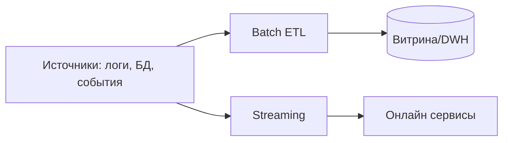
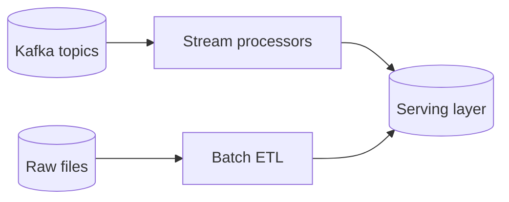

# Лекция 14. Обработка данных: batch и streaming

Коротко: зачем и где применяется. Batch — пакетная обработка больших объёмов с отложенным результатом (ETL, отчёты, обучение моделей). Streaming — потоковая обработка событий в реальном времени (мониторинг, антифрод, рекомендательные ленты). Вместе они покрывают разные SLA, стоимости и скорости.

## Результаты обучения

После лекции вы:

- объясните различия и компромиссы между batch и streaming;
- спроектируете простой конвейер ETL и поток событий с буферизацией/повторной доставкой;
- запустите минимальную практику: Kafka + Python consumer (stream) и Airflow/cron для batch;
- сформулируете SLI/SLO для задержки/точности и добавите метрики обработки;
- избежите частых ошибок: «двойная обработка», «неидемпотентные операции», «неправильная семантика времени».

## Пререквизиты

- Базовые знания Python/SQL.
- Понимание очередей/шины событий (Kafka, RabbitMQ) и cron.
- Навыки работы в Linux bash.

## Введение: картина мира

Представьте фабрику: batch — это ночная смена, когда свозят сырьё, а утром — готовый продукт. Streaming — конвейер, где детали поступают непрерывно и сразу собираются. В реальных проектах часто сочетают оба подхода: поток для оперативных сигналов, batch — для агрегатов, офлайн‑аналитики и обучения моделей.

## Основные понятия и терминология

- Batch processing: обработка накопленного объёма данных «пакетами» по расписанию или при поступлении.
- Streaming processing: непрерывная обработка событий с малой задержкой.
- ETL/ELT: Extract‑Transform‑Load (или Load‑Transform в DWH).
- Event time vs Processing time: время события (в источнике) и время обработки (в системе).
- Exactly‑once/At‑least‑once: гарантии доставки/обработки.
- Idempotency: повторный запуск операции не меняет результат.

## Пошаговое освоение темы

### Подтема 1. Паттерны конвейеров: от источников к витринам

Определения:

- Source: исходный поток/файл/БД.
- Transform: очистка, агрегирование, обогащение.
- Sink: целевое хранилище/витрина/шина событий.



Пояснение к примеру: два пути обработки — ночной ETL в витрины и онлайн поток для сервисов реального времени.

Проверка: для вашего проекта перечислите источники, нужные трансформации и целевые места хранения.

Типичные ошибки: смешивать офлайн и онлайн нагрузки в одном сервисе; отсутствие контракта схемы между этапами.

### Подтема 2. Batch: расписание, повторные запуски, идемпотентность

Определения:

- Cron: планировщик периодических задач в Unix.
- Airflow: оркестратор DAG задач с зависимостями.
- Checkpoint: контрольная точка для повторного запуска.

```bash
# file: etl.sh
set -euo pipefail
DATE=$(date -u +%Y-%m-%d)
INPUT=/data/raw/$DATE.jsonl
OUTPUT=/data/dwh/$DATE.parquet

jq -c '{user, ts, amount}' "$INPUT" \
 | python3 transform.py \
 | python3 load_to_parquet.py "$OUTPUT"
```

Пояснение к примеру: простой ETL по расписанию — чтение JSONL, трансформация и загрузка в Parquet; дата — ключ идемпотентности.

Проверка: создайте тестовый файл raw, запустите скрипт, убедитесь в наличии Parquet и верной схеме.

Типичные ошибки: отсутствие `set -euo pipefail`; перезапись выходного файла без версионирования; отсутствие «checkpoint» папок.

### Подтема 3. Streaming: Kafka и потребители

Определения:

- Kafka topic: лог событий по ключам.
- Consumer group: балансировка чтения среди потребителей.
- Offset: позиция чтения; коммиты для надёжности.

```python
# file: stream_consumer.py
from kafka import KafkaConsumer
import json, time

consumer = KafkaConsumer(
	'payments',
	bootstrap_servers=['localhost:9092'],
	group_id='etl-realtime',
	enable_auto_commit=False,
	value_deserializer=lambda v: json.loads(v.decode('utf-8'))
)

def process(evt):
	# идемпотентная обработка по event_id
	# ... write to sink avoiding duplicates ...
	pass

while True:
	for msg in consumer.poll(timeout_ms=500).values():
		for record in msg:
			try:
				process(record.value)
				consumer.commit()
			except Exception:
				time.sleep(0.1)
				# повтор — оставляем offset некоммиченным
```

Пояснение к примеру: ручной коммит offset после успешной обработки — достигаем semantics at‑least‑once с идемпотентностью на уровне sink.

Проверка: отправьте события в topic, убедитесь, что после ошибки и повтора данные не дублируются в хранилище.

Типичные ошибки: авто‑коммит до записи; нет ключа идемпотентности; отсутствие ретраев с backoff.

### Подтема 4. Семантика времени: окна, вода, задержки

Определения:

- Event time: время создания события в источнике.
- Processing time: время обработки в системе.
- Window: временное окно (tumbling/sliding/session).

```python
# file: windowing_example.py
import statistics

events = [
  {"ts": 1700000000, "value": 10},
  {"ts": 1700000030, "value": 12},
  {"ts": 1699999990, "value": 9} # позднее событие
]

def window(events, start, end):
	xs = [e["value"] for e in events if start <= e["ts"] < end]
	return {
	  "count": len(xs),
	  "p50": statistics.median(xs) if xs else None
	}

print(window(events, 1700000000, 1700000060))
```

Пояснение к примеру: концепция «окна по времени события»; поздние события могут попадать в прошлые окна — нужна политика доприёма (watermark).

Проверка: измените порядок поступления событий — убедитесь, что окно по event time стабильно.

Типичные ошибки: считать по processing time и терять поздние события; игнорировать худшие задержки.

### Подтема 5. Метрики обработки: задержка, пропускная способность, ошибки

Определения:

- Latency: время от получения до записи в sink.
- Throughput: событий/сек.
- Dead‑letter queue (DLQ): очередь для «плохих» сообщений.

```python
# file: metrics.py
import time
from prometheus_client import Counter, Histogram, start_http_server

processed = Counter('events_processed_total', 'Processed events', ['result'])
latency = Histogram('event_latency_seconds', 'Event processing latency')

start_http_server(8000)

def handle(evt):
	t0 = time.time()
	try:
		# ... process evt ...
		processed.labels(result='ok').inc()
	except Exception:
		processed.labels(result='error').inc()
	finally:
		latency.observe(time.time() - t0)
```

Пояснение к примеру: добавляем базовые метрики для потокового обработчика — счётчики результатов и гистограмму задержки.

Проверка: запросите `http://localhost:8000/metrics`, проверьте наличие рядов и изменение после генерации событий.

Типичные ошибки: бесконечные label значения (userId); использовать Summary вместо Histogram без необходимости.

### Подтема 6. Сводим вместе: гибридная архитектура

Определения:

- Lambda architecture: слой batch (истина), слой speed (быстрое приближение).
- Kappa architecture: обработка только потока с переигрыванием истории.
- Replay: повторное проигрывание событий для восстановления.



Пояснение к примеру: слой потоковой обработки формирует быстрые представления, а batch периодически «выравнивает» истину.

Проверка: для вашей предметной области определите, какие метрики/срезы нужны «сразу», а какие — раз в час/день.

Типичные ошибки: держать две независимые истины; забывать про переигрывание истории при смене логики.

## Разбор типичных ошибок и анти‑паттернов

- Неидемпотентные записи в sink → дубликаты.
- Авто‑коммит offset до фактической обработки.
- Смешивание event/processing time.
- «Вечные» ретраи без DLQ и лимитов.
- Бесконтрольная кардинальность меток в метриках.

## Вопросы для самопроверки

1. В чём ключевые отличия batch и streaming?
2. Когда выбрать ETL, а когда потоковую обработку?
3. Что такое idempotency и почему она важна?
4. Объясните exactly‑once vs at‑least‑once.
5. Чем event time отличается от processing time?
6. Какие типы окон существуют и где их применять?
7. Зачем нужен DLQ?
8. Какие метрики важны для потоковых конвейеров?
9. Как избежать дубликатов при повторах?
10. Что такое watermark и для чего он используется?
11. Когда имеет смысл Lambda architecture?
12. Как организовать повторное проигрывание (replay)?
13. Какие компромиссы у histogram vs summary?
14. Как влияют guarantees доставки на дизайн конвейера?
15. Почему важно ограничивать кардинальность labels?

## Краткий конспект (cheat‑sheet)

- Batch: расписание, идемпотентность, версии данных.
- Streaming: offsets, consumer groups, DLQ, метрики lat/throughput.
- Время: event vs processing; окна tumbling/sliding/session.
- Гарантии: at‑least‑once + идемпотентность; exactly‑once — дорого и зависит от стека.
- Архитектуры: Lambda/Kappa; replay для обновлений логики.

## Дополнительно

Глоссарий:

- ETL/ELT: извлечение‑трансформация‑загрузка.
- Topic: поток сообщений в Kafka.
- Offset: позиция чтения в топике.
- DLQ: очередь «плохих» сообщений.
- Watermark: порог доприёма поздних событий.
- Replay: воспроизведение истории событий.

Полезные ссылки:

- Apache Kafka docs: [https://kafka.apache.org/documentation](https://kafka.apache.org/documentation)
- Apache Airflow docs: [https://airflow.apache.org/docs/](https://airflow.apache.org/docs/)
- Stream processing patterns: [https://martin.kleppmann.com/papers/](https://martin.kleppmann.com/papers/)

## Быстрая практика

```bash
# 1) Запуск локальной Kafka (например, через Docker)
docker run -d --name kafka -p 9092:9092 bitnami/kafka:latest

# 2) Создание топика
docker exec kafka kafka-topics.sh --create --topic payments --bootstrap-server localhost:9092 --partitions 1 --replication-factor 1

# 3) Генерация событий
docker exec -i kafka kafka-console-producer.sh --topic payments --bootstrap-server localhost:9092 <<<'{"event_id":"1","amount":100}'

# 4) Запуск Python consumer
python3 stream_consumer.py

# 5) Метрики обработчика
curl -s http://localhost:8000/metrics | head -n 20
```

Ожидаемый результат: события принимаются обработчиком, оффсет коммитится только после успешной записи; метрики показывают рост счётчиков и значения задержки.

Критерии качества: все обязательные секции присутствуют, определения даны перед примерами, у каждого примера есть «Пояснение», «Проверка» и «Типичные ошибки», форматирование корректно.

# Лекция 14. Обработка данных: batch и streaming
План:
- MapReduce, Spark; stateful stream processing (Flink/Kafka Streams)
- Exactly-once в потоках, watermarking
- Lambda/Kappa архитектуры
Практика: простая job в Spark или поток в Kafka Streams.
Чтение: Kleppmann гл.11–12; Flink/Kafka Streams docs.

## Материал для лекции
- Batch vs streaming: задержка, консистентность, сквозные SLA.
- MapReduce и Spark: RDD/DataFrame, шаги job, shuffle.
- Потоки: окна (tumbling/sliding/session), event time vs processing time.
- Watermarks и поздние события; allowed lateness.
- Чекпоинты, state backends; exactly-once в Flink.
- Архитектуры Lambda vs Kappa: компромиссы и применимость.
- Интеграция со стримингом: Kafka/Flink connectors, CDC.
