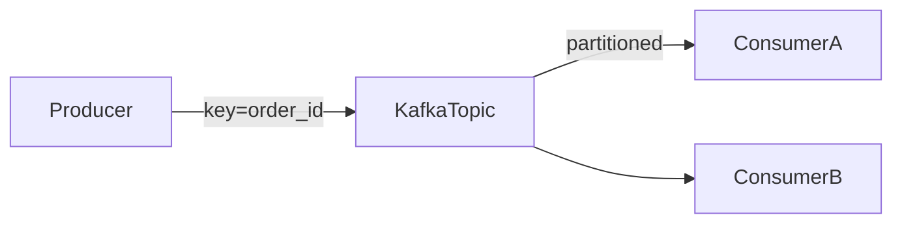
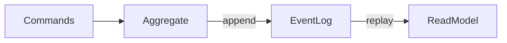

# Лекция 15. Событийные архитектуры (Event-Driven Architecture)

Коротко: зачем и где применяется. Событийная архитектура позволяет слабосвязанным сервисам реагировать на события вместо прямых синхронных вызовов. Это повышает масштабируемость, устойчивость и скорость разработки в микросервисах, IoT и веб‑платформах.

## Результаты обучения

После лекции вы:

- различите командно‑ориентированный (request/response) и событийный подход;
- спроектируете поток событий и контракты (схемы, ключи, версии);
- реализуете минимальный EDA‑пример: продюсер/консюмеры (Kafka/Node.js) и обработку событий;
- объясните «exactly‑once» vs «at‑least‑once», идемпотентность и ретраи;
- избежите типичных ошибок: «шумные топики», «неверсионированные события», «скрытая синхронность».

## Пререквизиты

- Базовые знания HTTP/REST, очередей и брокеров сообщений.
- Навыки работы с Docker и Linux bash.
- Желательно: опыт Node.js или Python.

## Введение: картина мира

Представьте городскую систему светофоров: каждый светофор реагирует на «события» (подъезд машины, пешеходная кнопка) и не знает деталей других перекрёстков. В системах так же: событие описывает факт (например, «заказ создан»), а заинтересованные сервисы реагируют. Это снижает связность, упрощает масштабирование и даёт гибкость для новых потребителей.

## Основные понятия и терминология

- Event: неизменяемый факт, произошедший в системе (например, OrderCreated). Не команда!
- Producer/Consumer: отправитель и получатель событий.
- Topic/Stream: лог событий по ключу; упорядоченность внутри партиции.
- Key/Partition: ключ шардирования, определяющий порядок в партиции.
- Schema/Versioning: контракт структуры события, эволюция без ломки потребителей.
- Idempotency: повторная обработка события не меняет результат.
- Eventual consistency: согласованность достигается со временем через обработку событий.

## Пошаговое освоение темы

### Подтема 1. Мотивы и компромиссы EDA

Определения:

- Слабая связность: сервисы взаимодействуют через события, а не прямые вызовы.
- Асинхронность: отправитель не ждёт результат, потребитель обрабатывает позже.
- Обратная совместимость: новые поля в событиях не ломают старых consumers.

Короткий вывод: EDA повышает масштабируемость и устойчивость, но добавляет сложность управления схемами, порядком и «после‑эффектами».

Типичные ошибки: превращать события в команды («пойди сделай»); жёсткая зависимость на момент доставки; отсутствие версионирования.

### Подтема 2. Моделирование событий и контрактов

Определения:

- Бизнес‑событие: доменный факт (OrderCreated, PaymentAuthorized).
- Техническое событие: низкоуровневый сигнал (LogAppended).
- Envelope: обёртка события с метаданными (event_id, ts, schema_version).

```json
{
	"event_type": "OrderCreated",
	"schema_version": 2,
	"event_id": "uuid-123",
	"ts": "2025-12-04T12:00:00Z",
	"payload": {
		"order_id": "o-42",
		"user_id": "u-7",
		"items": [{"sku": "A1", "qty": 2}],
		"total": 199.99,
		"currency": "USD"
	}
}
```

Пояснение к примеру: контракт события с типом, версией и уникальным идентификатором — позволяет безопасно эволюционировать и отслеживать.

Проверка: добавьте новое поле в payload (например, promo_code) и убедитесь, что старые потребители игнорируют неизвестное поле.

Типичные ошибки: менять смысл существующих полей; отсутствует schema_version; нет event_id → сложно обеспечить идемпотентность.

### Подтема 3. Топики, ключи и порядок

Определения:

- Partition: шард логов для горизонтального масштабирования.
- Key: определяет партицию; внутри партиции — порядок событий стабилен.
- Compaction: сжатие логов по ключу (Kafka compacted topics).



Пояснение к примеру: упорядоченность по ключу обеспечивает корректную обработку последовательности (создан → оплачен → отправлен).

Проверка: публикуйте события с одинаковым order_id — убедитесь, что консюмер видит их в правильном порядке.

Типичные ошибки: использовать случайные ключи и терять порядок; один «универсальный» топик для всего.

### Подтема 4. Мини‑практика: продюсер и консюмер (Node.js + Kafka)

Определения:

- kafkaJS: клиент Kafka для Node.js.
- Producer/Consumer: отправка и приём событий с контролем ключа и оффсетов.
- Idempotent sink: запись, устойчиво защищённая от дублей по event_id.

```js
// file: producer.js
import { Kafka } from 'kafkajs'

const kafka = new Kafka({ clientId: 'orders-app', brokers: ['localhost:9092'] })
const producer = kafka.producer()
await producer.connect()

await producer.send({
	topic: 'orders',
	messages: [{
		key: 'o-42',
		value: JSON.stringify({ event_type: 'OrderCreated', event_id: 'uuid-123', payload: { order_id: 'o-42' } })
	}]
})

await producer.disconnect()
```

```js
// file: consumer.js
import { Kafka } from 'kafkajs'

const kafka = new Kafka({ clientId: 'orders-worker', brokers: ['localhost:9092'] })
const consumer = kafka.consumer({ groupId: 'orders-group' })
await consumer.connect()
await consumer.subscribe({ topic: 'orders', fromBeginning: true })

const seen = new Set()
await consumer.run({
	eachMessage: async ({ message }) => {
		const evt = JSON.parse(message.value.toString())
		if (seen.has(evt.event_id)) return // идемпотентность по event_id
		seen.add(evt.event_id)
		// ... обработка payload ...
		console.log('handled', evt)
	}
})
```

Пояснение к примеру: минимальный продюсер/консюмер с ключом parititon и идемпотентной защитой от повторов.

Проверка:

- запустите локальную Kafka (Docker), создайте топик orders;
- выполните producer.js и убедитесь, что consumer.js получает событие один раз.

Типичные ошибки: отсутствие groupId → повторная обработка каждым инстансом; игнорирование ключа → потеря порядка.

### Подтема 5. Гарантии доставки и обработка ошибок

Определения:

- At‑least‑once: событие обработают ≥1 раз → требуются идемпотентные операции.
- At‑most‑once: событие обработают ≤1 раз → возможны потери.
- Exactly‑once: «ровно один раз» → дорого и редко доступно end‑to‑end.

```bash
# Политика ретраев (псевдокод)
max_retries=5
backoff=0.5 # seconds
for attempt in 1..max_retries:
	try process(event)
	catch error:
		sleep(backoff * attempt)
		if attempt==max_retries: send_to_dlq(event)
```

Пояснение к примеру: экспоненциальный backoff, лимит попыток, отправка в DLQ — базовые практики надёжной обработки.

Проверка: смоделируйте ошибку обработки и убедитесь, что событие попадает в DLQ после лимита.

Типичные ошибки: бесконечные ретраи; нет DLQ; «exactly‑once» заявлен, но не реализован в хранилище.

### Подтема 6. Событийный сорсинг и CQRS (кратко)

Определения:

- Event Sourcing: состояние системы — результат воспроизведения лога событий.
- CQRS: разделение команд (изменения) и запросов (чтение).
- Snapshot: периодическая «снимок» для ускорения восстановления.



Пояснение к примеру: лог событий — «истина», read‑модели строятся переигрыванием; команды порождают новые события.

Проверка: для небольшой доменной области опишите последовательность событий и как из них строится read‑модель.

Типичные ошибки: хранить состояние как «истину» и терять историю; смешивать команды и события.

## Разбор типичных ошибок и анти‑паттернов

- «Командные» события: события, которые требуют немедленного действия от конкретного сервиса.
- Отсутствие версионирования схем: ломаются старые потребители.
- Перегруженные топики: всё в один поток → сложная фильтрация и масштабирование.
- Скрытая синхронность: ожидание ответа «здесь и сейчас» от потребителя.
- Нет идемпотентности: дубли при повторах/ретраях.

## Вопросы для самопроверки

1. Чем событие отличается от команды?
2. Как выбрать ключ партиционирования?
3. Зачем нужны schema_version и event_id?
4. Что даёт compaction и когда он полезен?
5. Объясните различия at‑least‑once, at‑most‑once и exactly‑once.
6. Как обеспечить идемпотентность обработки?
7. Что такое DLQ и когда его использовать?
8. Чем EDA помогает масштабируемости и устойчивости?
9. Какие риски у «единого большого топика»?
10. Что означает eventual consistency и как её учитывать в дизайне?
11. В чём идея Event Sourcing и CQRS?
12. Как эволюционировать схему события без «ломки»?
13. Какие метаданные стоит включать в envelope события?
14. Как тестировать поток событий и потребителей?
15. Что такое «скрытая синхронность» и как её избегать?

## Краткий конспект (cheat‑sheet)

- EDA: события вместо команд, слабая связность, асинхронность.
- Контракты: envelope (type, version, id, ts), эволюция схем.
- Kafka: topics, partitions, keys, compaction; groupId — кто обрабатывает.
- Гарантии: чаще at‑least‑once + идемпотентность; exactly‑once — ограниченно.
- Ошибки: без DLQ, без версионирования, потеря порядка, единый топик.

## Дополнительно

Глоссарий:

- Envelope: обёртка метаданных события.
- Compaction: сжатие топика по ключу для последних значений.
- DLQ: очередь «плохих» сообщений.
- CQRS: разделение команд и запросов.
- Event Sourcing: модель состояния как сумма событий.

Полезные ссылки:

- Kafka docs: [https://kafka.apache.org/documentation](https://kafka.apache.org/documentation)
- Event Sourcing/CQRS: [https://martinfowler.com/eaaDev/EventSourcing.html](https://martinfowler.com/eaaDev/EventSourcing.html)
- Avro/Schema Registry: [https://docs.confluent.io/platform/current/schema-registry/index.html](https://docs.confluent.io/platform/current/schema-registry/index.html)

## Быстрая практика

```bash
# 1) Запуск Kafka (Docker)
docker run -d --name kafka -p 9092:9092 bitnami/kafka:latest

# 2) Создание топика
docker exec kafka kafka-topics.sh --create --topic orders --bootstrap-server localhost:9092 --partitions 3 --replication-factor 1

# 3) Запуск consumer
node consumer.js

# 4) Отправка события
node producer.js

# 5) Проверка порядка
for i in $(seq 1 5); do node producer.js; done
```

Ожидаемый результат: события попадают в соответствующие партиции по ключу, консюмер обрабатывает один раз в группе; при повторах идемпотентность исключает дубликаты.

Критерии качества: все обязательные секции присутствуют; определения перед примерами; у примеров есть «Пояснение», «Проверка», «Типичные ошибки»; корректные fenced‑блоки и форматирование.

# Лекция 15. Событийные архитектуры
План:
- Event Sourcing и CQRS
- CDC (Debezium), outbox pattern
- Последовательность событий и реконструкция состояния
Практика: прототип outbox + потребитель.
Чтение: Event Sourcing/CQRS статьи, Debezium docs.

## Материал для лекции
- Event Sourcing: лог событий как источник истины, immutable append‑only.
- Команды, события, проекции; реконструкция состояния.
- CQRS: разделение write/read моделей, независимая оптимизация.
- Идемпотентные обработчики, replays и миграции схем событий.
- Порядок событий и дедупликация; ключи идемпотентности.
- CDC с Debezium: захват изменений БД, схемы и совместимость.
- Transactional Outbox/Inbox: гарантированная доставка между БД и шиной.
