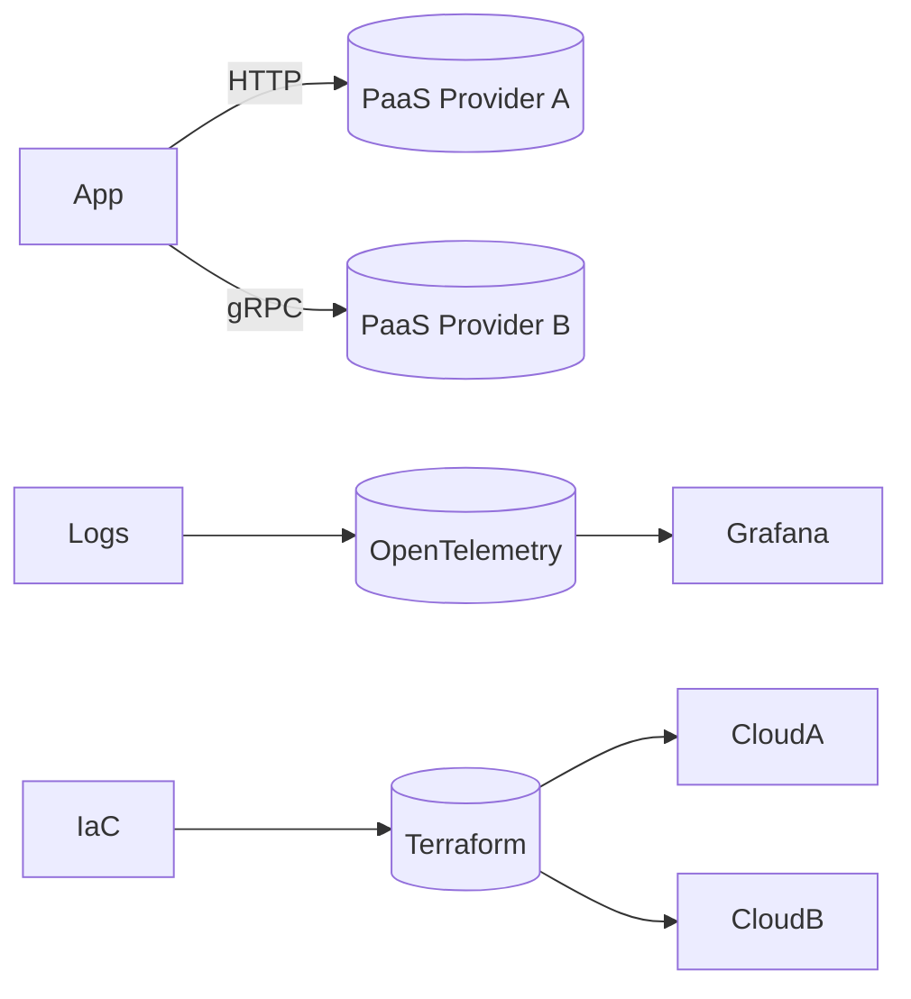

# Лекция 16. Облачные модели и провайдеры

Коротко: зачем и где применяется. Облака позволяют быстро получать инфраструктуру и платформы «как сервис» (IaaS/PaaS/FaaS/SaaS), платить за использование, масштабироваться и повышать надёжность. Разберём модели, ключевые сервисы трёх крупных провайдеров (AWS, Azure, GCP), безопасность и стоимость.

## Результаты обучения

После лекции вы:

- различите IaaS, PaaS, FaaS, SaaS и поймёте, когда что выбирать;
- разберёте базовые сервисы: вычисление, сеть, хранилища, базы данных, очереди, наблюдаемость;
- запустите минимальную практику: Terraform для IaaS, контейнер в PaaS, функция в FaaS (локально/эмуляторы);
- оцените стоимость и SLO, настроите базовую безопасность (IAM, ключи, сети);
- избежите частых ошибок: «твёрдый» привязка к провайдеру, открытые S3/Storage, неконтролируемая стоимость.

## Пререквизиты

- Базовые знания сетей, контейнеров Docker, CI/CD.
- Навык работы в Linux bash.
- Понимание IaC (Terraform) — приветствуется.

## Введение: картина мира

Аналогия: аренда квартиры vs покупка дома. IaaS — «аренда жилья» (виртуалки/сети/диски), PaaS — «арендованный дом с обслуживанием» (управляемые платформы), FaaS — «такси по кнопке» (функции по событию), SaaS — «готовый сервис» (почта, CRM). В проектах часто смешивают: ядро на PaaS/FaaS, тяжёлые части — IaaS, бизнес‑инструменты — SaaS.

## Основные понятия и терминология

- IaaS: инфраструктура как сервис (VM, сети, блок‑хранилища).
- PaaS: платформа как сервис (БД, контейнерные платформы, очереди).
- FaaS/Serverless: функции по событиям, биллинг по факту выполнения.
- SaaS: готовые приложения (почта, аналитика, APM).
- IAM: управление идентификациями и доступами (ролями/политиками).
- Region/Zone: география и зоны доступности.
- SLA/SLO: договор/цели доступности. $error\_budget = 1 - SLO$.

## Пошаговое освоение темы

### Подтема 1. Портфель сервисов: AWS/Azure/GCP

Определения:

- Compute: EC2 (AWS), VM (Azure), Compute Engine (GCP).
- Containers: ECS/EKS, Azure Container Apps/AKS, GKE.
- Functions: Lambda, Azure Functions, Cloud Functions.
- Storage: S3, Blob Storage, Cloud Storage.
- DB: RDS/Aurora/DynamoDB, Azure SQL/Cosmos DB, Cloud SQL/Spanner/Firestore.
- Messaging: SQS/SNS/Kinesis, Service Bus/Event Grid, Pub/Sub.

Короткий вывод: у провайдеров есть аналогичные классы сервисов; выбирайте по региону, цене, зрелости и интеграциям.

Типичные ошибки: полагать, что названия равны возможностям; игнорировать ограничения регионов и квоты.

### Подтема 2. IaaS c Terraform: минимальная ВМ и сеть

Определения:

- Terraform: IaC‑инструмент для описания и создания ресурсов.
- Provider: плагин для работы с конкретным облаком.
- State: состояние развёрнутых ресурсов (не теряйте!).

```hcl
# file: main.tf (псевдопример, провайдер замените на выбранный)
terraform {
	required_providers { aws = { source = "hashicorp/aws", version = ">= 5.0" } }
}

provider "aws" {
	region = "eu-central-1"
}

resource "aws_vpc" "main" { cidr_block = "10.0.0.0/16" }
resource "aws_subnet" "app" { vpc_id = aws_vpc.main.id cidr_block = "10.0.1.0/24" }
resource "aws_security_group" "web" {
	vpc_id = aws_vpc.main.id
	ingress { from_port=80 to_port=80 protocol="tcp" cidr_blocks=["0.0.0.0/0"] }
}
resource "aws_instance" "vm" {
	ami = "ami-xxxxxxxx" # выберите актуальный AMI
	instance_type = "t3.micro"
	subnet_id = aws_subnet.app.id
	vpc_security_group_ids = [aws_security_group.web.id]
}
```

Пояснение к примеру: создаём базовую сеть, группу безопасности и ВМ. Паттерн одинаков для Azure/GCP с соответствующими ресурсами.

Проверка: выполните `terraform init/plan/apply` (при наличии учётки), убедитесь в создании ВМ и доступности порта 80.

Типичные ошибки: хранить state в локальном файле; открытый доступ 0.0.0.0/0 без необходимости; забытый `destroy`.

### Подтема 3. PaaS: контейнерное приложение без ВМ

Определения:

- PaaS контейнеров: управляемые рантаймы (Azure Container Apps, Cloud Run, App Runner).
- Auto‑scaling: масштабирование по метрикам (CPU, запросы/сек).
- Build & Deploy: образ/пакет → платформа разворачивает.

```yaml
# file: container.yaml (Cloud Run/пример высокого уровня)
service: web
image: gcr.io/PROJECT/web:latest
env:
	- name: NODE_ENV
		value: production
scaling:
	min: 0
	max: 10
concurrency: 80
```

Пояснение к примеру: декларативный запуск контейнера на управляемой платформе; провайдер следит за масштабированием и доступностью.

Проверка: задеплойте образ в выбранный PaaS (эмулятор/локальный режим, если доступен), проверьте автоскейл под нагрузкой.

Типичные ошибки: хранить секреты в переменных окружения без менеджера секретов; неправильная настройка concurrency.

### Подтема 4. FaaS: функция по событию

Определения:

- Trigger: источник события (HTTP, очередь, таймер).
- Cold start: задержка при первом запуске инстанса.
- Timeout: максимальное время выполнения функции.

```python
# file: handler.py (AWS Lambda совместимый стиль)
def handler(event, context):
		order = event.get('order_id')
		# ... обработка ...
		return { 'statusCode': 200, 'body': f'Handled {order}' }
```

Пояснение к примеру: минимальный обработчик события; переносимая концепция для Azure Functions/Cloud Functions.

Проверка: вызовите локально через эмулятор/тест; измерьте задержку и таймаут.

Типичные ошибки: тяжёлые зависимости → долгий cold start; отсутствие ограничений по времени/памяти.

### Подтема 5. Стоимость, SLO и безопасность

Определения:

- Pay‑as‑you‑go: плата за фактическое использование.
- Reserved/Spot: модели экономии для VM.
- IAM Policy: документ прав доступа для субъекта/сервиса.

```bash
# Мини‑чек‑лист аудита
echo "1) Закрыты ли публичные бакеты?"
echo "2) Настроены ли минимально необходимые IAM роли?"
echo "3) Ограничены ли входы по IP/сетям?"
echo "4) Есть ли бюджет/алерты по стоимости?"
echo "5) Логи/метрики собираются и видны?"
```

Пояснение к примеру: базовые вопросы аудита аккаунта в облаке для снижения рисков и расходов.

Проверка: включите бюджет/алерты на аккаунте; проверьте IAM политики и закрытость хранилищ.

Типичные ошибки: отсутствие бюджетов; «широкие» роли типа admin для сервисов; открытые хранилища.

### Подтема 6. Мульти‑облако и переносимость

Определения:

- Vendor lock‑in: зависимость от уникальных сервисов провайдера.
- Abstraction: вынос логики/данных на переносимые уровни (Kubernetes, Terraform, OpenTelemetry).
- Data gravity: сложность перемещения больших объёмов данных.



Пояснение к примеру: переносимость через стандарты и абстракции; наблюдаемость и IaC помогают поддерживать мульти‑облако.

Проверка: выделите уникальные сервисы провайдера и замените их на переносимые аналоги, где возможно.

Типичные ошибки: строить «универсальный» слой слишком рано; игнорировать стоимость выхода/сети.

## Разбор типичных ошибок и анти‑паттернов

- «Всегда IaaS»: игнорировать зрелые PaaS/FaaS и переплачивать за операционные задачи.
- Жёсткий lock‑in на уникальные сервисы без плана выхода.
- Плохой IAM: широкие права и секреты в коде.
- Отсутствие бюджетов и алертов стоимости.
- Игнорирование регионов/зон и отказоустойчивости.

## Вопросы для самопроверки

1. Чем отличаются IaaS, PaaS, FaaS и SaaS?
2. Какие компромиссы между PaaS и IaaS?
3. Что такое IAM и зачем он нужен?
4. Как считать error budget для SLO доступности?
5. Чем опасен vendor lock‑in?
6. Что такое cold start и как его минимизировать?
7. Зачем нужны бюджеты/алерты по стоимости?
8. Какие базовые сервисы входят в портфель облаков?
9. Как повысить переносимость между облаками?
10. Какие риски у открытых облачных хранилищ?
11. Что выбрать для простого API: PaaS или FaaS?
12. Когда имеет смысл Reserved/Spot инстансы?
13. Что хранить в Terraform state и как его защищать?
14. Как организовать наблюдаемость в мульти‑облаке?
15. Какие параметры важны при выборе региона?

## Краткий конспект (cheat‑sheet)

- Модели: IaaS/PaaS/FaaS/SaaS — выбирайте по задачам, SLO, бюджету.
- Базовые сервисы: compute, storage, DB, messaging, observability.
- Безопасность: IAM минимальные права, секреты — в менеджере, сети — закрыты.
- Стоимость: бюджеты/алерты, pay‑as‑you‑go, Reserved/Spot.
- Переносимость: Kubernetes, Terraform, OpenTelemetry; избегайте lock‑in.

## Дополнительно

Глоссарий:

- IAM: управление доступом в облаке.
- Region/Zone: география и зоны доступности.
- Billing: модели оплаты.
- Serverless: выполнение функций по событию.
- IaC: инфраструктура как код.

Полезные ссылки:

- AWS docs: [https://docs.aws.amazon.com](https://docs.aws.amazon.com)
- Azure docs: [https://learn.microsoft.com/azure](https://learn.microsoft.com/azure)
- GCP docs: [https://cloud.google.com/docs](https://cloud.google.com/docs)
- Terraform: [https://developer.hashicorp.com/terraform/docs](https://developer.hashicorp.com/terraform/docs)

## Быстрая практика

```bash
# 1) Инициализация Terraform (без учётки — локальная проверка синтаксиса)
terraform init && terraform validate

# 2) План развёртывания
terraform plan

# 3) Контейнер в PaaS (локальный аналог: Docker run)
docker run -d -p 8080:80 nginx:alpine

# 4) Функция локально
python3 -c "import handler; print(handler.handler({'order_id':'o-1'}, {}))"

# 5) Чек стоимость/безопасность
echo 'Проверьте бюджеты и IAM роли в аккаунте'
```

Ожидаемый результат: Terraform валидируется, локально запускается контейнер, функция отрабатывает; аудит безопасности/стоимости выполнен по чек‑листу.

Критерии качества: все обязательные секции присутствуют; определения перед примерами; у примеров есть «Пояснение», «Проверка», «Типичные ошибки»; корректные fenced‑блоки и форматирование.

# Лекция 16. Облачные модели и провайдеры
План:
- IaaS/PaaS/SaaS; public/private/hybrid/multi-cloud
- Shared Responsibility Model
- Базовые сервисы: compute, storage, network, managed DB
Практика: сравнение сервисов 2 провайдеров.
Чтение: AWS/Azure/GCP overview, Well-Architected (обзор).

## Материал для лекции
- Модели: IaaS/PaaS/SaaS, публичное/частное/гибрид/мульти‑облако.
- Shared Responsibility: границы ответственности клиента/провайдера.
- Compute: VM, контейнеры, serverless; когда что выбирать.
- Хранилища: объектное/блочное/файловое; классы и SLA долговечности.
- Сети: VPC/VNet, peering, egress‑стоимость, NAT, GW.
- Управляемые БД: плюсы/минусы, ограничения и версии.
- Регионы/зоны, паттерны HA; landing zone и базовые guardrails.
