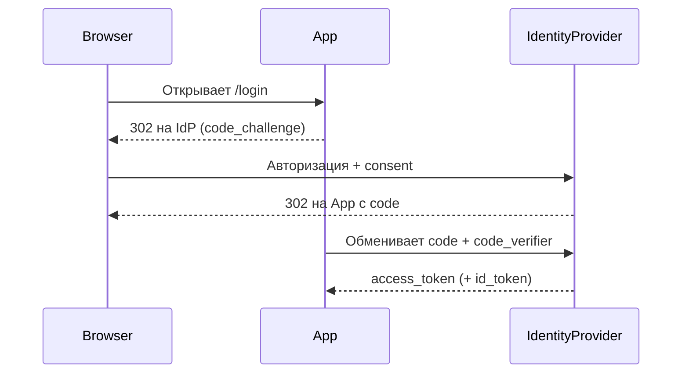
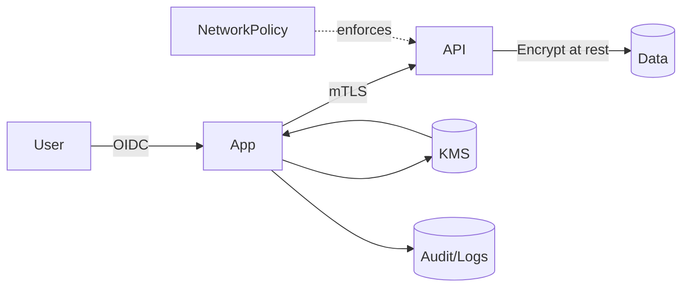

# Лекция 23. Безопасность в РС и облаках

Зачем: распределенные системы и облака увеличивают поверхность атаки. Наша цель — построить «слоеную» защиту: идентификация и доступ, шифрование, сеть, секреты, мониторинг, комплаенс.

## Результаты обучения

- Понимать базовые принципы безопасности в распределенных системах и облаках (Zero Trust, least privilege, defense-in-depth).
- Настраивать AuthN/AuthZ для сервисов: OIDC/OAuth2 (PKCE) и mTLS между сервисами.
- Управлять секретами и ключами с помощью KMS/Vault; применять envelope encryption и ротацию.
- Применять сетевые политики и базовые контролы в Kubernetes/облаке.
- Выполнять threat modeling (STRIDE) и настраивать аудит/комплаенс события.

## Пререквизиты

- Базовый опыт веб/сервисной разработки.
- Docker Desktop (Windows) и Windows PowerShell.
- Понимание HTTP/TLS, знакомство с Kubernetes (базово) приветствуется.

## Введение: «картина мира»

Безопасность — это баланс рисков и стоимости. В облаках архитектура динамична: краткоживущие инстансы, auto‑scaling, сервисы сторонних провайдеров. Отдельные меры защиты не работают изолированно: требуется связка контрольных точек «от пользователя до базы данных».

Ментальная модель — «луковица» слоев защиты:

- Идентификация и доступ (IAM, OIDC/OAuth2, mTLS).
- Сеть (микросегментация, NetworkPolicy, firewall, WAF).
- Данные (шифрование at‑rest/in‑transit, KMS, управление ключами).
- Секреты (хранение, ротация, минимизация распространения).
- Наблюдаемость и реакция (логи, метрики, алерты, аудит, IR‑плейбуки).

## Основные понятия и терминология

- AuthN/AuthZ: аутентификация/авторизация; токены доступа; scopes/claims.
- OIDC/OAuth2: протоколы авторизации/идентификации; PKCE для публичных клиентов.
- mTLS: взаимная аутентификация сервис‑сервис по сертификатам X.509; доверенные корни.
- KMS: сервис управления ключами; envelope encryption; ротация ключей.
- STRIDE: модель угроз (Spoofing, Tampering, Repudiation, Information disclosure, Denial of service, Elevation of privilege).
- Least privilege/Zero Trust: минимально необходимые права; не доверяй по умолчанию.

## Пошаговое освоение темы

### Шаг 1. OIDC Authorization Code + PKCE (кратко)

Определения:

- OIDC: слой идентификации поверх OAuth2, возвращающий `id_token`.
- PKCE: расширение OAuth2 для публичных клиентов (code_verifier/challenge).
- `access_token`/`id_token`: доступ к API и удостоверение пользователя.



Пояснение к примеру:

- PKCE защищает публичных клиентов: `code_verifier` доказывает право на код.
- `id_token` — удостоверение пользователя; `access_token` — для доступа к API.

Проверка:

- Воспроизведите flow в тестовом окружении IdP (например, Keycloak/Okta/Auth0).

Типичные ошибки:

- Игнорируют `state`/`nonce` и уязвимы к CSRF/replay.
- Сохраняют токены в `localStorage` (XSS‑риск); используйте `httpOnly`‑cookie.

### Шаг 2. mTLS между сервисами (Node.js + OpenSSL demo)

Определения:

- mTLS: взаимная аутентификация клиента и сервера по сертификатам X.509.
- CA/chain: корневой центр сертификации и цепочка доверия.
- Ротация сертификатов: плановая смена ключей/сертификатов до истечения срока.

Создадим самоподписанный корень и сертификаты для клиента и сервера.

```powershell
# Создать корневой ключ и сертификат (CA)
openssl genrsa -out ca.key 4096
openssl req -x509 -new -nodes -key ca.key -sha256 -days 365 -subj "/CN=Demo CA" -out ca.crt

# Серверный ключ/CSR/сертификат
openssl genrsa -out server.key 2048
openssl req -new -key server.key -subj "/CN=server.local" -out server.csr
openssl x509 -req -in server.csr -CA ca.crt -CAkey ca.key -CAcreateserial -out server.crt -days 180 -sha256

# Клиентский ключ/CSR/сертификат
openssl genrsa -out client.key 2048
openssl req -new -key client.key -subj "/CN=client" -out client.csr
openssl x509 -req -in client.csr -CA ca.crt -CAkey ca.key -out client.crt -days 180 -sha256
```

Сервер с обязательным mTLS:

```js
import https from 'https'
import fs from 'fs'

const options = {
	key: fs.readFileSync('server.key'),
	cert: fs.readFileSync('server.crt'),
	ca: fs.readFileSync('ca.crt'),
	requestCert: true,
	rejectUnauthorized: true
}

https.createServer(options, (req, res) => {
	if (!req.client.authorized) {
		res.writeHead(401)
		return res.end('client cert required')
	}
	res.end('ok')
}).listen(8443)
```

Клиент с клиентским сертификатом:

```js
import https from 'https'
import fs from 'fs'

https.get({
	hostname: 'localhost',
	port: 8443,
	path: '/',
	ca: fs.readFileSync('ca.crt'),
	cert: fs.readFileSync('client.crt'),
	key: fs.readFileSync('client.key')
}, (res) => {
	res.on('data', d => process.stdout.write(d))
})
```

Пояснение к примеру:

- Сервер требует клиентский сертификат (`requestCert: true`) и доверяет только цепочке от `ca.crt`.
- Клиент предъявляет `client.crt/key` и проверяет сервер по `ca.crt`.

Проверка:

- Без клиентского сертификата сервер вернет 401. С валидным — `ok`.

Типичные ошибки:

- Смешение тестового и боевого CA; отсутствие ротации.
- Отключение проверки (`rejectUnauthorized: false`).

### Шаг 3. Kubernetes NetworkPolicy (микросегментация)

Определения:

- NetworkPolicy: правило на уровне кластера, ограничивающее сетевые соединения между pod`ами.
- Default‑deny: политика по умолчанию, запрещающая весь трафик, кроме явно разрешенного.
- CNI: сетевой плагин Kubernetes, реализующий поддержку политик.

```yaml
apiVersion: networking.k8s.io/v1
kind: NetworkPolicy
metadata:
	name: allow-frontend-to-api
	namespace: demo
spec:
	podSelector:
		matchLabels:
			app: api
	policyTypes:
		- Ingress
	ingress:
		- from:
				- podSelector:
						matchLabels:
							app: frontend
			ports:
				- protocol: TCP
					port: 8080
```

Пояснение к примеру:

- Разрешаем трафик на pod`ы `app=api` только с pod`ов `app=frontend` на порт 8080.
- Требуется CNI, поддерживающий NetworkPolicy (Calico/Cilium и др.).

Проверка:

- `kubectl exec` из pod`а frontend — запрос на API проходит.
- Из другого pod`а без метки — соединение блокируется.

Типичные ошибки:

- Нет «default‑deny» политики — остаются неявные разрешения.
- Использование широких селекторов, случайное открытие.

### Шаг 4. Envelope encryption с KMS (концепт + пример)

Определения:

- KMS: менеджер ключей для генерации/хранения/ротации CMK.
- Envelope encryption: шифрование данных data‑key и шифрование самого data‑key CMK.
- AEAD: режимы аутентифицированного шифрования (например, AES‑GCM).

Схема: KMS хранит и защищает master key (CMK). Данные шифруются data‑key, который шифруется (enveloped) CMK.

```python
# псевдокод: генерация data-key и шифрование
from Crypto.Cipher import AES
import os

data_key = os.urandom(32)  # запрос к KMS generate_data_key в реальности
cipher = AES.new(data_key, AES.MODE_GCM)
ciphertext, tag = cipher.encrypt_and_digest(b'secret payload')
encrypted_data_key = b'KMS:encrypted(data_key)'

package = {
	'ciphertext': ciphertext,
	'nonce': cipher.nonce,
	'tag': tag,
	'edk': encrypted_data_key
}
```

Пояснение к примеру:

- Приложение не хранит master key; при расшифровке запрашивает KMS для расшифровки `edk`.
- Ротация CMK не требует перешифровки данных — достаточно расшифровать `edk` новым ключом.

Проверка:

- Смените CMK (в тестовом KMS) и убедитесь, что данные читаются после повторной расшифровки `edk`.

Типичные ошибки:

- Хранение открытого data‑key на диске/в логах.
- Использование ECB/неаутентифицированных режимов шифрования.

### Шаг 5. Секреты: Vault/Kubernetes Secrets и ротация

Определения:

- Kubernetes Secret: объект для хранения конфиденциальных данных (base64, требует шифрования at rest).
- Vault: система динамических секретов с lease/TTL и отзывом.
- Encryption at rest: шифрование данных на диске (etcd/KMS).

```yaml
apiVersion: v1
kind: Secret
metadata:
	name: db-creds
	namespace: demo
type: Opaque
data:
	username: ZGJ1c2Vy
	password: c3VwZXJzZWNyZXQ=
```

Пояснение к примеру:

- Kubernetes Secrets — это base64‑кодированные значения; используйте encryption at rest (KMS) для etcd.
- Для динамических секретов применяйте Vault (lease, TTL) и sidecar/инициализацию.

Проверка:

- Включите `EncryptionConfiguration` в API‑сервере; проверьте, что etcd хранит шифротекст.

Типичные ошибки:

- Коммит секретов в Git; отсутствие RBAC ограничений на `secrets`.
- Длительные TTL у динамических секретов без ротации.

### Шаг 6. Политики доступов (пример IAM‑политики в стиле JSON)

Определения:

- IAM: управление идентичностями и доступами, политики «кто что может».
- Least privilege: минимально необходимые права для выполнения задач.
- Explicit deny: явный запрет, имеющий приоритет над разрешением.

```json
{
	"Version": "2012-10-17",
	"Statement": [
		{
			"Effect": "Allow",
			"Action": ["s3:GetObject"],
			"Resource": ["arn:cloud:storage:::demo-bucket/public/*"]
		},
		{
			"Effect": "Deny",
			"Action": ["s3:DeleteObject"],
			"Resource": ["arn:cloud:storage:::demo-bucket/*"]
		}
	]
}
```

Пояснение к примеру:

- Разрешаем только чтение из `public/`, явно запрещаем удаление во всем бакете.
- Принцип наименьших привилегий; используйте условия (IP, VPC, MFA) где доступно.

Проверка:

- Тестируйте политикой симулятором провайдера; убедитесь, что запрет работает сильнее разрешения.

Типичные ошибки:

- Широкие `Action: "*"` и `Resource: "*"` в проде.
- Отсутствие условий и ограничений по окружению.

### Шаг 7. Аудит и комплаенс: что логировать

Определения:

- Аудит: фиксирование значимых событий безопасности (доступ, изменения, ошибки).
- Tamper‑evidence: признаки попыток изменения/удаления логов.
- WORM/SIEM: неизменяемое хранилище и системы корреляции событий.

- Входы/выходы, escalation прав, доступ к чувствительным данным.
- Изменения политик/секретов/ключей, неуспешные попытки доступа.
- Подписание артефактов CI/CD, источники образов (supply chain).

Пояснение:

- Логи должны быть неизменяемыми (WORM/SIEM); обеспечьте ретенцию и доступ по ролям.

Проверка:

- Сымитируйте неуспешный логин и проверьте запись в аудит‑логе и алерт.

Типичные ошибки:

- Отсутствует централизованный сбор; логи хранятся локально без ретенции.

## Разбор типичных ошибок и анти‑паттернов

- Доверие по сети (flat network), отсутствие mTLS.
- Отсутствие default‑deny и чрезмерно широкие IAM политики.
- Секреты в репозитории; нет шифрования etcd/KMS.
- Нет ротации ключей/сертификатов; просроченные сертификаты ломают прод.
- Логи и алерты не подключены к процессу реагирования (IR‑плейбуки).

## Вопросы для самопроверки

1. Чем отличаются `access_token` и `id_token` в OIDC?
2. Зачем нужен PKCE и для каких клиентов он обязателен?
3. Что такое mTLS и чем он отличается от TLS?
4. Как работает envelope encryption и зачем он нужен?
5. Как включить encryption at rest для Kubernetes Secrets?
6. Какие риски высокой кардинальности лейблов у метрик для безопасности?
7. Что такое принцип наименьших привилегий и как его применить в IAM?
8. Какие события обязательно логировать для аудита?
9. Что такое STRIDE и приведите пример для сервиса загрузки файлов.
10. Какие проблемы возникают без default‑deny NetworkPolicy?
11. Как тестировать IAM‑политики перед применением на проде?
12. Почему хранить секреты в Git опасно даже в приватных репозиториях?

## Краткий конспект (cheat‑sheet)

- OIDC: Authorization Code + PKCE; хранение токенов в httpOnly‑cookies; `state`/`nonce` обязательны.
- mTLS: клиентские сертификаты, доверенный CA, ротация; не отключайте проверку.
- KMS: CMK + data‑key; envelope encryption; ротация без перешифровки данных.
- Kubernetes: NetworkPolicy (default‑deny), Secrets + encryption at rest, RBAC.
- IAM: least privilege, явные Deny, условия (IP/VPC/MFA).
- Аудит: неизменяемые логи, события безопасности, ретенция и доступ.

## Дополнительно

Глоссарий:

- CMK: customer/master key для KMS.
- EDK: зашифрованный data‑key.
- WAF: веб‑фаервол для защиты от классов атак (OWASP).
- IR: инцидент‑респонс, план реагирования.
- PSa/PSs: Pod Security admission/standards (ограничения привилегий в Kubernetes).

Ссылки:

- OAuth 2.1 и OIDC — [openid.net/specs](https://openid.net/specs/)
- Kubernetes NetworkPolicy — [kubernetes.io/docs](https://kubernetes.io/docs/concepts/services-networking/network-policies/)
- Kubernetes Encryption at Rest — [kubernetes.io/docs](https://kubernetes.io/docs/tasks/administer-cluster/encrypt-data/)
- HashiCorp Vault — [developer.hashicorp.com](https://developer.hashicorp.com/vault/docs)

## Диаграмма защиты (обзор)



## Быстрая практика (Windows PowerShell)

```powershell
# 1) Сгенерируйте CA/сертификаты и поднимите mTLS demo (Шаг 2)
# 2) Примените NetworkPolicy в кластер (Шаг 3)
# 3) Проверьте доступность API только от frontend pod и ответ сервера при mTLS

# Проверка mTLS клиента к серверу
node .\client.js

# Проверка, что трафик от неподходящего pod блокируется
kubectl run test --image=busybox -n demo --rm -it -- wget -qO- http://api.demo.svc.cluster.local:8080
```

Ожидаемый результат: mTLS соединение успешно только с валидным клиентским сертификатом; NetworkPolicy блокирует неразрешенных клиентов.

## Короткая формула риска (KaTeX)

Пусть совокупный риск $R$ — это произведение вероятности инцидента $P$ на ущерб $I$ минус эффект контролей $C$:

$$ R = P \, I - C, \quad C = C_{auth} + C_{net} + C_{enc} + C_{audit} $$

Где $C_{auth}$ — аутентификация/авторизация (OIDC/mTLS), $C_{net}$ — сегментация сети, $C_{enc}$ — шифрование/KMS, $C_{audit}$ — аудит и реагирование.
