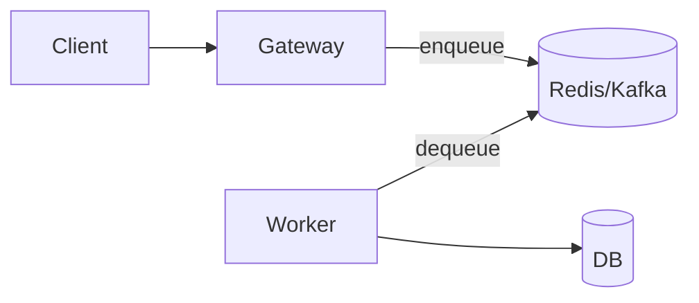
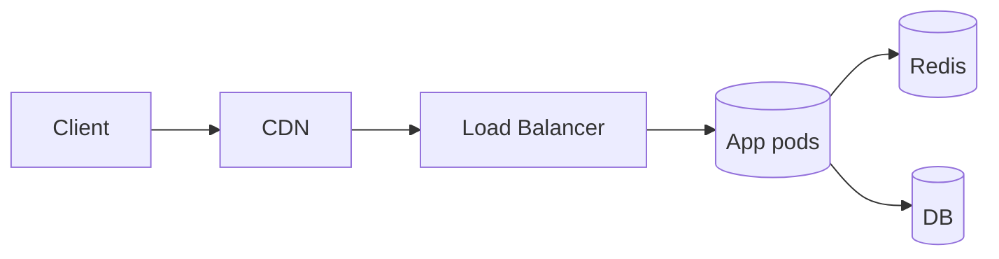

# Лекция 24. Производительность и масштабирование

Зачем: производительность и масштабирование — это про скорость ответа, устойчивость под нагрузкой и рациональные затраты. Мы научимся измерять, находить узкие места и безопасно «разгонять» систему.

## Результаты обучения

- Понимать ключевые метрики: латентность (P50/P95/P99), пропускная способность, tail latency.
- Применять законы Литтла и Амдала для оценки пределов производительности.
- Проектировать вертикальное и горизонтальное масштабирование, знать ограничения.
- Настраивать HPA/VPA и защищать систему backpressure/очередями и rate limiting.
- Внедрять кэширование (локальный, Redis, CDN) и выбирать стратегии инвалидации.
- Проводить базовое профилирование и валидировать улучшения нагрузочным тестом.

## Пререквизиты

- Базовый опыт разработки веб‑сервисов.
- Docker Desktop (Windows) и Windows PowerShell.
- Базовое понимание Kubernetes и HTTP‑кэширования приветствуется.

## Введение: «картина мира»

Производительность — это система уравнений и ограничений: где‑то упираемся в CPU, где‑то в сеть или базу. Масштабирование не лечит плохие алгоритмы, а кэш не исправляет «инвалидируемость». Мы работаем по циклу: измерить → улучшить → подтвердить.

Аналогия: автомагистраль. Пропускная способность — количество машин в минуту (throughput), скорость — латентность (время проезда), хвостовые задержки — пробки (tail latency). Полосы — горизонтальное масштабирование, более мощные машины — вертикальное.

## Основные понятия и терминология

- Латентность: P50 (медиана), P95/P99 (хвост), SLO по перцентилям.
- Пропускная способность (throughput): запросов/сек; зависит от работы и параллелизма.
- Закон Литтла: $L = \lambda \cdot W$, где $L$ — среднее число запросов в системе, $\lambda$ — интенсивность, $W$ — среднее время в системе.
- Закон Амдала: $S(N) = \frac{1}{(1-p) + \frac{p}{N}}$, потолок ускорения при доле распараллеливаемой работы $p$.
- Backpressure: контролируемый отказ/замедление при перегрузке.
- Rate limiting: ограждает ресурсы с помощью токен‑бакетов и квот.

## Пошаговое освоение темы

### Шаг 1. Метрики SLI, SLO, SLA

Зачем: без четких метрик надежности невозможно управлять ожиданиями пользователей и приоритетами команд. SLI/SLO/SLA — фундамент SRE‑подхода.

Что такое SLI, SLO, SLA

- SLI (Service Level Indicator): измеряемая метрика качества услуги глазами пользователя. Примеры: доля успешных запросов, P95 времени ответа, доступность.
- SLO (Service Level Objective): целевой порог для SLI (внутренняя цель команды). Пример: «P95 < 300 мс для 99.9% запросов за 30 дней».
- SLA (Service Level Agreement): внешнее соглашение с ответственностью/компенсациями. Включает SLO и оговаривает последствия нарушения.

Иерархия: SLI — измеряем; SLO — обещаем; SLA — гарантируем и отвечаем.

Примеры использования

- API финтех‑платформы: SLI — 99.96% успешных запросов/сутки; SLO — 99.9%; SLA — компенсация при доступности < 99.5%.
- Видеостриминг: SLI — доля сеансов без буферизации; SLO — ≥ 98%. При падении ниже порога система снижает битрейт, чтобы вернуть метрику в норму.

Как внедрить в компании

- Выберите 3–5 критичных SLI (доступность, P95, ошибки 5xx, успешность ключевых операций).
- Задайте реалистичные SLO на основе данных и бизнес‑требований; согласуйте с продуктом.
- Определите SLA лишь для внешних клиентов/контрактов, минимизируя юридические риски.
- Настройте сбор и визуализацию: Prometheus/Grafana (метрики), Sentry (ошибки), отдельные дешборды SLO.
- Введите error budget и процессы: заморозка релизов при исчерпании бюджета, приоритезация надежности над фичами.

Заключение

SLI/SLO/SLA создают общий язык между бизнесом и инженерией. Error budget помогает балансировать скорость разработки и стабильность.

Формула error budget:

$$ \text{error\_budget} = 1 - \text{SLO} $$

Пояснение:

- При SLO 99.9% бюджет ошибок — 0.1% за период. Нарушение бюджета сигнализирует о необходимости снизить риск (фиксить инциденты, откладывать релизы).

Проверка:

- Сформулируйте 2–3 SLI для вашего сервиса и задайте SLO; проверьте наличие графиков и алертов по этим метрикам.

Типичные ошибки:

- Слишком много SLI (десятки) — распыление внимания; расплывчатые SLO без времени/объема.
- SLA без надежной телеметрии и юридической проработки; отсутствие процессов по error budget.

### Шаг 1. Нагрузочный тест и базовые метрики (autocannon)

```powershell
npm i -g autocannon
autocannon http://localhost:3001/work
```

Пояснение к примеру:

- `autocannon` — кроссплатформенный инструмент для быстрой оценки RPS/латентности.
- Цель — получить базовую латентность и RPS до оптимизаций.

Проверка:

- Сравните P95 до/после изменений; улучшения <10% часто статистически незначимы.

Типичные ошибки:

- Тестируют на ноутбуке с «шумными соседями» (фоновые процессы), нет стабильности.

### Шаг 2. Профилирование Node.js (CPU + event loop)

```bash
node --cpu-prof --cpu-prof-dir=./profiles server.js
```

Пояснение к примеру:

- Ключи `--cpu-prof*` сохраняют профиль выполнения для анализа «горячих» функций.
- Ищите синхронные блокировки event loop (crypto, zlib, большие JSON).

Проверка:

- Откройте профиль в Chrome DevTools (Performance) и найдите узкие места.

Типичные ошибки:

- Оптимизируют «на глаз», не измеряя; отсутствует нагрузка во время профилирования.

### Шаг 3. Кэш Redis для дорогих операций

```js
// cache.js
import express from 'express'
import Redis from 'ioredis'

const app = express()
const redis = new Redis(process.env.REDIS_URL || 'redis://localhost:6379')

app.get('/fib', async (req, res) => {
	const n = Number(req.query.n || 40)
	const key = `fib:${n}`
	const cached = await redis.get(key)
	if (cached) return res.json({ value: Number(cached), cached: true })

	const fib = (k) => (k <= 1 ? k : fib(k - 1) + fib(k - 2))
	const value = fib(n)
	await redis.setex(key, 60, String(value))
	res.json({ value, cached: false })
})

app.listen(3001)
```

Пояснение к примеру:

- Простой CPU‑тяжелый маршрут `/fib` кэшируется в Redis на 60 секунд.
- `setex` задает TTL, предотвращая «вечное» устаревание.

Проверка:

- Первый запрос медленный (нет кэша), следующие быстрые и помечены `cached: true`.

Типичные ошибки:

- Кэш без инвалидации важных данных; перегрев Redis из‑за слишком подробных ключей.

### Шаг 4. Балансировка и CDN (Nginx + cache hints)

```nginx
http {
	upstream app {
		server host.docker.internal:3001;
	}
	server {
		listen 8080;
		location / {
			proxy_pass http://app;
			proxy_set_header Host $host;
			add_header Cache-Control "public, max-age=60";
		}
	}
}
```

Пояснение к примеру:

- `Cache-Control` подсказывает CDN/браузеру кэшировать 60 секунд (подходит для GET/идемпотентных ресурсов).
- `host.docker.internal` — доступ к локальному приложению из контейнера на Windows.

Проверка:

- Воспользуйтесь DevTools → Network, убедитесь в `Cache-Control` и повторной загрузке из кэша (304/диск).

Типичные ошибки:

- Кэширование персональных/секретных ответов; отсутствие `Vary` при зависимости от заголовков.

### Шаг 5. Rate limiting (token bucket в Express)

```js
// rate.js
import express from 'express'

const app = express()
const buckets = new Map()

function allow(ip) {
	const now = Date.now()
	const state = buckets.get(ip) || { tokens: 10, last: now }
	const refill = Math.floor((now - state.last) / 1000) * 5
	state.tokens = Math.min(10, state.tokens + refill)
	state.last = now
	if (state.tokens <= 0) return false
	state.tokens -= 1
	buckets.set(ip, state)
	return true
}

app.use((req, res, next) => {
	if (!allow(req.ip)) return res.status(429).json({ error: 'Too Many Requests' })
	next()
})

app.get('/work', (_, res) => res.json({ ok: true }))
app.listen(3001)
```

Пояснение к примеру:

- Параметры: емкость 10, скорость пополнения 5/сек. На проде используйте Redis/cluster‑shared счетчики.

Проверка:

- Отправьте >10 запросов за секунду — часть вернется 429.

Типичные ошибки:

- Локальный лимитер в многопроцессной/многосерверной архитектуре — несогласованный лимит.

### Шаг 6. Backpressure: очередь и worker



Пояснение:

- Перед тяжелой операцией запрос ставится в очередь; Gateway отвечает 202 Accepted.
- Worker забирает задачи с управлением параллелизмом, защищая DB/API от перегрузки.

Проверка:

- Замерьте стабильность latency у Gateway при росте входного потока; очередь должна расти, а не время ответа.

Типичные ошибки:

- Отсутствие DLQ/повторной обработки; бесконечный рост очереди без планки.

### Шаг 7. Kubernetes HPA для API

```yaml
apiVersion: autoscaling/v2
kind: HorizontalPodAutoscaler
metadata:
	name: api-hpa
	namespace: demo
spec:
	scaleTargetRef:
		apiVersion: apps/v1
		kind: Deployment
		name: api
	minReplicas: 2
	maxReplicas: 10
	behavior:
		scaleDown:
			stabilizationWindowSeconds: 60
	metrics:
		- type: Resource
			resource:
				name: cpu
				target:
					type: Utilization
					averageUtilization: 70
```

Пояснение к примеру:

- Цель — держать среднюю загрузку CPU ~70%; стабилизация предотвращает «дрыганье» реплик.
- Для latency‑driven HPA используйте custom/external метрики (Prometheus Adapter).

Проверка:

- Подайте нагрузку, убедитесь в росте реплик в пределах [2,10]; после снижения нагрузки — плавное уменьшение.

Типичные ошибки:

- Нет лимитов/requests — HPA некорректно вычисляет утилизацию; слишком агрессивные пороги.

## Разбор типичных ошибок и анти‑паттернов

- Оптимизация без измерений и регресс‑тестов; «микрооптимизации» без эффекта на P95.
- Горизонтальное масштабирование при «горлышке» в базе/файловой системе.
- Агрессивный кэш, нарушающий консистентность; отсутствие стратегии инвалидации.
- Локальные лимитеры в распределенной архитектуре; отсутствие глобальных квот.
- HPA без resource requests/limits; отсутствие балансировки и readiness‑проб.

## Вопросы для самопроверки

1. Чем отличаются P50, P95 и P99 и почему SLO часто задают по P95?
2. Сформулируйте закон Литтла и приведите пример для очереди запросов.
3. Как доля распараллеливаемой работы влияет на ускорение по закону Амдала?
4. Когда кэш поможет, а когда навредит? Примеры инвалидации.
5. В чем разница между backpressure и rate limiting?
6. Как настроить HPA по пользовательской метрике (идея решения)?
7. Чем опасны локальные счетчики для лимитов в кластере?
8. Зачем CDN для API/статических ресурсов и какие риски?
9. Какие признаки «узкого места» в базе данных?
10. Как валидировать, что оптимизация действительно улучшила пользовательскую метрику?

## Краткий конспект (cheat‑sheet)

- Метрики: RPS, P95/P99, tail; сравнивайте до/после.
- Формулы: $L = \lambda W$ (Литтл), $S(N)=\frac{1}{(1-p)+p/N}$ (Амдал).
- Кэш: Redis/TTL, CDN `Cache-Control`. Осторожно с персональными данными.
- Лимиты: token bucket; храните счетчики централизованно.
- Backpressure: очередь + воркеры; 202 Accepted.
- HPA: cpu 70% c `stabilizationWindow`; кастомные метрики через Adapter.

## Дополнительно

Глоссарий:

- Tail latency: хвост распределения задержек, влияющий на UX.
- Warm cache: прогретый кэш; cold start — первая загрузка без кэша.
- Thundering herd: лавина запросов, одновременно истощающая ресурс/кэш.
- Read‑through/Write‑through/Write‑back: режимы интеграции кэша.
- Backoff: постепенное увеличение задержки ретраев.

Полезные ссылки:

- Kubernetes HPA v2 — https://kubernetes.io/docs/tasks/run-application/horizontal-pod-autoscale/
- Redis docs — https://redis.io/docs/latest/
- CDN caching — https://developer.mozilla.org/en-US/docs/Web/HTTP/Headers/Cache-Control

## Диаграмма потока запросов



Пояснение к диаграмме:

- CDN снимает часть GET‑нагрузки; балансировщик распределяет по репликам; кэш разгружает DB.

## Быстрая практика (Windows PowerShell)

```powershell
# 1) Запустите demo API (cache.js или rate.js) на 3001
# 2) Проведите короткий тест
autocannon http://localhost:3001/fib?n=40

# 3) Включите кэш и сравните P95
autocannon http://localhost:3001/fib?n=40
```

Ожидаемый результат: P95 заметно снижается после включения кэша; при лимитировании лишние запросы получают 429, защищая апстрим.
