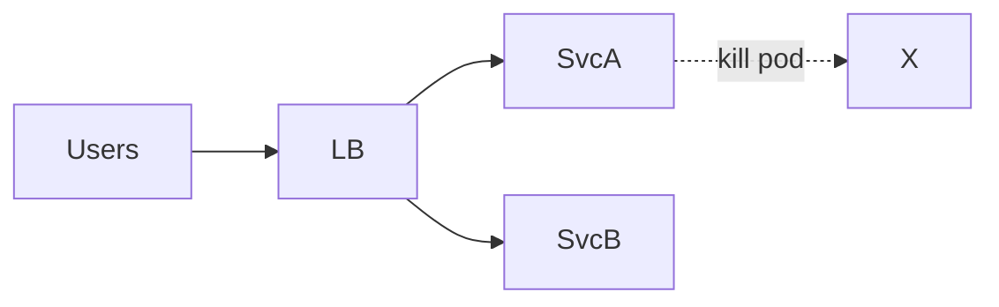

# Лекция 25. Тестирование и надежность

Зачем: тестирование — это «страховка» надежности. В распределенных системах важно проверять не только корректность, но и поведение под отказами и нагрузкой.

## Результаты обучения

- Различать уровни тестов: unit/integration/e2e/contract и их роли.
- Проектировать тестовые данные, добиваться детерминизма и снижать флейки.
- Проводить нагрузочные/сценарные тесты, интерпретировать SLI/SLO и SLT.
- Запускать fault injection/chaos эксперименты: latency, packet loss, node kill.
- Измерять надежность: MTBF/MTTR и защищать релизы (canary, rollback guards).

## Пререквизиты

- Базовый опыт разработки и написания тестов (JavaScript/Python/Java).
- Docker Desktop (Windows) и Windows PowerShell.

## Введение: «картина мира»

Пирамида тестирования в распределенных системах трансформируется: добавляются контрактные тесты между сервисами и эксперименты надежности. Мы стремимся к «детерминизму там, где возможно» и «стоическим» системам там, где ошибки неизбежны.

## Основные понятия и терминология

- Unit/Integration/E2E: уровни охвата; контрактные тесты (consumer/provider) проверяют совместимость API.
- Flaky: тест, чье прохождение зависит от условий среды/времени; боремся стабилизацией и детерминизмом.
- SLT: service level tests — проверяют соответствие SLO (порогам качества) из перспективы пользователя.
- Chaos/Fault injection: управляемые эксперименты отказов для оценки устойчивости.
- MTBF/MTTR: среднее время между отказами/восстановления; ключевые показатели надежности.

## Пошаговое освоение темы

### Шаг 1. Контрактные тесты (Pact JS) для совместимости API

Определения:

- Контрактный тест: проверка соглашения между «потребителем» (consumer) и «поставщиком» (provider) API о формате запросов/ответов.
- Consumer‑driven contract: потребитель фиксирует ожидаемое поведение; провайдер подтверждает соответствие.
- Совместимость API: способность клиента и сервера работать без изменений после релиза.

```bash
npm i --save-dev pact @pact-foundation/pact
```

```js
// consumer.test.js
import { Pact } from '@pact-foundation/pact'
import fetch from 'node-fetch'

const provider = new Pact({ consumer: 'Web', provider: 'API', port: 1234 })

describe('contract: Web -> API', () => {
	beforeAll(() => provider.setup())
	afterAll(() => provider.finalize())

	it('GET /users returns list', async () => {
		await provider.addInteraction({
			state: 'users exist',
			uponReceiving: 'a GET to /users',
			withRequest: { method: 'GET', path: '/users' },
			willRespondWith: {
				status: 200,
				headers: { 'Content-Type': 'application/json' },
				body: [{ id: 1, name: 'Alice' }]
			}
		})

		const res = await fetch('http://localhost:1234/users')
		const json = await res.json()
		expect(json[0].name).toBe('Alice')
		await provider.verify()
	})
})
```

Пояснение к примеру:

- Consumer‑driven контракты фиксируют ожидания клиента от API; провайдер затем валидирует контракт.
- Уменьшают риск «тихих» несовместимостей между сервисами после релизов.

Проверка:

- Запустите тест; затем сгенерируйте Pact file и проверьте, что API‑провайдер проходит валидацию.

Типичные ошибки:

- Контракты покрывают несущественные детали (динамические поля), ломая совместимость без причины.

### Шаг 2. Интеграционные тесты с детерминизмом (Jest + sqlite)

Определения:

- Интеграционный тест: проверка взаимодействия нескольких компонентов (БД, сервис, сеть) вместе.
- Детерминизм тестов: одинаковый исход при повторном запуске благодаря контролю времени/рандома/окружения.
- Flaky‑тест: непредсказуемый из‑за внешних факторов (сеть, тайминги, гонки).

```bash
npm i --save-dev jest sqlite3
```

```js
// integ.test.js
import sqlite3 from 'sqlite3'
import { open } from 'sqlite'

test('save and load', async () => {
	const db = await open({ filename: ':memory:', driver: sqlite3.Database })
	await db.exec('CREATE TABLE t(id INTEGER, name TEXT)')
	await db.run('INSERT INTO t VALUES(1, "demo")')
	const row = await db.get('SELECT name FROM t WHERE id=1')
	expect(row.name).toBe('demo')
})
```

Пояснение к примеру:

- In‑memory DB дает детерминизм; фиксируйте время/случайности (seed) и окружение.

Проверка:

- Запустите тест несколько раз; убедитесь, что нет флейков.

Типичные ошибки:

- Зависимость от внешних систем/сетей в интеграционных тестах; нестабильные таймауты.

### Шаг 3. SLT: проверка P95 и ошибок 5xx (k6)

Определения:

- SLT (Service Level Tests): тесты, валидирующие выполнение SLO на уровне пользовательских показателей.
- P95: 95‑й перцентиль времени ответа; показывает «хвост» задержек.
- Ошибки 5xx: серверные ошибки; индикатор деградации.

```powershell
choco install k6 -y
k6 run .\slt.js
```

```js
// slt.js
import http from 'k6/http'
import { sleep } from 'k6'

export const options = {
	vus: 20,
	duration: '2m',
	thresholds: {
		http_req_duration: ['p(95)<300'],
		http_req_failed: ['rate<0.01']
	}
}

export default function () {
	const res = http.get('http://localhost:3001/work')
	sleep(1)
}
```

Пояснение к примеру:

- Пороговые значения соответствуют SLO: P95 < 300 мс, ошибки < 1%.

Проверка:

- k6 покажет соответствие порогам; используйте его в CI как «SLO‑гейт» на релиз.

Типичные ошибки:

- Случайные зависимые факторы: нестабильная сеть/окружение в CI; неверно выбранная нагрузка.

### Шаг 4. Fault injection: задержки и потери пакетов (tc)

Определения:

- Fault injection: управляемое внесение отказов для оценки устойчивости.
- Задержка/потери: сетевые аномалии (delay/loss), влияющие на латентность и надежность.
- Backoff/Retry: шаблоны поведения клиента при временных ошибках.

```powershell
# В PowerShell запустить WSL или использовать сценарий на Linux
wsl --exec sudo tc qdisc add dev eth0 root netem delay 100ms loss 1%
wsl --exec sudo tc qdisc del dev eth0 root
```

Пояснение к примеру:

- `tc netem` моделирует задержки/потери; проверяйте ретраи, таймауты, деградации.

Проверка:

- Под нагрузкой измерьте рост P95/P99 и долю ошибок; система должна ухудшаться контролируемо (backoff/circuit breaker).

Типичные ошибки:

- Отсутствие ограничений на ретраи → усиление перегрузки («thundering herd»).

### Шаг 5. Chaos experiment: убийство узла

Определения:

- Chaos engineering: системные эксперименты отказов в прод‑подобной среде для повышения устойчивости.
- Kill pod/instance: принудительное завершение единицы вычисления, проверяющее авто‑восстановление.
- Readiness/Liveness: пробки Kubernetes, определяющие готовность/живость контейнера.



Пояснение:

- Случайный «kill pod» проверяет: корректный ребаланс, readiness/liveness, отсутствие синхронных зависимостей.

Проверка:

- Во время эксперимента SLO/SLT не должны выходить за пороги; если выходят — улучшайте устойчивость (реплики, кэш, таймауты).

Типичные ошибки:

- Запуск экспериментов в рабочее время без защит/коммуникации; отсутствие плана отката.

## Разбор типичных ошибок и анти‑паттернов

- Отсутствие контрактных тестов в микросервисах → «ломающие» релизы.
- Интеграционные тесты полагаются на внешние нестабильные системы.
- SLT выполняются в произвольных условиях, не отражающих пользовательские профили.
- Chaos без гвардов (SLO‑гейтов) и планов отката.

## Вопросы для самопроверки

1. Чем отличаются unit, integration, e2e и контрактные тесты?
2. Что такое flaky‑тесты и как их обнаружить/исправить?
3. Что проверяют SLT и как они связаны с SLO?
4. Как безопасно внедрять fault injection в CI/CD?
5. Какие гварды нужны для chaos experiments?
6. Как измерить MTTR и зачем он важен?
7. Приведите пример consumer‑driven контракта и его ценность.

## Краткий конспект (cheat‑sheet)

- Контракты: Pact (consumer/provider), предотвращают несовместимость.
- Интеграционные тесты: изолируйте от внешних систем; используйте in‑memory.
- SLT: k6 thresholds (P95/ошибки) как гейт релиза.
- Fault injection: `tc netem` задержки/потери, наблюдайте деградации.
- Chaos: kill pods, проверяйте readiness/liveness и ребаланс.

## Дополнительно

Глоссарий:

- SLT: тесты, валидирующие выполнение SLO.
- Circuit breaker: шаблон, ограничивающий вызовы при отказах.
- Canary: малый трафик на новую версию для проверки.
- Rollback: автоматический откат при нарушении гвардов.

Полезные ссылки:

- Principles of Chaos Engineering — https://principlesofchaos.org/
- Pact Foundation — https://docs.pact.io/
- k6 — https://k6.io/docs/

## Формулы надежности (KaTeX)

$$ MTBF = \frac{\text{время работы}}{\text{число отказов}}, \quad MTTR = \frac{\text{время восстановления}}{\text{число инцидентов}} $$

Комментарий: снижайте MTTR (быстрое обнаружение/реагирование) и повышайте MTBF (устойчивость/качество), чтобы улучшить надежность.
