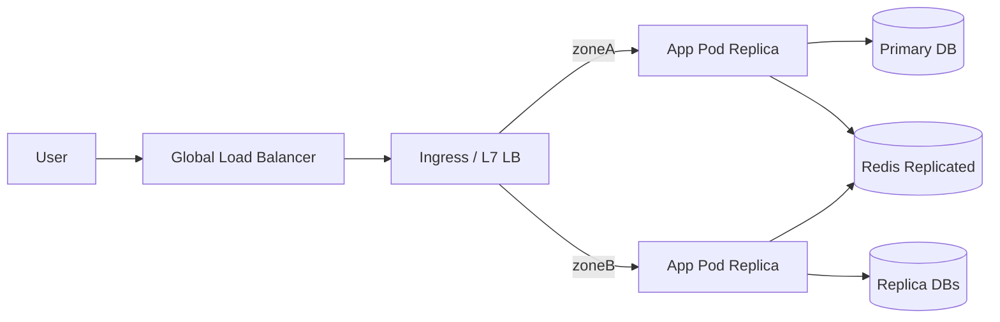

# Лекция 27. Кейс: проектирование высокодоступного веб‑сервиса

Коротко: зачем и где применяется. Разберём практический кейс — как спроектировать, развернуть и протестировать высокодоступный (HA) веб‑сервис с ограничениями по RTO/RPO, устойчивостью к отказам узлов и сеть‑фолтам. Покажем конкретные паттерны, настройки и команды для проверки.

## Результаты обучения

После лекции вы:

- спроектируете HA‑архитектуру для веб‑сервиса (frontend, app, storage) с учётом зон отказа и географии;
- внедрите механизмы обнаружения отказов и автоматического восстановления (healthchecks, liveness/readiness, autoscaling, self‑healing);
- спланируете стратегию для данных (репликация, бэкапы, RPO/RTO) и кэшей (invalidate/replicate);
- прогоните базовые тесты устойчивости (failover, node drain, сетевые разрывы) и соберёте метрики/логи для анализа инцидента;
- выберете стратегию деплоя (rolling/canary/blue‑green) и проверите, что откат быстрый и безопасный.

## Пререквизиты

- Базовые знания Linux, Docker/Kubernetes (см. лекции про контейнеры и оркестрацию).
- Умение работать с `kubectl`, `docker`, командами мониторинга (Prometheus/Grafana) и инструментами для нагрузки (`hey`, `wrk`, `siege`).
- Понимание сетей, DNS и принципов репликации СУБД.

## Введение: картина мира

HA‑сервис — это не только «несколько копий». Это продуманный дизайн: распределение нагрузки, проверка состояния, управление сессиями, согласованность данных и процессы восстановления. Цель — минимизировать простои и потери данных при отказах оборудования/сети/ПО.

## Основные понятия и терминология

- RTO (Recovery Time Objective): максимальное время восстановления при инциденте.
- RPO (Recovery Point Objective): приемлемая потеря данных во времени.
- Healthcheck / Readiness / Liveness: сигналы состояния контейнера/сервиса.
- Circuit Breaker / Retry / Backoff: механизмы устойчивости к временным ошибкам.
- Leader election / Quorum: распределённые механизмы согласования (DB/coordination).

## Пошаговое освоение темы

### Подтема 1. Архитектура: зоны, балансировка, резервирование

Определения:

- Load Balancer: распределяет трафик между инстансами (L4/L7).
- Multi‑AZ / Multi‑Region: размещение ресурсов в разных зонах/регионах.
- Active‑Active vs Active‑Passive: работа нескольких активных копий vs готовность резервной.

Кейс‑схема (условная):



Пояснение к примеру: глобальный LB направляет трафик в ближайший регион; внутри региона L7 LB (ingress) балансирует между pod‑ами, которые обращаются к реплицированной БД и кэшу.

Проверка: убедитесь, что при выключении ноды в zoneA трафик перенаправляется на zoneB и пользовательский поток не падает заметно.

Типичные ошибки: один LB без резервного пути; хранение состояния сессии в памяти одного экземпляра (sticky sessions без репликации).

### Подтема 2. Stateful: база данных и согласованность

Определения:

- Primary‑Replica: главный для записи и реплики для чтения.
- Synchronous vs Asynchronous replication: синхронная обеспечивает меньший RPO, но увеличивает задержки.
- Consensus (Raft/Paxos): для распределённых согласований и leader election.

Пример: конфигурация PostgreSQL с синхронной репликацией (упрощённо) — в учебных целях используйте managed Postgres.

Пояснение к примеру: синхронная репликация уменьшает риск потери данных (RPO≈0), но может снизить throughput и увеличить задержки по записи.

Проверка: симулируйте отказ primary и проверьте failover на replica; измерьте время переключения и потерю транзакций.

Типичные ошибки: использовать асинхронную репликацию для критичных записей без компенсационных мер; отсутствие регулярных тестов восстановления.

### Подтема 3. Stateless приложения: сессии и кэширование

Определения:

- Stateless: приложение не хранит пользовательскую сессию в локальной памяти.
- Sticky sessions: привязка пользователя к определённому бэкенду (не рекомендуется для HA без репликации сессий).
- Distributed cache: Redis/Memcached с репликацией и persistence (AOF/RDB) для критичных данных.

Пример: хранение сессий в Redis (самое простое решение для HA):

```yaml
# file: redis-statefulset.yaml (упрощённый)
apiVersion: apps/v1
kind: StatefulSet
metadata:
  name: redis
spec:
  serviceName: redis
  replicas: 3
  selector:
    matchLabels:
      app: redis
  template:
    metadata:
      labels:
        app: redis
    spec:
      containers:
      - name: redis
        image: redis:7
        ports:
        - containerPort: 6379
        volumeMounts:
        - name: data
          mountPath: /data
  volumeClaimTemplates:
  - metadata:
      name: data
    spec:
      accessModes: [ "ReadWriteOnce" ]
      resources:
        requests:
          storage: 5Gi
```

Пояснение к примеру: StatefulSet позволяет создать реплицированный Redis с постоянным хранилищем; приложение хранит сессии/ключи в Redis, а не в памяти pod‑а.

Проверка: при перезапуске pod данные продолжают быть доступны (при корректной конфигурации persistence); при выключении одного pod другие обслуживают запросы.

Типичные ошибки: использование ephemeral storage для session store; отсутствие persistence → потеря сессий при restart.

### Подтема 4. Обнаружение и лечение отказов: probes, retries, circuit breakers

Определения:

- Readiness probe: сигнал, что pod готов принимать трафик.
- Liveness probe: сигнал, что pod здоров; при провале Kubernetes перезапустит контейнер.
- Circuit breaker: предотвращает лавину запросов к падающему сервису.

Пример: readiness/liveness в Deployment:

```yaml
# file: deployment.yaml (excerpt)
readinessProbe:
  httpGet:
    path: /health/ready
    port: 8080
  initialDelaySeconds: 5
  periodSeconds: 10
livenessProbe:
  httpGet:
    path: /health
    port: 8080
  initialDelaySeconds: 30
  periodSeconds: 10
```

Пояснение к примеру: readiness исключает pod из rotation до готовности; liveness заставит kube перезапустить «зависший» pod.

Проверка: внедрите временный код, возвращающий 500 на `/health`, и наблюдайте, что kube перезапускает pod; убедитесь, что LB убирает его из пула.

Типичные ошибки: слишком агрессивные probes → ложные перезапуски; слишком мягкие → долгое выявление проблем.

### Подтема 5. Тестирование устойчивости: chaos и сценарии failover

Определения:

- Chaos engineering: контролируемое введение сбоев для проверки устойчивости.
- Drills: регулярные упражнения по восстановлению (DR drills).

Практические шаги:

1. Load test базовой конфигурации (baseline).
2. Simulate node/pod failure: `kubectl drain <node>` / `kubectl delete pod`.
3. Simulate network partition: iptables/drop rules или `tc` в тестовой среде.
4. Observe metrics (error rate, latency), logs and traces; confirm RTO/RPO.

Пояснение к примеру: регулярные испытания и репетиции позволят понять реальные границы системы и заранее скорректировать SLO/SLA.

Проверка: выполните `kubectl drain` на ноде с запущенными pod’ами, затем запустите нагрузочный тест и сравните latencies и ошибочные ответы.

Типичные ошибки: запуск хаоса в проде без отката; отсутствие наблюдаемости во время теста.

### Подтема 6. Деплой и откат: safe deployment strategies

Определения:

- Rolling update: постепенная замена экземпляров.
- Canary deploy: небольшой процент трафика для новой версии.
- Blue‑green: параллельные окружения, переключение трафика.

Пример: канареечный деплой в Kubernetes (высокоуровнево):

Пояснение к примеру: постепенно увеличивайте % трафика на новую версию, анализируя метрики и ошибок, и при проблемах откатитесь на предыдущую.

Проверка: используйте Istio/Linkerd или ingress with weight routing, переключите 5% трафика на новую версию и мониторьте SLO.

Типичные ошибки: полагаться на только ручной мониторинг; не иметь автоматического отката при нарушении SLO.

## Разбор типичных ошибок и анти‑паттернов

- Хранение состояния локально в pod → потеря сессий при failover.
- Нет healthchecks → LB продолжает шлёпать падший pod.
- Отсутствие DR‑планов и тестов восстановления.
- Откаты делаются вручную и медленно.
- Неправильная конфигурация репликации БД → split‑brain или потеря данных.

## Вопросы для самопроверки

1. Что важнее для вашего кейса: RTO или RPO? Почему?
2. Чем отличается readiness от liveness probe — примеры использования.
3. Какой механизм вы выберете для хранения сессий: sticky sessions или external store? Почему?
4. Когда стоит использовать синхронную репликацию БД?
5. Какие шаги в тесте failover вы выполните в первую очередь?
6. Как вы измерите успешность canary‑деплоя?
7. Что такое split‑brain и как его избежать?
8. Как проверить, что LB правильно перераспределяет трафик при отказе ноды?
9. Какие метрики ключевые при тестах устойчивости?
10. Что такое circuit breaker и зачем он нужен?

## Краткий конспект (cheat‑sheet)

- HA = архитектура + процессы + тесты.
- Stateful data: репликация, резервные копии, тщательные DR‑процедуры.
- Stateless apps: храните сессии/кэш в распределённых системах (Redis/DB);
- Probes: readiness для rotation, liveness для перезапуска;
- Deployment: canary/blue‑green/rolling + observability + автоматический откат.

## Дополнительно

Глоссарий:

- RTO/RPO, Readiness/Liveness, Circuit Breaker, Split‑brain, Quorum, StatefulSet, Leader election.

Полезные ссылки:

- Kubernetes probes: [https://kubernetes.io/docs/tasks/configure-pod-container/configure-liveness-readiness-startup-probes/](https://kubernetes.io/docs/tasks/configure-pod-container/configure-liveness-readiness-startup-probes/)
- Chaos Engineering: [https://principlesofchaos.org/](https://principlesofchaos.org/)
- Postgres replication and failover patterns: [https://www.postgresql.org/docs/current/warm-standby.html](https://www.postgresql.org/docs/current/warm-standby.html)

## Быстрая практика

```bash
# 1) Baseline: короткий load test
hey -n 10000 -c 100 http://ingress.example.com/api/endpoint

# 2) Simulate node failure
kubectl drain node/worker-1 --ignore-daemonsets --delete-local-data

# 3) Observe metrics (Prometheus/Grafana)
#  открываем дашборд с latency/error rate

# 4) Simulate DB failover (в тестовой среде):
# переключите primary на replica через managed console или promotion

# 5) Run canary: переключим 5% трафика на новую версию (пример для Istio):
kubectl apply -f canary-50.yaml

# 6) Restore node
kubectl uncordon node/worker-1

# 7) Post‑mortem: собрать логи/трейсы и подготовить RCA
```

Ожидаемый результат: система остаётся доступной при отказе узла, latency может немного вырасти; при промоушне canary метрики не нарушают SLO. Пост‑мортем содержит хронологию, инвентаризацию и план улучшений.

Критерии качества: все обязательные секции присутствуют; определения перед примерами; у примеров есть «Пояснение», «Проверка», «Типичные ошибки»; корректные fenced‑блоки и форматирование.
# Лекция 27. Кейс-стади: высокодоступный веб-сервис
План:
- Требования, SLO, ограничения
- Архитектура: данные, кэш, очереди, CDN, DR
- План деплоя и эксплуатации
Практика: эскиз high-level архитектуры под SLO.
Чтение: Well-Architected; SRE case studies.

## Материал для лекции
- Требования и SLO: целевые перцентили, бюджет ошибок, нагрузочный профиль.
- Разложение на домены: API, данные, кэши, очереди, async‑обработка.
- Выбор БД/шардирование, кэширование, CQRS/ES при необходимости.
- Глобальная доставка: CDN, DNS, геораспределение, multiregion DR.
- Наблюдаемость: лог/метрики/трейсы, дашборды для SLI.
- Эксплуатация: runbook, алерты, on‑call, план откатов и тесты DR.
