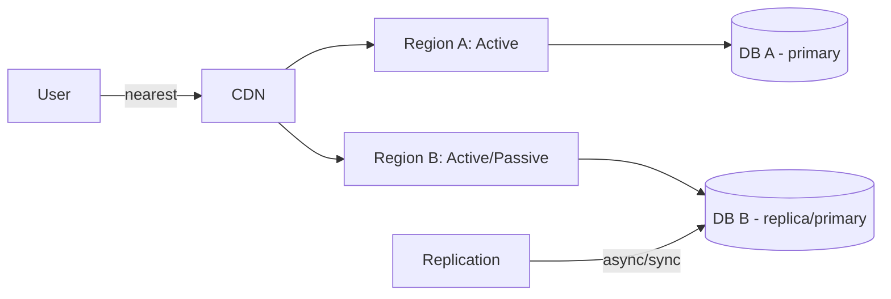

# Лекция 28. Дисастер‑рековери и мульти‑региональные архитектуры

Коротко: зачем и где применяется. DR (Disaster Recovery) и мульти‑региональный дизайн помогают обеспечить устойчивость бизнеса при крупных отказах (региональные сбои, природные катастрофы, ошибки человеческого фактора). На практике это баланс между стоимостью, сложностью и желаемыми RTO/RPO.

## Результаты обучения

После лекции вы:

- поймёте стратегии DR: backup‑and‑restore, pilot‑light, warm‑standby, active‑active;
- сумеете выбрать подходящую стратегию для конкретного сервиса при заданных RTO/RPO и бюджете;
- спроектируете мульти‑региональную архитектуру с учётом репликации данных, DNS‑failover и согласованности;
- настроите базовые проверки DR‑готовности и проведёте простой drill (реплика‑promotion);
- оцените компромиссы по стоимости, задержке и консистентности при мульти‑регионе.

## Пререквизиты

- Знания по сетям, DNS и принципам репликации баз данных (Postgres, MySQL, NoSQL).
- Понимание контейнеров/оркестрации и облачных сервисов (предыдущие лекции).
- Навыки работы с CLI провайдера (aws/az/gcloud) и kubectl.

## Введение: картина мира

DR — это план и практика восстановления сервиса после катастрофы. Мульти‑регион — про распределение рабочих нагрузок и/или резервных копий по регионам. Выбор модели зависит от: допустимой простоя (RTO), допустимой потери данных (RPO), бюджета и сложности управления.

## Основные понятия и терминология

- RTO (Recovery Time Objective): допустимое время восстановления сервиса.
- RPO (Recovery Point Objective): допустимая потеря данных по времени.
- Pilot‑light: минимальная инфраструктура в резервном регионе, которая при необходимости разворачивается до полноты.
- Warm‑standby: постоянно запущенная, но уменьшенная копия системы в резерве.
- Active‑active: два или более регионов активно обслуживают трафик.
- DNS failover: переключение трафика через изменение DNS (TTL влияет на скорость).

## Пошаговое освоение темы

### Подтема 1. Стратегии DR: от простого к сложному

Определения:

- Backup & Restore: регулярные бэкапы, восстановление вручную/полуавтоматически.
- Pilot‑light: минимальная инфраструктура горячая, данные реплицируются; при инциденте увеличиваем мощности.
- Warm‑standby: уменьшенная среда всегда готова принять трафик.
- Active‑active: оба региона активны и синхронно/асинхронно реплицируют данные.

Короткий вывод: чем более строгие RTO/RPO требуется, тем выше стоимость и сложность реализации.

Типичные ошибки: выбирать active‑active без готовности к конфликтам данных; недооценивать тестирование восстановлений.

### Подтема 2. Репликация данных: синхронная vs асинхронная

Определения:

- Synchronous replication: запись подтверждена в нескольких регионах до ответа клиенту — RPO≈0, большая задержка.
- Asynchronous replication: запись подтверждена только локально, позже реплицируется — меньшая задержка, возможна потеря данных.

Пояснение: для критичных транзакций выбирайте синхронную репликацию внутри региона (multi‑AZ). Для межрегиональной репликации чаще используют асинхронную репликацию и компенсирующие механизмы.

Проверка: сравните задержку записи при разных моделях в тестовой среде; оцените потерю данных при аварии primary.

Типичные ошибки: ожидать синхронности при межрегиональной репликации без оценки latency.

### Подтема 3. DNS и маршрутизация: failover и health checks

Определения:

- DNS TTL: время жизни записи — влияет на скорость переключения.
- Health check & failover: мониторинг endpoint и автоматическая смена A/AAAA/CNAME на резервные IP.
- Anycast vs Geo DNS: способы доставлять пользователей в ближайший регион.

```yaml
# Пример Route53 health check и failover (high level)
# - health check каждую 30s, если primary недоступен — переключаем на secondary
```

Пояснение: короткий TTL делает переключение DNS быстрее, но увеличивает нагрузку на DNS‑сервера; использование глобального LB (CloudFront, Global Accelerator) может дать более быстрый failover.

Проверка: уменьшите TTL до 60s, выключите primary endpoint и замеряйте время переключения в разных географиях.

Типичные ошибки: полагаться только на DNS‑failover при наличии долгого TTL; игнорировать DNS caching у клиентов/ISP.

### Подтема 4. Архитектурные паттерны для мульти‑региона

Определения:

- Active‑Passive (hot standby): основной регион активен, резерв готов.
- Active‑Active (geo‑distributed): оба региона активны; нужно решать вопросы консистентности.
- Data sharding by region: данные пользователей хранятся в регионе ближе к ним.

Mermaid диаграмма:



Пояснение: active‑active снижает время отклика и даёт избыточность, но требует сложной логики разрешения конфликтов и репликации.

Проверка: смоделируйте write conflict (одинаковые ключи) и посмотрите, как ваша архитектура справляется с разрешением.

Типичные ошибки: считать, что достаточна просто репликация — нужен план разрешения конфликтов.

### Подтема 5. DR‑drills: как тестировать и автоматизировать восстановление

Определения:

- DR drill: плановое упражнение по восстановлению сервиса.
- Runbook: пошаговая инструкция восстановления систем.

Практика:

1. Подготовьте runbook для основных сценариев: потеря региона, повреждение БД, потеря сети.
2. Прогоняйте drills в тестовой среде — проверяйте RTO/RPO и собирайте метрики.
3. Автоматизируйте как можно больший набор шагов (promotion snapshot, DNS switch, autoscaling).

Пояснение: только регулярные упражнения дадут уверенность в реальном DR‑сценарии.

Проверка: проведите drill «promotion replica» и измерьте время полного восстановления.

Типичные ошибки: не документировать шаги, не рефлексировать после drills (нет post‑mortem).

### Подтема 6. Безопасность и соответствие в мульти‑регионе

Определения:

- Data residency: требования с точки зрения закона о хранении данных.
- Cross‑region encryption: шифрование данных при передаче между регионами.

Пояснение: мульти‑региональность может усложнить соответствие требованиям (GDPR и др.), поэтому следует учитывать ограничения по хранению и передаче данных.

Проверка: проверьте договоры провайдера и настройки регионов для хранения PII/критичных данных.

Типичные ошибки: реплицировать персональные данные в регионы, где это запрещено; забыть про ключи KMS и их репликацию.

### Подтема 7. Стоимость и компромиссы

Определения:

- Cost of replication: дополнительные расходы на хранение и трафик.
- Operational cost: расходы на поддержание готовности и drills.

Короткий вывод: мульти‑региональность дороже; балансируйте требования бизнеса и доступный бюджет.

Типичные ошибки: недооценка egress‑трафика и стоимости репликации.

## Разбор типичных ошибок и анти‑паттернов

- Отсутствие тестов восстановления (DR drills).
- Активная репликация без стратегии разрешения конфликтов.
- Полагание исключительно на DNS‑failover при долгих TTL.
- Копирование всех данных в каждую страну без оценки соответствия и стоимости.

## Вопросы для самопроверки

1. Какие стратегии DR вы знаете и при каких условиях применять каждую?
2. Чем отличается RTO от RPO и как они влияют на архитектуру?
3. Какие компромиссы между синхронной и асинхронной репликацией?
4. Как DNS‑TTL влияет на скорость failover?
5. Что такое pilot‑light и когда он подходит?
6. Какие шаги должны быть в runbook при потере региона?
7. Как обеспечить соответствие законам о данных в мульти‑регионе?
8. Почему важны DR drills и post‑mortem?
9. Какие дополнительные расходы возникают при мульти‑регионе?
10. Как тестировать разрешение конфликтов при active‑active?

## Краткий конспект (cheat‑sheet)

- DR модели: Backup & Restore, Pilot‑light, Warm‑standby, Active‑Active.
- RTO/RPO определяют требования к восстановлению и потери данных.
- Репликация: синхронная внутри региона, асинхронная межрегиональная.
- DNS failover: короткий TTL + health checks; глобальные LB ускоряют failover.
- DR drills: автоматизация + runbooks + post‑mortem.

## Дополнительно

Глоссарий:

- RTO, RPO, Pilot‑light, Warm‑standby, Active‑Active, DNS TTL, Data residency.

Полезные ссылки:

- AWS Well‑Architected — Reliability pillar: [https://aws.amazon.com/architecture/well-architected/](https://aws.amazon.com/architecture/well-architected/)
- Google Cloud DR patterns: [https://cloud.google.com/solutions/disaster-recovery](https://cloud.google.com/solutions/disaster-recovery)
- Postgres replication: [https://www.postgresql.org/docs/current/warm-standby.html](https://www.postgresql.org/docs/current/warm-standby.html)

## Быстрая практика

```bash
# 1) Снимок БД и копирование в резервный регион (пример AWS snapshot copy)
aws rds create-db-snapshot --db-instance-identifier mydb --db-snapshot-identifier mydb-snap-$(date +%s)
aws rds copy-db-snapshot --source-region us-east-1 --source-db-snapshot-identifier arn:aws:rds:us-east-1:123456789012:snapshot:mydb-snap-... --target-region eu-west-1 --target-db-snapshot-identifier mydb-snap-copy

# 2) Тест promotion replica (в тестовой среде)
# В managed Postgres: promote read replica to master via console or CLI

# 3) Проверка DNS failover (понизить TTL в тестовой зоне и симулировать недоступность)

# 4) Проведение DR drill: составьте runbook и прогоните сценарий восстановления

# 5) Сбор метрик и пост‑мортем: экспорт логов и трассировок для RCA
```

Ожидаемый результат: наличие рабочего процесса snapshot→copy→promotion в тестовой среде; runbook отработал; оценены реальные RTO/RPO.

Критерии качества: все обязательные секции присутствуют; определения перед примерами; у примеров есть «Пояснение», «Проверка», «Типичные ошибки»; корректные fenced‑блоки и форматирование.
# Лекция 28. DR и мульти-регион
План:
- RPO/RTO, стратегии резервирования/репликации/фейловера
- Региональные отказоустойчивые паттерны
- Итоги курса, подготовка к экзамену
Практика: план DR для целевой архитектуры.
Чтение: DR patterns (AWS/GCP), Kleppmann гл.12 (итоги).

## Материал для лекции
- Цели DR: RTO/RPO, классификация критичности сервисов.
- Резервное копирование и восстановление: частота, проверка, каталоги.
- Топологии: active‑passive, active‑active, кворум и split‑brain.
- Репликация: синхронная/асинхронная, лаг, порядок, конфликт‑резолв.
- Сетевые аспекты multi‑region: DNS, GSLB, Anycast, контроль egress.
- Автоматизация фейловера и регулярные DR‑учения; непрерывное улучшение.
