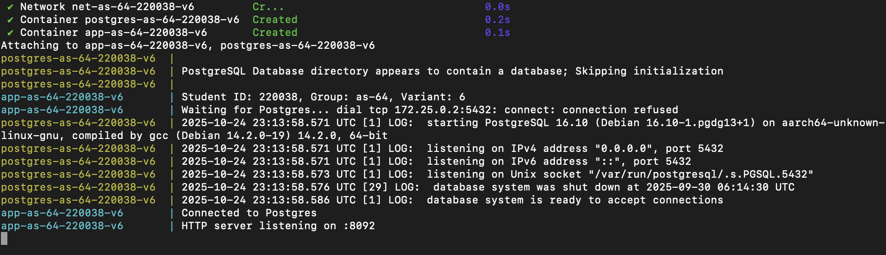
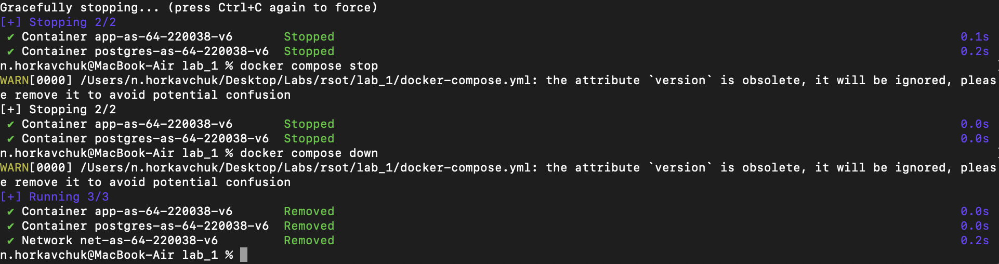

# Лабораторная работа №1

## Метаданные студента

- Горкавчук Никита Михайлович
- Группа: **АС-64**
- № зачетной книжки: **220038**
- Email (учебный)
- GitHub Username: **Exage**
- Вариант **№6**
- Дата выполнения: **16 сентября 2025 года**
- ОС: **MacOS Sequoia 15.6.1, Docker Desktop/Engine: 27.x (Darwin)**
- ОС: **Alpine Linux v3.20, Docker Desktop/Engine: 27.x (Darwin)**

## Шаги для запуска

1. **Собрать Docker-образ Go-сервиса**:

```
docker build -t my-go-app:stu-220038-v6 .
```

1. **Поднять сервисы через docker-compose**:

```
docker compose up -d --build
```

1. **Проверить работу эндпоинтов**:

```
curl http://localhost:8092/health
```

1. **Проверить корректное завершение (graceful shutdown)**:

```
docker stop app-as-64-220038-v6
```

## Эндпоинты

* GET `/` — простой ответ сервиса: `Hello`
* GET `/ping` — проверка отклика: `Pong`
* GET `/health` — тех. состояние сервера и БД (JSON)
* GET `/author` — информация об авторе (JSON)
* GET `/*` — любые другие пути → JSON-ошибка: `{"error":"Wrong Way!","code":404}` (HTTP-статус остаётся 200)

## Логи

### Запуск



### Остановка


