# Лабораторная работа 02. Kubernetes: базовый деплой

## Метаданные студента

ФИО: Куликович Иван Сергеевич

Группа: AS-63

StudentID: 220015

Email: `AS006312@g.bstu.by`

GitHub username: teenage717

Вариант: 11

Дата выполнения: 25.10.2025

ОС: Windows 10 Pro

Docker version: 28.3.2

kubectl version: v1.32.2

Minikube version: v1.37.0

### Описание проекта

Базовый деплой HTTP-сервиса на Python Flask с Redis в Kubernetes. Проект включает подготовку манифестов, настройку конфигурации, ресурсы (Deployment, Service, ConfigMap), readiness/liveness probes и локальный запуск в Minikube.

## Архитектура

Namespace: app11

Deployment: web11 (2 реплики)

Service: ClusterIP на порту 8073

ConfigMap: конфигурация приложения

Redis: база данных для хранения состояния

Resource Limits: CPU 150m, Memory 128Mi

### Запуск проекта

Предварительные требования:

Установленный Docker

Установленный kubectl

Установленный Minikube

1. Сборка Docker образа:
docker build -t app-as-63-220015:stu-220015-v11 .
2. Запуск Minikube кластера:
minikube start --driver=docker
minikube addons enable ingress
3. Загрузка образа в Minikube:
minikube image load app-as-63-220015:stu-220015-v11
4. Деплой в Kubernetes:
kubectl apply -f k8s/

## Проверки

### Проверить все ресурсы

kubectl -n app11 get all
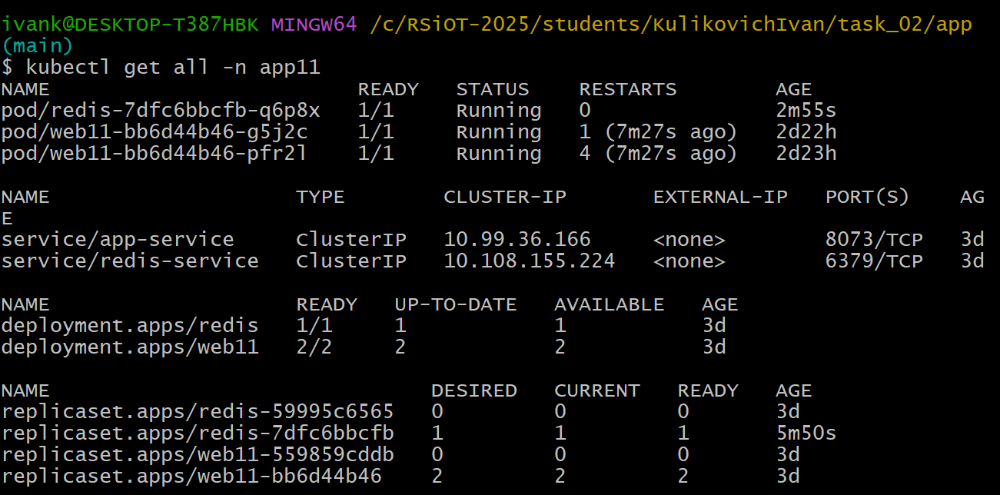

### Проверить поды

kubectl -n app11 get pods
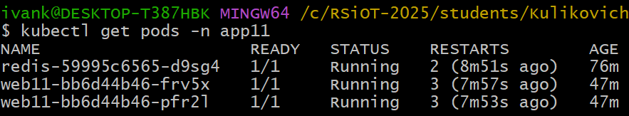

### Проверить сервисы

kubectl -n app11 get services
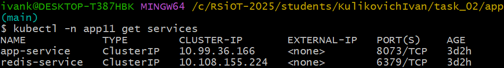

### Проверить deployment

kubectl -n app11 get deployments
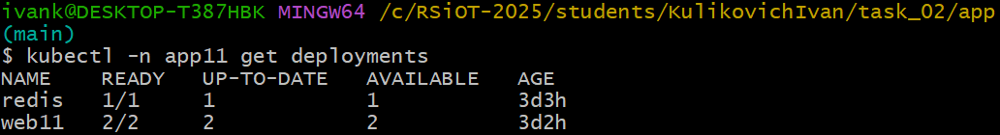

kubectl describe deployment web11 -n app11
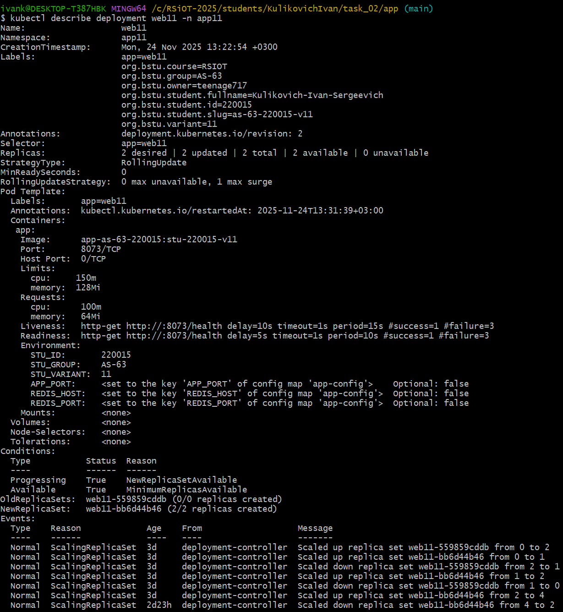

## Доступ к приложению

### Port-forward для доступа к приложению

kubectl -n app11 port-forward service/app-service 8073:8073

### В другом терминале проверить доступ

`curl http://localhost:8073/`
Ожидаемый результат: HTML страница со счетчиком посещений

### Проверка работы

`curl http://localhost:8073/health`
Ожидаемый результат: OK

Скриншот проверки результата:
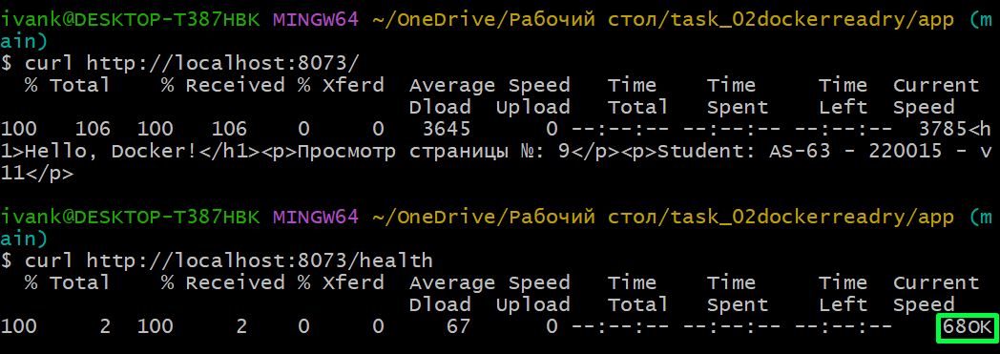

### Проверка логов

kubectl -n app11 logs -l app=web11
Результат: логи с ENV переменными StudentID: 220015, Group: AS-63, Variant: 11
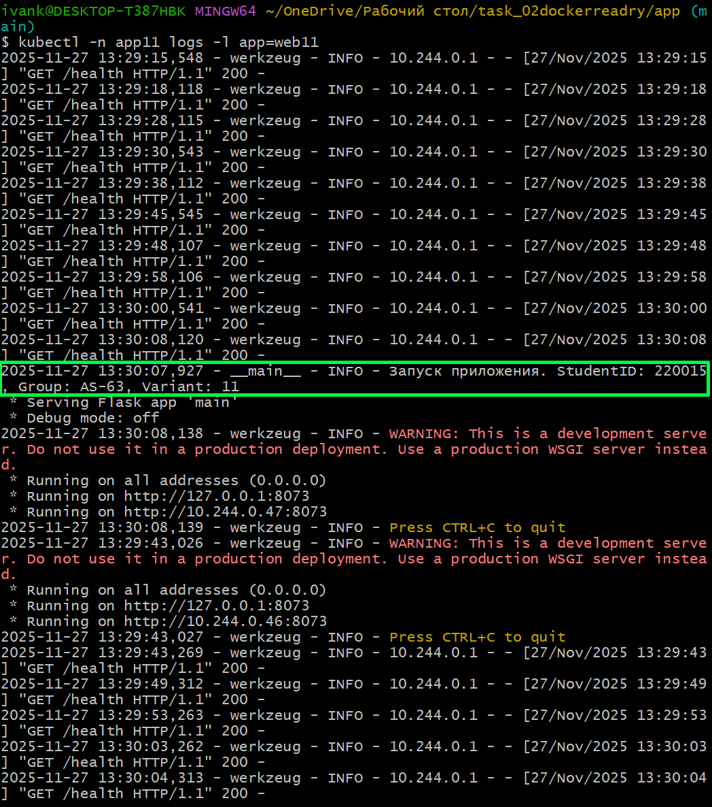

### Проверка масштабирования

### Увеличим количество реплик

kubectl -n app11 scale deployment web11 --replicas=6

Проверим что изменилось:

kubectl -n app11 get pods

Добавились две реплики:

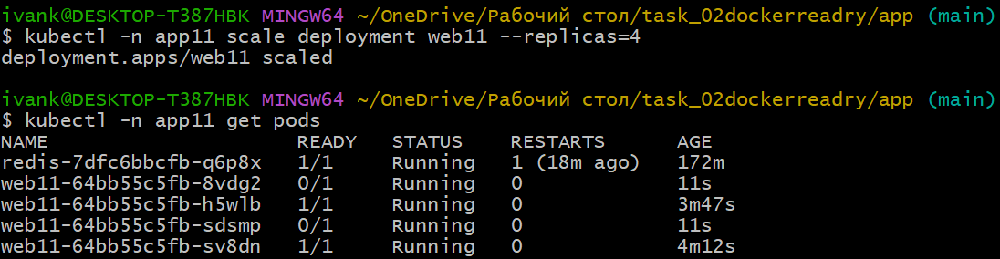

### Liveness/Readiness probes (health check)

Liveness probes:
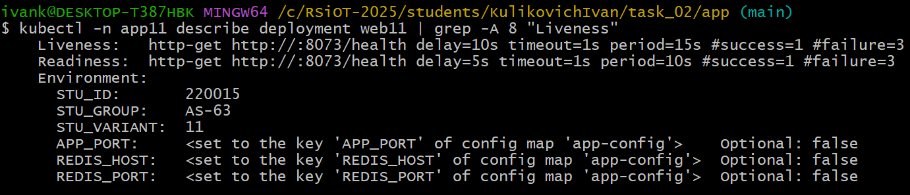

Readiness probes:
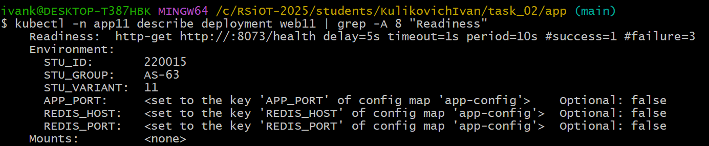

### Проверка на gracefull shotdown

Корректное завершение работы:
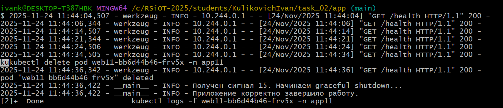

## Управление приложением

### Перезапуск deployment

kubectl -n app11 rollout restart deployment web11

### Просмотр логов

kubectl -n app11 logs -l app=web11 --tail=50

### Удаление ресурсов

kubectl delete -f k8s/

### Остановка Minikube

minikube stop

## Бонусное задание: Persistent Volume для Redis

PersistentVolumeClaim для хранения данных Redis - обеспечение сохранности данных между перезапусками контейнера.

### Что было сделано

Создан PersistentVolumeClaim (PVC):

Объем: 1Gi

Access Mode: ReadWriteOnce

Для хранения данных Redis

Обновлена конфигурация Redis:

Добавлен volumeMount в контейнер Redis

Настроена команда redis-server --appendonly yes для включения persistence

Данные сохраняются на примонтированный volume

## Доказательство корректности работы

Счетчик посещений сохраняется между перезапусками Redis

При удалении pod Redis данные не теряются

После пересоздания pod счетчик продолжает с последнего значения
Скриншот работы бонусного задания:
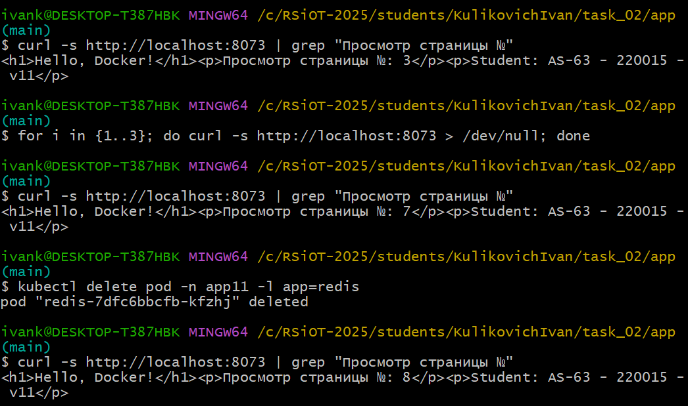
