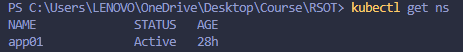
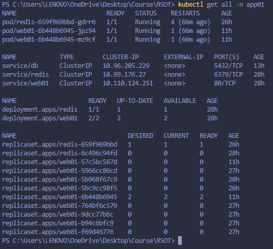
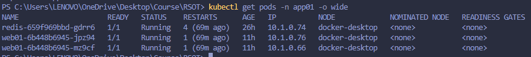
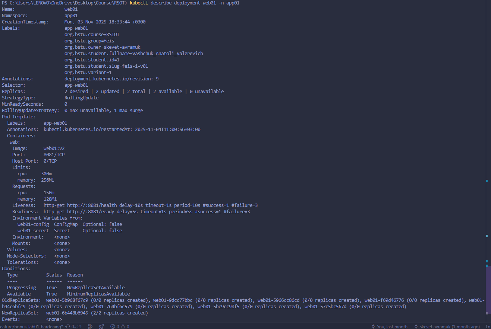
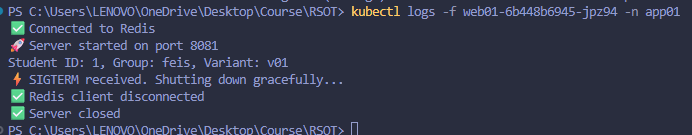
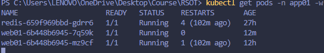
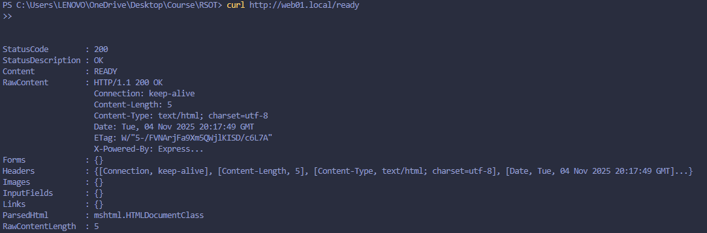
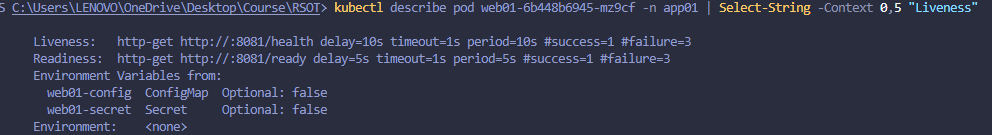
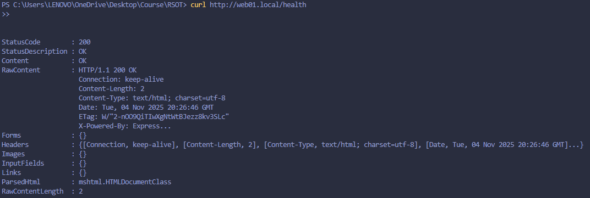

# Министерство образования Республики Беларусь

<p align="center">Учреждение образования</p>
<p align="center">“Брестский Государственный технический университет”</p>
<p align="center">Кафедра ИИТ</p>
<br><br><br><br><br><br>
<p align="center"><strong>Лабораторная работа №2</strong></p>
<p align="center"><strong>По дисциплине:</strong> “Распределенные системы и облачные технологии”</p>
<p align="center"><strong>Тема:</strong> Kubernetes: базовый деплой (stateless)</p>
<br><br><br><br><br><br>
<p align="right"><strong>Выполнил:</strong></p>
<p align="right">Студент 4 курса</p>
<p align="right">Группы АС-63</p>
<p align="right">Ващук А.В.</p>
<p align="right"><strong>Проверил:</strong></p>
<p align="right">Несюк А.Н.</p>
<br><br><br><br><br>
<p align="center"><strong>Брест 2025</strong></p>

---

## Цель работы

Изучить основы деплоя контейнеризованных приложений в кластер Kubernetes, научиться создавать базовые манифесты (Deployment, Service, Ingress), настраивать liveness/readiness probes, лимиты ресурсов и выполнять rolling update без простоя.

---

### Вариант №1

## Метаданные студента

- ФИО - Ващук Анатолий Валерьевич
- Группа - АС-63
- № студенческого/зачетной книжки (StudentID) - 220036
- Email (учебный) - as006407@g.bstu.by
- GitHub username - skevet-avramuk
- Вариант № - 1
- Дата выполнения - 04.11.2025
- ОС (версия), версия Docker Desktop/Engine - Windows 11, Docker version 27.4.0

---

## Окружение и инструменты

- Docker Desktop — среда контейнеризации с встроенным кластером Kubernetes (использовался для деплоя и проверки работы сервисов).

- kubectl — CLI-клиент для управления Kubernetes-ресурсами.

- Docker CLI — сборка и публикация контейнерного образа приложения.

- VS Code — IDE для редактирования YAML-манифестов и исходного кода.

- curl — утилита для проверки HTTP-доступности сервиса (проверка /live и /ready).

## Структура репозитория c описанием содержимого

✍️ \*Опишите свою структуру репозитория согласно заданию.

#### Пример:

```
Dockerfile               # multi-stage сборка контейнерного образа приложения
docker-compose.yml       # локальный запуск сервиса без Kubernetes
k8s/                     # Kubernetes-манифесты (deployment, service, ingress, redis, pvc, secret, configmap)
src/                     # исходный код приложения (server.js)
```

---

## Подробное описание выполнения и проверки работоспособности

### 1. Подготовка образа приложения Dockerfile - multi-stage build

```
docker build -t web01:latest .
```

### 2. Подготовка Kubernetes манифестов (в src/k8s/)

Создать и заполнить следующие YAML-файлы:

- namespace.yaml — Namespace для варианта (app01).

- configmap.yaml — Конфигурация приложения

- secret.yaml — Секреты

- pvc.yaml — PersistentVolumeClaim для Redis

- redis-deployment.yaml и redis-service.yaml — развернуть Redis. Смонтировать PVC.

- web-deployment.yaml — ключевые требования:

  - replicas: 2 (из варианта),

  - strategy: RollingUpdate с maxUnavailable: 0, maxSurge: 1,

  - контейнер: образ web01:latest, imagePullPolicy: IfNotPresent (для локальной работы с Docker Desktop),

  - ports: containerPort: 8081,

  - readinessProbe и livenessProbe (HTTP на /ready и /health),

  - resources.requests / resources.limits (150m / 128Mi и разумные лимиты),

- web-service.yaml — Service ClusterIP.

- ingress.yaml — Ingress ресурс. Установить nginx ingress controller.

### 3. Подключение и использование Docker Desktop Kubernetes

В Docker Desktop включить Kubernetes (Settings → Kubernetes → Enable).

### 4. Применение манифестов и базовая проверка

#### 4.1. Применить манифесты:

```
kubectl apply -f ./k8s/namespace.yaml
kubectl apply -n app01 -f ./k8s/
```

#### 4.2. Проверить статусы:

##### 4.2.1 Проверка списка пространств имён

```
kubectl get ns
```



###### 4.2.2 Просмотр всех объектов внутри пространства имён app01

```
kubectl get all -n app01
```



##### 4.2.3 Подробная информация о подах

```
kubectl get pods -n app01 -o wide
```



##### 4.2.4 Подробное описание Deployment

```
kubectl describe deployment web01 -n app01
```



### 5. Проверка логирования и корректного завершения работы

#### 1. Просмотр логов контейнера

1. Убеждаемся, что под работает
2. Включаем просмотр логов приложения
3. Отправляем одному из подов сигнал SIGTERM(для проверки на graceful)



### 6. Проверка liveness и readiness probes

#### 1. Проверка readiness

Readiness показывает, что приложение готово принимать запросы.

```
kubectl get pods -n app01 -w
```



Проверка вручную:

```
curl http://web01.local/ready
```



#### 2. Проверка liveness

Liveness показывает, что приложение живое.
Если probe /health не отвечает — Kubernetes перезапускает контейнер.

Проверка:

```
kubectl describe pod <имя_pod> -n app01 | grep -A 5 "Liveness"
```



Проверка вручную:

```
curl http://web01.local/health
```



## Контрольный список (checklist)

#### Пример:

- [ ✅ / ✅ ] README с полными метаданными студента
- [ ✅ / ✅ ] Dockerfile (multi-stage, non-root, labels)
- [ ✅ / ✅ ] docker-compose.yml
- [ ✅ / ✅ ] Kubernetes манифесты
- [ ✅ / ✅ ] Health/Liveness/Readiness probes
- [ ✅ / ✅ ] Старт/остановка: логирование и graceful

---

## Вывод

В ходе лабораторной работы была выполнена базовая настройка и деплой приложения в Kubernetes.
Созданы и применены манифесты Deployment, Service, ConfigMap, Secret, PVC и Ingress.
Настроены проверки liveness и readiness, реализовано логирование и graceful shutdown приложения.
Проведены проверки работы через kubectl и ручные запросы curl.
Приложение успешно развёрнуто и функционирует корректно — поды автоматически перезапускаются при сбое, а обновления проходят без простоя.
