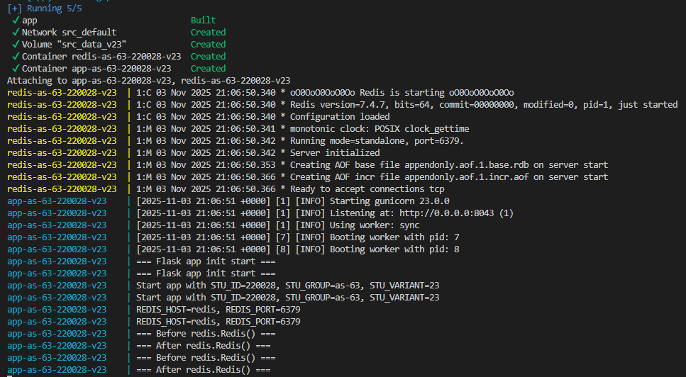
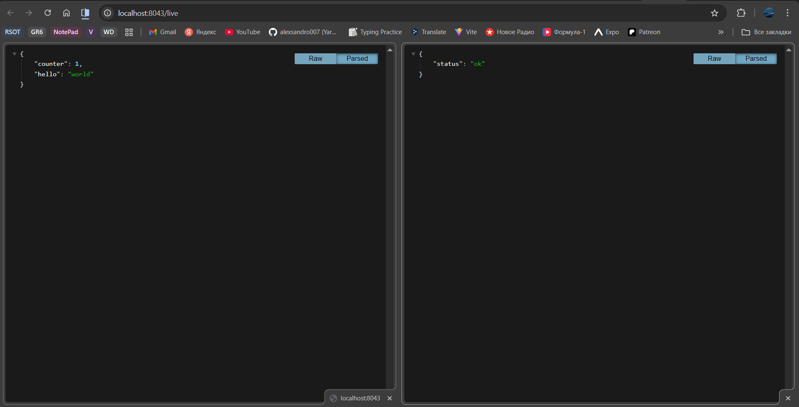

# Лабораторная работа №1

<p align="center">Министерство образования Республики Беларусь</p>
<p align="center">Учреждение образования</p>
<p align="center">"Брестский Государственный технический университет"</p>
<p align="center">Кафедра ИИТ</p>
<br><br><br><br><br><br>
<p align="center"><strong>Лабораторная работа №1</strong></p>
<p align="center"><strong>По дисциплине:</strong> "Распределенные системы и облачные технологии"</p>
<p align="center"><strong>Тема:</strong> Контейнеризация и Docker</p>
<br><br><br><br><br><br>
<p align="right"><strong>Выполнил:</strong></p>
<p align="right">Студент 4 курса</p>
<p align="right">Группы АС-63</p>
<p align="right">Ярмола Александр Олегович</p>
<p align="right"><strong>Проверил:</strong></p>
<p align="right">Несюк А.Н.</p>
<br><br><br><br><br>
<p align="center"><strong>Брест 2025</strong></p>

---

## Цель работы

Освоить базовые навыки работы с Docker: создание образов, запуск контейнеров, работа с volume и сетью. Научиться собирать минимальные образы (multi-stage) и запускать контейнеры под непривилегированным пользователем. Закрепить основы docker-compose: зависимости (БД/кэш), volume, сети. Настроить healthcheck и graceful shutdown.

---

### Вариант №23

## Метаданные студента

- **ФИО:** Ярмола Александр Олегович
- **Группа:** АС-63
- **№ студенческого (StudentID):** 220028
- **Email (учебный):** as006325@g.bstu.by
- **GitHub username:** alexsandro007
- **Вариант №:** 23
- **ОС и версия:** Windows 10, Docker Desktop 28.1.1

---

## Окружение и инструменты

В лабораторной работе использовались следующие технологии согласно варианту №23:

- **Стек:** Python/Flask
- **Порт:** 8043
- **Health endpoint:** /live
- **Зависимость:** Redis
- **Volume:** data_v23
- **UID:** 65532
- **Тег образа:** v23
- **Базовый образ:** python:3.12-alpine
- **Redis образ:** redis:7-alpine

---

## Структура репозитория c описанием содержимого

```
task_01/
├── doc/
│   ├── README.md          # Отчет по лабораторной работе
│   └── img/               # Скриншоты выполнения
│       ├── launch.png
│       ├── work.png
│       └── stop.png
└── src/
    ├── Dockerfile         # Multi-stage образ
    ├── docker-compose.yml # Оркестрация Flask + Redis
    ├── .dockerignore      # Исключения при сборке
    └── app/
        ├── main.py        # Flask приложение
        └── requirements.txt # Зависимости Python
```

---

## Подробное описание выполнения

### 1. Собрать минимальный образ для HTTP-сервиса

Создан Dockerfile с multi-stage сборкой:
- Этап builder: установка зависимостей
- Финальный образ: только runtime

```bash
cd src
docker build -t flask-app:stu-220028-v23 .
```

**Результат:** Образ размером ~78MB (< 150MB ✅)

### 2. Оформить docker-compose.yml

Создан файл docker-compose.yml с двумя сервисами:
- Flask приложение (app)
- Redis (зависимость)
- Named volume для данных

```bash
docker compose up -d --build
```



### 3. Реализовать graceful shutdown (SIGTERM)

Добавлен параметр `--graceful-timeout 30` в gunicorn для корректной обработки SIGTERM.

```bash
docker compose stop
```


### 4. Настроить кэширование зависимостей

В Dockerfile requirements.txt копируется отдельно перед копированием кода приложения, что позволяет Docker кэшировать слой с зависимостями.

**Проверка работы:**



---

## Контрольный список (checklist)

- [✅] README с полными метаданными студента
- [✅] Dockerfile (multi-stage, non-root, labels)
- [✅] docker-compose.yml
- [✅] Health/Liveness/Readiness probes
- [✅] Старт/остановка: логирование и graceful shutdown
- [✅] Multi-stage build
- [✅] Финальный образ ≤ 150MB
- [✅] USER ненулевой (UID 65532)
- [✅] EXPOSE корректен
- [✅] Конфигурация через переменные окружения
- [✅] Named volume для данных
- [✅] Кэширование зависимостей
- [✅] Все метаданные (LABEL и labels)

---

## Вывод

В ходе выполнения лабораторной работы освоены базовые навыки работы с Docker и контейнеризацией приложений. Создан минимальный HTTP-сервис на Flask с multi-stage Dockerfile, размер финального образа составил ~78MB. Реализован запуск от непривилегированного пользователя (UID 65532) для повышения безопасности. Настроен docker-compose для оркестрации Flask-приложения и Redis с использованием named volume для персистентности данных. Реализован graceful shutdown через параметры gunicorn. Настроено кэширование зависимостей для ускорения повторных сборок. Все метаданные (LABEL, labels, именование ресурсов) соответствуют требованиям варианта №23.
